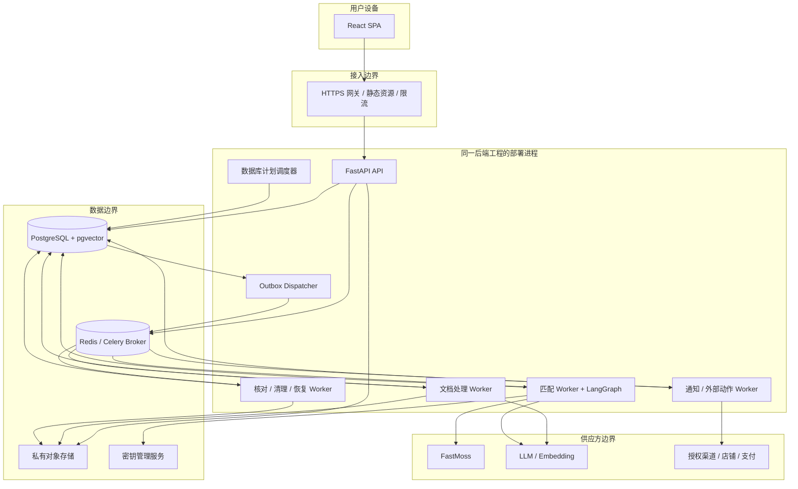
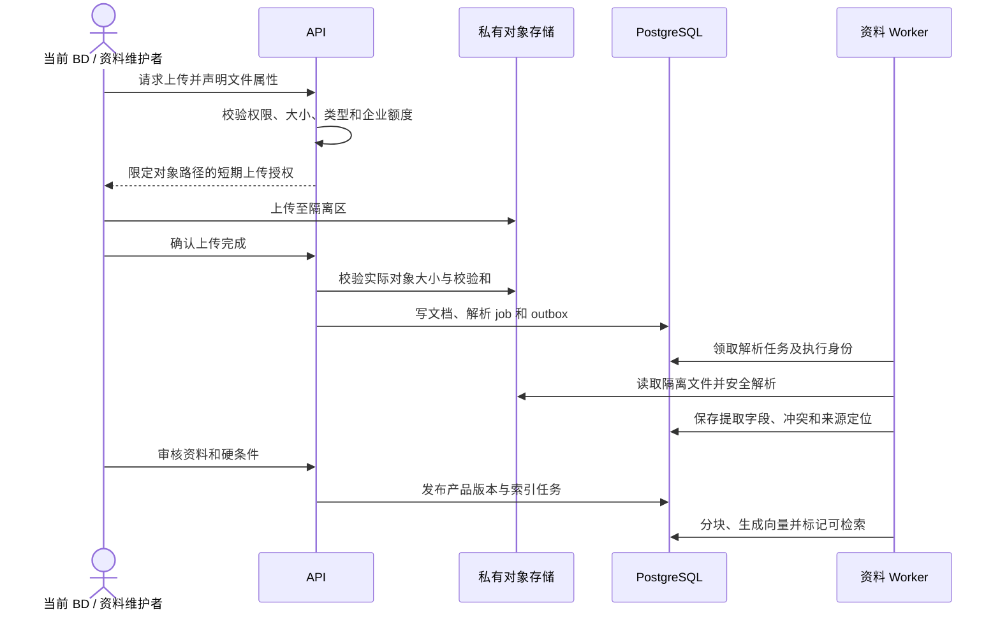
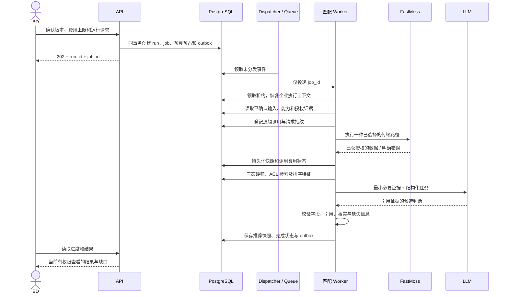
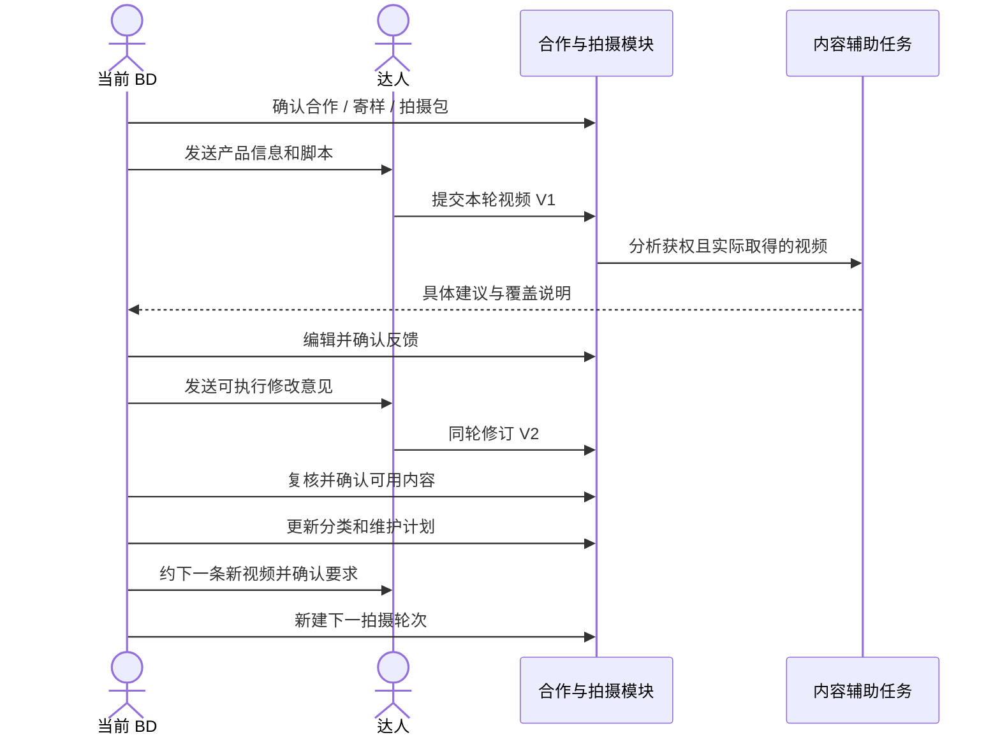

# 01 · 系统设计与工程组织

本分册把[产品规格](../product/final-spec.md)落实为模块、进程与关键业务流。字段和约束详见 [02](02-data-model.md)，匹配流程详见 [03](03-matching-and-rag.md)。所有组件均为目标设计。

## 1. 系统上下文

用户角色分为企业管理员、BD 和只读成员；账号可以属于多家企业，但切换企业会清空前端原企业缓存与临时选中项。公司既有产品资料、名单和合作记录可以经过校验导入。

外部边界包括 FastMoss、模型供应方、对象存储、邮件 / 身份 / 支付服务，以及获得权限后才启用的 TikTok Shop、物流或店铺订单系统。连接器失效不得阻止用户阅读仍在许可范围内的历史记录或手动录入合作进展。



图中 API → Redis 是限流 / 缓存用途。创建业务任务不直接依赖向 Redis 投递成功：API 提交 jobs + outbox 后返回已接收，由 Dispatcher 投递；任何直接发布捷径也必须保留数据库恢复路径。

图中 ING 是资料处理的编排 Worker；真正的文件解析在它调用的无网络、无业务凭据沙箱进程内完成。只有沙箱输出经过校验后，编排 Worker 才能在许可范围内调用 embedding / LLM。解析器本身不能访问图中的模型服务或业务数据库。

## 2. 业务模块及数据所有权

### 2.1 身份与企业 `identity`

管理账户、会话、恢复、企业、成员、邀请、角色、服务身份、资源 ACL 和账号撤权。每个 BD 独立拥有自己的任务与达人关系，不引入工作分配和转交流程。对外提供当前 `ExecutionContext` 和动作授权，不让其他模块自己解析 Cookie 或猜测权限。

`ExecutionContext` 至少包含 tenant_id、用户 / 服务主体、实际操作者、owner_principal_id、角色版本、请求 trace_id、资源范围。客户端不能自行提供可信的角色或权限版本。

### 2.2 产品与知识 `knowledge`

管理品牌、产品、型号、资料来源、文档版本、解析、候选字段、冲突、人工确认、知识块和索引状态。提取结果先进入待审核区，确认后才形成可执行的产品 / 条件版本。

提供 `get_product_context(version_id, context)` 和受权限过滤的检索服务。动态达人指标不归知识库作为唯一事实保存。更新产品创建新版本，不重写正在运行的任务输入。

### 2.3 任务与条件 `campaigns`

管理合作任务容器、单站点单元、目标、预算、条件版本、站点预设、搜索计划、保存搜索和运行请求。任务发布前验证输入完整性、规则冲突、能力覆盖和费用上界。

依赖 knowledge 的已发布版本和 connections 的能力报告；不自行调用供应方。多站点启动明确列出各站点准备结果，用户确认启动可执行集合，不静默跳过失败站点。

### 2.4 数据连接 `connections`

管理企业连接、加密凭据引用、授权范围、能力快照、字段映射、响应校验、速率限制和供应方调用记录。所有外部查询经过此模块和预算模块。

固定工具注册表将内部操作映射至 REST 或 MCP。响应转换为标准观测，保留原字段路径与证据定位；schema 变化时该能力降级，不把无法解析的数据当成零。

### 2.5 匹配与推荐 `matching`

拥有 matching_runs、候选发现路径、筛选决策、证据关联、分项评估、结果快照和阶段进度。负责执行已批准计划，协调整理产品上下文、发现、补查、筛选、排序和输出。

不拥有成员、凭据或预算额度修改权限；只能通过带 context 的接口获取授权资料、预占预算和请求工具。LangGraph 是该模块内部的执行实现，不暴露成面向前端的自由 Agent。

### 2.6 我的达人关系库 `creators`

拥有稳定达人身份、供应方标识、别名和身份确认，以及 creator_relationships 中本人的联系背景、标签、价值分类和维护计划。身份、单次匹配判断、长期关系价值分开；相同达人可在不同产品中有不同适配结论。

企业内基础身份由受限服务按稳定 ID 解析，其他 BD 的联系、报价、评价不因身份复用而暴露。本人重复导入不重复建关系，身份不确定时由本人确认。合并保留历史，不能合并他人的私有合作。

### 2.7 个人候选决定 `shortlists`

保存本人候选保留/排除、私人备注、对比及名单快照。BD 依据证据决定是否合作，确认后直接建立自己的 relationship / collaboration，不经过送审、认领、分配。

候选决定保留当时理由与版本；后续匹配不覆盖旧依据。可以读取企业公共产品资料，不等于可以读取另一 BD 的合作背景或名单。

### 2.8 具体合作与寄样 `collaborations`

保存本人沟通、联系人、合作意愿、条款、报价、样品、物流、承诺和结束原因。合作绑定 creator_relationship 与产品/站点任务，同一长期关系可以有多次合作。

匹配通过后由 BD 确认合作及寄样信息；SKU、数量、地址、费用、物流和签收分别记录。实际消息与样品操作经过 action_confirmations 和外部执行器，本人确认准确内容，没有上级审批。未接通渠道时可以人工发送并登记，草稿不等于已发送。

### 2.8a 拍摄指导与视频循环 `production`

拥有 content_briefs/content_brief_versions、production_rounds、video_assets/video_versions、video_reviews/feedback_items 和受限 submission_links。负责产品信息包、脚本、镜头清单、逐轮交付要求、视频回收、具体修改意见、返修验收与下一条新视频。

一轮对应一条新视频目标；返修增加该资产的 video_version，新视频建立下一轮。每轮固定产品版本、brief 版本、交付要求、期限和费用。寄样与准备拍摄包可以并行，签收事实单独核查。

AI 从产品资料和本人获权内容生成脚本，实际收到媒体后才进行受控分析，说明帧/音轨/字幕与覆盖范围。意见定位准确的视频版本和真实时间位置，由 BD 确认后发送。返修逐项复核，不让旧版本通过状态自动覆盖新版本。

回收、内容可用、平台发布和使用权各自记录；收到素材不等于已发布。达人提交链接只授予指定轮次的有限上传能力，不开放企业数据。单个后台任务处理一次明确版本或内容请求，长期关系靠持久业务状态串联，不依赖永远运行的 Agent。

### 2.9 经验规则 `learning`

拥有选人/内容反馈、规则建议、适用范围、本人确认及规则集合快照。草案不改变硬条件，确认、撤销和过期均可追溯。公司公共产品规则是配置权限，不是日常业务审批。

错误来源细分为达人、产品、库存、价格、履约、未知等，避免将经营背景误学为达人不适合。探索策略受用户确认的规则边界约束，不自动绕开硬条件。

### 2.10 日程与通知 `automation`

拥有本人保存搜索、触发计划、时区、静默时段、事件去重和通知偏好；派发待寄样、待回收、待审核、待返修、下一轮约拍和重点维护待办。周期触发先产生一个确定的计划发生实例，再创建业务任务；同一实例只产生一次逻辑作业。

维护动作绑定本人关系、跟进目的、节奏和下一步，暂停关系停止主动催促。变化通知包含前后值、证据时间、影响和建议动作。连接过期、额度不足和计划暂停是执行状态，不伪装成“没有新达人”。

### 2.11 分析与交付 `reporting`

拥有个人指标定义版本、查询口径、导出任务和报告，重点记录首条可用视频耗时、持续产出、返修、内容可用率和有价值达人再次产出。修订版本不重复计作新视频。读业务事实与观测生成结果，不自行修改推荐或合作事实。

关系型聚合 / 物化视图满足基线；需要历史数据仓库时按同一指标语义扩展。实际订单、估计 GMV、退款调整、广告来源分开，缺失保持缺失。

### 2.12 费用与订阅 `billing`

管理套餐权益、席位、应用订单 / 付款、订阅、企业消费限制，以及任务预占和供应方费用账本。应用服务费用与客户 FastMoss 费用是两套口径。

对外提供 `reserve_usage / settle_usage / reconcile_usage` 和 `check_entitlement`。权益检查在服务端执行，付费状态不能由前端开关修改。支付回调需验签、幂等和核对。

### 2.13 共享平台能力

`jobs` 管理执行、租约、进度、取消、等待输入、恢复和超时；`audit` 管理审计；`storage` 管理文件与签名访问；`observability` 管理日志指标；`data_lifecycle` 管理导出、删除、保留和备份恢复后的清理。

共享层仅容纳真正跨域的基础能力，不成为所有业务代码堆积的 `utils.py`。外部副作用的执行器由共享设施承载，具体业务条件仍由对应领域批准。

## 3. 模块协作规则

每个模块分为 API schema / router、application service、domain、repository 和必要的 adapter；简单 CRUD 不强制给每一张表创建抽象接口。事务由应用用例持有，repository 不自行 commit。

其他模块不得直接改写某模块的表。需要强一致的跨域用例由明确的应用服务在同一 Unit of Work 调用模块服务；无需同事务的后续处理通过 Outbox 事件。分析模块可以使用只读、已授权的查询视图，不能因此获得跨企业访问能力。

模块内部调用传递结构化对象或 ID，不传裸 SQL。公开服务如 `StartMatchingRun`、`PublishProductVersion`、`ConfirmShortlist`、`CreateProductionRound`、`ReviewVideoVersion`、`RecordCreatorClassification`、`ExecuteConfirmedAction` 必须在文档和测试中明确权限、前置条件、事务边界、产生事件及幂等策略。

推荐业务事件：`product.version_published`、`matching.run_completed`、`shortlist.confirmed`、`sample.dispatched`、`brief.confirmed`、`video.received`、`video.feedback_confirmed`、`video.accepted`、`production.next_round_confirmed`、`creator.classification_changed`、`maintenance.action_due`、`rule_set.published`、`connection.revoked`、`member.access_revoked`、`data.deletion_requested`。事件携带 event_id、tenant_id、entity_id、entity_revision、schema_version、occurred_at、trace_id；消息体不携带密钥、完整资料或多余个人信息。

## 4. 产品资料变成可用知识的流程



资料已发布但索引尚未完成时，结构化字段可以用于条件校验，UI 显示知识检索暂不可用。匹配是否需要等待由计划中的必需证据决定，不能误报全部就绪。

## 5. 一次完整匹配的事务边界



预算预占可拆为整个运行的应用上限和逐次调用额度占用；运行启动不是一次性购买所有候选详情。按每轮候选价值逐批补查，任何下一次调用前都检查剩余上限及取消状态。

网络超时并不证明 FastMoss 未执行。Worker 持久化 `unknown` 结果，核对完成前不自动重复该付费请求。若供应方无法核对，向用户展示不确定费用和是否接受再次调用的选择，其他已完成候选仍可产生 partial 结果。

## 6. 单个 BD 的视频产出与关系维护闭环

1. BD 查看匹配证据，决定是否继续；确认对方愿意合作、寄样地址和具体约定，建立自己的关系记录和本次合作。
2. 确认样品/SKU、数量、费用及物流，跟踪签收；匹配结果不自动触发寄样。
3. 准备产品信息、脚本、镜头清单、参考风格与验收要求。可与寄样并行，发送前由本人确认，保留实际发出的版本。
4. 新建第一拍摄轮次，绑定产品、brief、期限与费用；达人用限定链接提交，或由 BD 上传/登记。
5. BD 检查视频，AI 提供有覆盖说明的辅助分析；反馈定位具体版本、位置、问题和修改方法。
6. 需要返修则在同轮回收 V2/V3，复核具体意见；通过后记录内容可用性，发布与使用权独立维护，返修不增加新视频数。
7. 继续要新视频时确认新方向与约定，再开下一轮；不能从一次合作推定无限交付承诺。
8. 每轮后更新产出履约、内容价值、商业表现及维护优先级，AI 建议由本人确认。缺销售数据不否定已证实的内容价值。
9. 重点达人安排下次联系目的、新产品或约拍方向；具体合作结束不抹除长期关系。需要时也可以暂停维护或停止合作。



上述步骤均由当前 BD 推进，达人回应与上传不要求企业内部多人配合。

## 7. 部署进程和队列

基线队列按资源与副作用隔离：`ingestion`、`matching`、`media_analysis`、`external_actions`、`maintenance`。任务消息只包含可定位的 job_id，执行身份和敏感信息从数据库受控加载。队列并发受企业配额、连接速率、模型速率和总预算共同约束。

API 不执行 PDF 解析、音视频解码/转写、批量 embedding、长匹配或大导出。media_analysis 按文件大小、时长、分析覆盖和模型费用设上限，解码沙箱与业务/模型编排分开。Worker 不能把请求数据库 Session 传到子任务。图暂停释放进程；恢复命令创建一次新的 dispatch attempt，重新领取同一可恢复 job 的租约，不能同时运行两个图执行器。

调度器以数据库锁和唯一 schedule occurrence 保证多个实例不会重复逻辑触发。崩溃恢复扫描过期租约、未发布 Outbox、未核对费用和超时外部动作。对于漏过的周期，默认合并为一次最新刷新；若业务要求逐期补跑，必须显式配置并重新检查总预算。

健康检查分为进程存活、依赖就绪和业务积压。API 健康不等于 Worker 正在运行；连接中心单独显示供应方状态。

## 8. 目标工程目录

以下是拟实现结构，本次不创建空壳代码或假运行脚本。

```text
Langchain+Rag/
  README.md
  docs/
    product/final-spec.md
    architecture/...
  apps/
    web/
      src/
        app/                 # 路由、会话、企业上下文
        features/            # 按产品/任务/达人/合作等领域划分
        components/          # 共用控件，不含业务真相
        lib/api/             # 从 OpenAPI 生成的客户端与错误处理
        lib/auth/            # 会话和 CSRF 交互
        styles/
      package.json
  backend/
    pyproject.toml
    uv.lock
    src/tk_workspace/
      api/                   # FastAPI 入口、中间件、统一异常
      modules/
        identity/
        knowledge/
        campaigns/
        connections/
        matching/            # graph/ nodes/ schemas/ prompts/
        creators/
        shortlists/
        collaborations/
        production/           # 拍摄包、视频版本、反馈与持续产出
        learning/
        automation/
        reporting/
        billing/
      platform/
        db/ jobs/ outbox/ storage/ secrets/
        audit/ observability/ data_lifecycle/
      workers/               # Celery 入口与任务适配
      integrations/          # 已批准供应方实现，无业务自由权限
    migrations/
    tests/
      unit/ integration/ contract/ security/ e2e/
    evals/                   # 去标识评测集、版本与回归报告
  infra/
    compose/                 # Linux 容器开发与集成测试
    deploy/                  # 环境配置模板及资源声明
    runbooks/                # 连接失效、恢复、删除、费用核对
```

后端包按领域拆分，避免单个 chains.py 包含全部业务。路由不直接拼 Prompt；Prompt、结构化输出和评测数据必须一起版本管理。Schema 由服务端 OpenAPI 产生 TypeScript 客户端，前后端不得各自维护有差异的字段定义。

## 9. 环境与配置

区分 development、test、staging、production。各环境的数据库、对象前缀、密钥、供应方连接和模型预算独立；生产企业数据不自动复制到测试。测试适配器必须显式标记，不能在生产凭据无效时自动回退假数据。

配置分为部署配置、企业设置和单次运行快照。连接 token 放密钥存储；企业预算、过滤规则、时区等业务设置放数据库；一次运行实际生效值固定到快照。只有模型服务配置在批准清单内，不能允许企业提交任意 URL 让服务器携密钥访问。

示例配置只列变量名而不写入真实值：`DATABASE_URL`、`REDIS_URL`、`OBJECT_STORAGE_ENDPOINT`、`OBJECT_STORAGE_BUCKET`、`KMS_KEY_ID`、`SESSION_SECRET_REF`、`MODEL_PROVIDER_CONFIG_REF`、`PUBLIC_ORIGIN`、`OTEL_EXPORTER_OTLP_ENDPOINT`。应用启动时校验必需项，日志仅报告缺失的名字。

## 10. 扩容与演进条件

先观察任务等待、供应方限流、数据库查询、向量召回质量和模型延迟，再决定资源变化。可以独立增加 API 或某类 Worker，但预算 / 连接并发仍由跨进程机制保证。

当特定大企业的向量扫描影响服务，考虑该租户分区与分区 HNSW；当导出和统计影响事务库，增加受权限限制的只读副本 / 派生分析库；当外部动作稳定成为独立运营边界，再抽出服务。每次拆分都需要保留权限、事件顺序、幂等和恢复证据，不能只搬代码。

不预先承诺并发客户数量或“秒级全网找人”。系统可测量 API 响应、任务各阶段和候选单位成本；候选总时长依赖站点、候选范围、供应方和用户预算，在任务开始前显示估计与影响因素。
