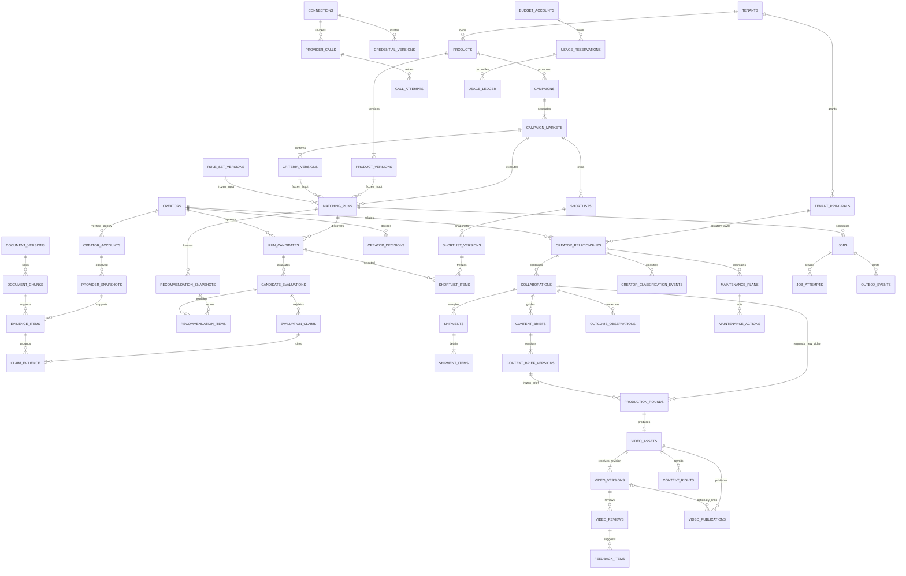

# 02 · 数据模型、租户隔离与一致性

修订日期：2026-09-29。状态：面向最终商用应用的可实施数据设计，不代表数据库已建成或供应方已完成授权。依据最终应用规格及本轮修订：以单个 BD 独立完成找人、寄样、内容指导、视频回收反馈、持续产出和达人维护为业务主线。本章规定数据契约；迁移脚本应逐条落实约束，不以 ORM 校验代替数据库约束。

## 1. 存储职责与不可破坏的约束

- **PostgreSQL 是事实主库**：产品版本、活动条件、达人身份、快照、证据、决定、合作、费用、任务、权限均有结构化记录。pgvector 保存可重建的检索向量，不承担交易状态或动态 GMV 的事实存储。
- **对象存储保存文件正文**：文档、产品素材、获准回收的视频及其返修版本、获准保存的供应方原始响应、导出物。数据库保存租户、对象键、摘要、ACL、授权与到期信息。Redis 仅保存可丢失缓存、流事件和临时协调信息；账本、去重记录与任务真相不依赖 Redis。
- **企业隔离与个人业务隔离同时成立**。同一自然人可加入多个企业；同一外部达人在两个企业中有两个内部身份。企业内仅稳定公开达人身份及获准共享的产品资料可复用；BD 的联系记录、报价、合作、视频评价、达人分类与维护事项按 `owner_principal_id` 私有。产品、供应方响应、缓存、向量与业务资料均不跨企业复用。管理员管理账户和设置，不因角色自动获得 BD 私有业务正文。
- **推荐属于一次有版本的任务执行**。产品版本、单市场任务条件版本、规则集合版本、检索/排序策略版本及数据快照必须能一起回查。
- **未知不等于零、不符合或失败**。有数值的观察值同时记录来源、时间与可用性；硬条件统一为 `pass | fail | unknown`。
- **历史事实追加，当前工作状态可修改**。已确认版本、已完成评价、个人名单决策快照、账本、操作事件不可原地覆盖；更正用新版本/冲销/补充事件表达。删除权与授权到期优先于永久保存原文，历史记录允许保留合法的“证据已不可用”占位。

## 2. 通用字段与命名

除明确标为全局目录的实体外，每张业务表都包含：

```text
id                uuid                 -- 应用生成；内部标识不充当权限证明
tenant_id         uuid NOT NULL
created_at        timestamptz NOT NULL
created_by        uuid NULL            -- tenant_principals.id，可为人或服务主体
updated_at        timestamptz          -- 仅可变实体使用
lock_version      bigint NOT NULL 1    -- 仅可变实体，用于 If-Match / 乐观并发
UNIQUE (tenant_id, id)
```

补充约定：

- 跨业务表引用一律用 `FOREIGN KEY (tenant_id, parent_id) REFERENCES parent(tenant_id, id)`。`id` 全局唯一也不能省略复合外键。
- 状态采用 `text + CHECK` 或小型字典表，迁移可增加状态；应用枚举从同一契约生成。状态转换仍须命令处理器在事务中验证。
- 私有业务实体及派生物另带 `owner_principal_id NOT NULL`、`UNIQUE(tenant_id,owner_principal_id,id)`。下文简称 owner 均指此字段；子表继承且不能独立更换 owner。公开身份/公共产品版本没有隐式访问私有业务的反向权限。
- 金额用 `numeric(20,6)`，币种 `char(3)`；汇率 `numeric(24,12) > 0`。严禁浮点金额。数量 `bigint`，比例用 `numeric` 并声明 `[0,1]` 或 `[0,100]`，同字段不能混用。
- 业务时刻用 `timestamptz`，用户时区另存 IANA 名称；统计窗口用 `window_start/window_end` 且 `start < end`，语义统一为半开区间 `[start,end)`。仅有日期的承诺用 `date + time_zone`，不能虚构一个精确时间。
- `jsonb` 只存版本化结构、原始字段与真正扩展项；高频过滤、外键、金额、状态、时间字段必须结构化。每份 JSON 有 `schema_version`，写入经 Pydantic/JSON Schema 校验。
- SHA-256 内容摘要用 `bytea`，请求/幂等摘要不得包含原始密钥。URL 为 `text` 且做协议白名单；外链不得自动作为抓取授权。
- 默认外键 `ON DELETE RESTRICT`。确认记录、账本及引用中的版本不能靠级联删除消失。只对完全归属且可重建的切块、向量、临时导出项使用受控级联。
- 租户查询索引以 `(tenant_id, …)` 起始；复合 FK 的子表列另建索引。外部 ID 全用 `text`，避免丢前导零或超出整数范围。

## 3. 主关系图

为保持可读性，图中省略每条关系都存在的 `tenant_id`。实际 DDL 均使用复合外键。



## 4. 企业、身份与权限

### 4.1 登录身份与企业主体

- `users`：全局登录身份，`id uuid`、`identity_provider text`、`provider_subject text`、`status text`；唯一 `(identity_provider, provider_subject)`。个人邮箱等单独加密或受限读取。用户目录不是任意企业可查询的通讯录。
- `tenants`：`id`、`name`、`status active|suspended|closing|closed`、`time_zone`、`authz_version bigint`、`retention_policy_id`。停用、关闭和恢复均有审计。
- `tenant_principals`：`tenant_id`、`kind user|service`、`user_id uuid NULL`、`service_key text NULL`、`status active|revoked`。约束“user 必有 user_id 且无 service_key；service 相反”。成员和 worker 都以企业主体执行；唯一 `(tenant_id,user_id) WHERE user_id IS NOT NULL`、`(tenant_id,service_key) WHERE service_key IS NOT NULL`。
- `memberships`：`principal_id`、`role admin|bd|viewer`、`joined_at`、`revoked_at`、`permission_version`；一个用户主体一条当前 membership。退出保留记录，撤销登录访问，业务资料仍归企业。
- `invitations`：邮箱摘要、角色、一次性 token 哈希、`expires_at/accepted_at/revoked_at`；邀请 token 不存明文，接受时重新检查席位与企业状态。
- `service_grants`：`principal_id`、允许的 `job_kind/resource_scope`、授权人、到期时间、`revoked_at`。后台任务不冒充已离职用户；定时任务有企业服务授权，人工发起任务仍检查原始申请人的操作范围。

默认 `bd` 可在配额与当前授权范围内直接操作自己的业务、确认自己的外部动作；`admin` 管理成员、连接、公司资料与政策，同时包含对本人业务的 BD 动作权限，不扩大跨 owner 可见性；`viewer` 仅查看明确授权的资源。上述角色不形成业务审批层级。成员离职时撤销权限、暂停其计划和未发出的外部动作，按留存政策封存其私有业务，不自动转交给其他 BD。

权限更新事务增加 `tenants.authz_version` 并写 outbox。每个 API 请求及每次向外部模型/供应方发送数据前重新确认当前主体有效，不能仅依赖排队时的权限快照。

### 4.2 RLS 与请求上下文

运行时使用 `NOBYPASSRLS`、非表所有者的数据库角色。租户表启用并 `FORCE ROW LEVEL SECURITY`；迁移、备份、运维角色与应用凭据分离。PostgreSQL 的超级用户、`BYPASSRLS` 角色以及通常的表所有者具有绕过行安全的能力，不能把普通应用连接配置成这些身份。[PostgreSQL 行安全文档](https://www.postgresql.org/docs/18/ddl-rowsecurity.html)

```sql
-- 说明性 DDL；每张租户表均须应用并验证。
ALTER TABLE products ENABLE ROW LEVEL SECURITY;
ALTER TABLE products FORCE ROW LEVEL SECURITY;

CREATE POLICY products_tenant_guard ON products AS RESTRICTIVE
  FOR ALL TO app_runtime
  USING (
    tenant_id = NULLIF(current_setting('app.tenant_id', true), '')::uuid
  )
  WITH CHECK (
    tenant_id = NULLIF(current_setting('app.tenant_id', true), '')::uuid
  );

-- RESTRICTIVE 租户门禁外，还要存在按命令区分的 PERMISSIVE 读/写策略。
-- can_read_product / can_write_product 实现 membership + owner/resource ACL，默认拒绝。
CREATE POLICY products_read ON products FOR SELECT TO app_runtime
  USING (authz.can_read_product(tenant_id, id));
CREATE POLICY products_insert ON products FOR INSERT TO app_runtime
  WITH CHECK (authz.can_create_product(tenant_id));
CREATE POLICY products_update ON products FOR UPDATE TO app_runtime
  USING (authz.can_write_product(tenant_id, id))
  WITH CHECK (authz.can_write_product(tenant_id, id));
-- 普通运行角色不获 DELETE；删除由受控删除命令触发。
```

请求先从可信会话验证用户和企业 membership，再在同一短事务用参数化 `SELECT set_config('app.tenant_id', :tenant_id, true)` 设置租户，同时设置 `app.user_id`、`app.principal_id`。`true` 表示事务范围；连接池复用不能保留上一个请求的上下文。未设置上下文应拒绝或返回零行。API 路径中的 tenant_id 只作请求选择，不能作授权依据。

GUC 不是对抗已攻陷应用角色的独立身份认证机制；应用必须禁止任意 SQL 和模型生成 SQL。RLS 防止漏加过滤和跨租户关联，不能代替会话认证。`authz` 辅助函数避免递归 membership RLS；如需 `SECURITY DEFINER`，仅用不可登录的专门属主、固定 `search_path`、最小只读权限、显式校验上下文，并撤销 `PUBLIC EXECUTE`，逐函数测试。

后台任务从数据库任务记录获得 tenant_id；不能信任队列消息提供的任意 tenant_id。调度器可用专门函数跨租户领取任务 ID，但不能读取企业正文；执行器随后切换到该任务的授权企业上下文。工单排障授权限时、留审计，不向客服角色开放全库绕过权限。

### 4.3 会话、ACL 和支持记录

全局身份表只由身份模块的受限查询访问，不使用任意企业上下文读写全部账户。`auth_identities` 保存 local / 已配置 OIDC 身份映射；采用本地登录时，`password_credentials` 保存成熟算法密码哈希及更新时刻，绝不保存可逆密码。`sessions` 保存 token_hash、user_id、issued_at、last_seen_at、expires_at、revoked_at、认证强度；`verification_tokens` 保存验证/恢复/邀请用途、摘要、失效和使用时间；`mfa_factors` 保存加密认证器秘密或对应公钥，`recovery_codes` 只保存摘要及消费状态。

企业内 `resource_grants` 保存获准主体、权限集合、有效期与资源外键。只为产品资料、文档、报告等可显式授权资源提供 ACL；BD 的私有关系、合作、沟通、视频反馈和分类不因企业会员身份或 admin 角色公开，也不提供默认共享业务入口。资源类型限制为已注册产品、任务、文档、合作、报告等；实现为明确的资源关联表或 CHECK 限制且有实际 FK 的稀疏关联，不允许任意表名加 UUID 的无约束多态引用。权限由资源继承规则解析；文件、chunk、claim、导出不能因复制失去来源限制。`document_grants` 是文档领域的对应授权表，不能与通用授权投影分别修改而产生两份真相。

`support_requests` 记录企业问题、相关脱敏 job/request ID、状态和处理人；`support_grants` 记录企业批准的支持主体、资源范围、目的、有效期及撤销。平台客服不能凭工单 ID 自行获得资料正文权限。

## 5. 产品、任务与版本

### 5.1 产品事实

- `brands`：`name`、负责人、状态。
- `products`：`brand_id`、`sku text`、`name`、`owner_principal_id`、`current_version_id NULL`、`status active|archived`；有效 SKU 唯一 `(tenant_id,sku)`。一个产品对应一件可明确区分的型号；变体关系用可空 `parent_product_id` 表达。
- `product_versions`：`product_id`、`version_no int > 0`、`status draft|confirmed|superseded`、`facts jsonb`、`facts_schema_version`、`content_hash`、`confirmed_by/confirmed_at`、`effective_from/expires_at`。唯一 `(tenant_id,product_id,version_no)`；confirmed 后不可改 facts。规范事实包括功能、使用场景、禁用表述、目标客户与来源定位，金额仍由结构化市场价格存储。
- `product_market_terms`：`product_version_id`、`market_code`、`price_amount/currency`、`sample_policy`、佣金上下界、报价有效期；金额未知用 NULL 配合 `availability`，不可填 0。国家/站点码来自平台市场目录，不自动等同 ISO 国家码。
- `product_document_links`：产品版本与文档版本的多对多关系；唯一 `(tenant_id,product_version_id,document_version_id,purpose)`。声明冲突保存 `knowledge_conflicts`，含两个证据 ID、冲突字段、状态、决议和处理人。

当前版本指针使用 `(tenant_id,id,current_version_id)` 到版本 `(tenant_id,product_id,id)` 的复合外键，防止把另一产品的版本标为当前。此类循环 FK 用先插产品、再插版本、最后设指针的事务处理，不取消完整性约束。

### 5.2 合作任务与单市场单元

- `campaigns`：`product_id`、`name`、目标、开始/结束日期、`owner_principal_id`、状态。活动归单个 BD，其他 BD 不可枚举其活动或关联合作。最终产品默认一个活动推广一个产品，多个产品分别建活动；避免未经需求确认的组合商品复杂度。
- `campaign_markets`：`campaign_id`、`market_code`、`time_zone`、`reporting_currency`、目标名单数量、`current_criteria_version_id`、状态。唯一 `(tenant_id,campaign_id,market_code)`；同市场的不同批次使用不同 campaign。销售市场、内容语言和受众条件放在不同字段/条件中。
- `criteria_versions`：`campaign_market_id`、`version_no`、`product_version_id`、`criteria_json`、`schema_version`、`status draft|confirmed|superseded`、确认人/时刻；唯一 `(tenant_id,campaign_market_id,version_no)`。JSON 条件为受限 DSL：`criterion_id / field_key / operator / expected / hardness / unknown_policy / provenance`。hard 条件必须人工确认，操作符来自白名单，禁止 SQL/代码片段。
- `rules`：规则的逻辑身份、作用域 `company|campaign_market|personal`、scope 所需外键、状态。CHECK 保证 personal 必有主体，campaign_market 必有市场单元，company 不带个人/活动外键。
- `rule_versions`：`rule_id`、版本号、DSL、依据、`proposed|approved|revoked`、确认人、有效期。模型仅创建 proposed。撤销追加事件并更新当前可用状态，历史 run 保留当时版本。
- `rule_set_versions` + `rule_set_items`：一次执行解析后采用的完整规则集合与逐条规则版本；保存作用域解析结果、冲突处理、集合摘要。冲突未确认不得静默覆盖，run 进入 `waiting_input`。

规则作用域与优先级是明确业务策略：公司强制约束不能被个人偏好覆盖；活动可增加限制；个人偏好只影响获准的排序维度。临时费用或档期反馈不能自动晋升为公司规则。

### 5.3 执行输入冻结

- `matching_runs`：`campaign_market_id`、`product_version_id`、`criteria_version_id`、`rule_set_version_id`、`search_plan_id`、`capability_snapshot_id`、`rights_policy_version_id`、`graph_version`、`state_schema_version`、`strategy_version`、`prompt_version`、`model_profile_id`、`embedding_profile_id`、`connector_contract_version`、`status`、`input_hash`、`request_key`、`parent_run_id NULL`、发起主体、起止时刻、失败分类、`cancellation_requested_at`。
- 状态统一 `queued|running|waiting_input|cancel_requested|succeeded|partial|failed|cancelled`。`partial` 说明部分来源完成并保留缺口，不能当作完整成功。只有非终态运行可用新 job attempt 恢复；任何终态重试或实质输入变化均创建 parent_run_id 关联的新 run，不原地复活终态。
- `run_inputs`：获准使用的具体 document_version、rule_set、人工记录版本/观察截止时间清单及摘要。引用源变化不改变既有输入。
- `run_search_paths`：`run_id`、`kind product_terms|filters|reference_creator|similar_product|relationship_library`、规范查询计划、查询依据、是否放宽条件及确认记录、路径状态。relationship_library 只召回当前 owner 的关系与获准反馈；公开身份表不作为全企业私有合作索引。
- 唯一 `(tenant_id,requested_by,request_key)`，其中 request_key 已包含逻辑操作的命名空间；相同 key 配不同 input_hash 返回冲突，并与 API idempotency_records 保持同一作用域。以 `(tenant_id,campaign_market_id,created_at DESC)` 查历史。run 对 criteria 的 FK 扩展含 campaign_market_id，保证两者属于同一单元；product_version 同理必须属于 campaign.product_id，创建事务校验并用复合键/约束触发器实现跨层不变量。

`search_plans` 保存 market、product/criteria/rule_set 版本、发现路径、输入哈希、capability_snapshot_id、有限查询计划及 `draft|confirmed|superseded`；确认后不原地修改。`run_confirmations` 保存 run、confirmation_kind、input_hash、展示内容引用、确认主体、期限和决定；预算或条件放宽由该 run 所属 BD 本人确认，只适用于相同输入。

`model_profiles` 固定 provider/model/version、结构化输出能力、上下文和输出限制、数据处理范围、配置摘要；`prompt_versions` 和 `ranking_policy_versions` 是不可变配置目录或与代码提交绑定的注册表。企业自定义配置归属 tenant，公共软件配置可以全局共享，但不包含企业数据。每次 run 存实际配置引用，不用动态指针代表历史配置。

## 6. 企业达人身份、数据快照与证据

### 6.1 身份不可用昵称去重

- `creators`：企业内逻辑身份，`display_name`、`canonical_creator_id NULL`、`status active|merged|archived`。合并是可审计的显式操作；历史候选不重写。canonical 指向同租户未合并的根身份，事务检查无环。
- `creator_accounts`：`creator_id`、`platform`、`provider`、`subject_scope`、`external_creator_id`、`platform_stable_id NULL`、公开地址、`identity_verified_at`。唯一 `(tenant_id,provider,subject_scope,external_creator_id)`；subject_scope 明确该 ID 是 global 还是 market/account 范围，不猜测供应方 ID 全局唯一。
- `creator_aliases`：account、昵称/URL、观测起止时间、来源快照。昵称变化不产生新身份，昵称相同不自动合并。
- `creator_identity_links`：候选两个身份、关联证据、`proposed|confirmed|rejected`、确认人。跨市场合并须稳定平台 ID 或人工确认；不能仅凭相似头像、邮箱或昵称。
- `creator_exclusions`：creator、`personal|company_policy|campaign_market` 范围、相应 owner/活动外键、原因、证据、创建人、到期和复查时间。personal/campaign_market 记录私有；company_policy 仅承载管理员明确发布且依据获准共享的公司政策。任务内拒绝不会创建公司级永久排除，也不公开个人拒绝原因。

稳定身份规范化用于同一 BD 的名单整理和数据关联，不实现企业内抢占、认领或重复联系拦截。两个 BD 可各自建立同一达人的私有关系，任何候选提示都不得暴露“其他 BD 已联系”、他人的报价或合作背景。身份合并只统一公开身份根节点；保留私有关系各自的 owner、原始引用和历史，不合并业务内容。同一 owner 因身份合并出现两条关系时，由本人确认如何合并并保留关系别名与历史。

### 6.2 外部快照与能力

- `provider_snapshots`：`connection_id`、`provider_call_id`、可空 `creator_account_id`、`resource_kind`、`external_resource_id`、`market_code`、`fetched_at`、`source_updated_at NULL`、`window_start/end NULL`、`payload_schema_version`、规范字段 `payload jsonb`、原文对象引用（仅获准时）、`payload_hash`、`rights_policy_version_id`、`expires_at`、`availability available|expired|deleted|withheld`。
- `metric_observations`：`snapshot_id`、`metric_key`、`value numeric NULL`、`availability known|unknown|not_applicable`、`basis source_reported|source_estimated|computed|human_confirmed`、币种/单位、统计窗口、计算版本。CHECK：known 必有 value，unknown/not_applicable 必无 value；不存在原始 GMV 到跨市场评分的隐式换算。
- `provider_capability_observations`：connection、market、operation、field_key、`availability documented|verified|unavailable|unknown`、`access_status allowed|denied|unknown`、missing_reason、探测时间、有效期、调用与错误引用。只有当前有效、verified 且 allowed 才标为已验证可用；暂时故障另记 last_error，不用故障响应证明能力永久不存在。公有能力目录是代码/全局元数据；用户权限探测结果仍属于企业。
- `capability_snapshots` + `capability_snapshot_items`：固定某次计划 / run 使用的逐操作、字段观测集合，含 transport、schema hash、映射版本、统计/分页限制和验证时间。旧能力快照用于追溯，运行前仍检查当前授权是否撤销。
- `rights_policy_versions`：供应方/合同、允许操作、LLM 处理与缓存/导出范围、地区限制、保留期限、有效期、审核凭据。无允许范围时功能门禁拒绝执行，不能以空值表示无限授权。

供应方快照、人工记录、derived_records、evidence_items 和模型缓存均标注 `visibility tenant|private` 与 owner（private 时必填），权限只可等于或严于原始来源。公司授权的公共快照可按权利策略共享；个人连接响应、含个人搜索上下文的产物和私有合作依据不可经缓存、错误信息或证据引用泄露给他人。证明候选匹配的私有证据只能进入同 owner 的结果。

高频索引 `(tenant_id,creator_account_id,resource_kind,fetched_at DESC)` 和 `(tenant_id,expires_at) WHERE availability='available'`。允许缓存时，以 `(tenant_id,visibility,owner_scope,connection_id,credential_permission_version,operation,market_code,canonical_request_hash,contract_version)` 命中；不同 tenant 即使同 provider key 也不共享缓存。

### 6.3 证据与结论链

- `evidence_items`：`source_kind provider_snapshot|document_chunk|human_record|derived`、四选一 source FK、定位信息 `locator jsonb`（字段路径/页码/片段/视频时间）、原始链接、捕获时间、统计窗口、`fact_basis`、授权版本、内容摘要、可用性。使用 CHECK 保证按 kind 恰好一个源非空。不得只用任意 `source_type + source_id` 而无可校验外键。
- `human_records`：记录类型、结构化事实、原币种金额、确认状态、发生/记录时间、操作者、证据附件及更正前记录。人工信息与 provider 数值不混在一个无法辨别来源的 payload。
- `derived_records` + `derived_record_inputs`：计算/模型推断、算法版本、输入证据集合、模型配置、生成时间；区分可确定计算与 LLM 推断。只允许引用已有证据，防止模型自行生成引用 ID。
- `run_candidates`：`run_id`、`creator_id`、`first_seen_at`、`discovery_state`；唯一 `(tenant_id,run_id,creator_id)`。`candidate_discoveries` 连接 candidate 与 search_path、初始 snapshot，多路径重复只保留一个候选但保留所有发现理由。
- `candidate_evaluations`：candidate、evaluation_no、criteria/rule/model/strategy 版本、`hard_result pass|fail|unknown`、`fit_score numeric NULL`、`evidence_coverage numeric`、状态、缺失项与生成时间；版本记录不可覆盖，`evidence_coverage` 明确为资料覆盖度而非正确概率。
- `criterion_evaluations`：evaluation、criterion_id、结果三态、实际值、比较口径、计算版本。唯一 `(tenant_id,evaluation_id,criterion_id)`。
- `evaluation_claims`：evaluation、`claim_kind match|mismatch|missing|question`、文本、`basis observed|computed|llm_inferred|human_confirmed`、`support_status supported|contradicted|insufficient|unresolved`、定位与校验版本；`claim_evidence` 保存 claim 与 evidence 的多对多引用。missing/question 可无证据，关键肯定事实无证据时验证失败。03 的 DTO kind `sourced_fact|calculated_fact|model_inference|human_confirmation` 依次显式映射为这里的 basis，不另设一套矛盾事实。

### 6.4 推荐输出快照

`recommendation_snapshots` 保存 run_id、snapshot_kind、输入/证据集合摘要、ranking_policy_version、发布时间、截断/缺失说明与可用性，唯一 `(tenant_id,run_id,snapshot_kind)`。正式完成快照只能提交一次；中途进度读 run_candidates，不反复覆盖正式快照。

`recommendation_items` 保存 snapshot、run_candidate、candidate_evaluation、group `qualified|needs_verification|excluded`、组内 rank、comparison_cohort_key、主要理由引用。唯一 `(tenant_id,snapshot_id,run_candidate_id)` 与 `(tenant_id,snapshot_id,group,rank)`。扩展复合 FK 约束 candidate / evaluation 同属对应 run。hard_result 与 group 一致性由发布事务和约束触发器验证，unknown 不能写成 qualified。

名单 shortlists 是 BD 私有决策产物，可以引用多个合法推荐快照；recommendation_snapshots 是系统计算产物，二者不可合并为同一个可变排序表。快照删除或源权限变化时通过 artifact_dependencies 限制当前可读内容，历史元数据保留范围受许可控制。

排序不修改原始数值。保存分项分数、权重版本、缺失值处理与硬条件淘汰原因；不同 market 的排序各自独立。所有读取结论的 API 再过滤当前可访问的证据，已撤权内容不能因为被复制进旧摘要就继续展示。

## 7. BD 私有关系、寄样与持续内容生产

### 7.1 个人候选决策和达人关系

- `shortlists`：`campaign_market_id`、名称、`owner_principal_id`、当前版本指针。owner 必须与所属 campaign 的 owner 一致。
- `shortlist_versions`：shortlist、version_no、`draft|confirmed|superseded`、`confirmed_by/confirmed_at`、参考 run 集合、预算快照/假设、内容摘要。confirmed 是本人冻结候选决定，编辑另建版本；不设提交、审核人或上下级批准状态。
- `shortlist_items`：shortlist_version、creator、run_candidate、evaluation、rank、推荐理由、已知费用与未知项。唯一 `(tenant_id,shortlist_version_id,creator_id)`，rank 唯一。扩展复合 FK 保证引用评价属于该候选，引用来源须该 BD 当前可读。
- `creator_decisions`：campaign_market、creator、owner、`keep|exclude|needs_verification|reconsider`、reason_code、说明、evaluation、操作者、supersedes_id。追加事件产生当前决定投影；“keep”只表示 BD 认为值得推进，不能触发自动寄样、签约或发信。
- `creator_relationships`：`creator_id`、`owner_principal_id`、`status active|paused|archived`、`preferred_channel`、`preferred_language`、`time_zone`、首次联系时间、最近互动时间、下一次维护时间、备注引用、`current_classification_event_id NULL`。唯一 `(tenant_id,owner_principal_id,creator_id)`；此关系是该 BD 长期经营一个达人的业务根，与具体产品合作分开。
- `relationship_events`：relationship、owner、event_kind、发生时间、记录时间、来源、supersedes_id，用于追加联系状态、偏好更正与维护历史。任何派生标签、提醒或检索结果均继承个人权限。

企业可有多名 BD 独立使用同一基础设施，不建立团队、任务分配或负责人抢占表。私有业务表必须带 owner，并以 `(tenant_id,owner_principal_id,parent_id)` 引用父级相同三列的唯一键；子对象不可挪到另一 BD 的关系。业务 RLS 同时验证 tenant 和 owner；受限服务主体只在明确绑定该 owner 的 job lease / service grant 下执行，不能遍历其他人的业务。`authz.can_act_for_owner(tenant_id,owner_principal_id)` 只允许当前有效 BD 主体等于 owner，或当前有效租约明确授权的服务主体；不得写成 admin 恒为真。此约束覆盖名单、run/候选、关系、合作、brief、视频、分类、维护、记录/证据/导出等派生物，不限于根表。viewer 不能读取未授权的私有业务，admin 默认只读运营所需脱敏用量元数据。

### 7.2 单次合作、条款与本人确认的外部动作

- `collaborations`：`relationship_id`、`owner_principal_id`、`campaign_market_id`、`product_version_id`、`status planned|contacting|negotiating|agreed|in_progress|completed|closed`、closed_reason、当前条款版本、`agreed_at/started_at/completed_at`。关系和活动的 owner 必须相同；同一关系可有多个产品/批次合作，不覆盖历史合作。
- `collaboration_terms_versions`：collaboration、version_no、固定费、佣金规则、寄样条件、约定新视频数量、币种、报价时刻/有效期、`proposed|confirmed|withdrawn`、确认人、来源记录。本人记录已达成条款不伪装成达人已签收/已同意；须记录双方确认来源，变化产生新版本。未知费用用 availability+NULL。
- `cost_items`：collaboration、可空 shipment/production_round、kind `fixed_fee|sample|shipping|content_fee|other`、amount、currency、`estimated|quoted|confirmed|settled`、来源与税费口径。`budget_scenarios` 记录试算快照；样品/物流/内容费属于合作成本，与 API/模型消耗账本分开。
- `exchange_rate_snapshots`：base/quote currency、rate、rate_date、source、fetched_at。换算同时保留原金额和 rate_snapshot_id；未知成本不能形成完整利润结论。
- `contact_records`：relationship、owner、channel、经授权取得的联系信息密文、来源、允许用途、过期时间。联系方式属于私有关系，稳定达人身份表不存私人联系、报价或评价。
- `communication_records`：relationship、可空 collaboration、owner、channel、`inbound|outbound|internal`、body_ref、发生时间、`manual|import|connector`、external_message_id。唯一 `(tenant_id,connection_id,external_message_id)` 仅在外部消息 ID 存在时适用；手录不可伪装同步，其他 BD 无权读取存在性与摘要。
- `message_drafts`：collaboration、可空 brief_version/review、product_version、evidence 集合、正文/附件引用、`draft|confirmed|discarded|superseded`、confirmed_by、confirmed_content_hash。LLM 生成的是草稿；本人确认后方可发给达人。
- `external_actions`：owner、relationship、collaboration、action_kind、connection、target、payload_version/hash、confirmation_id、idempotency_key、`draft|awaiting_confirmation|confirmed|dispatching|succeeded|failed|unknown|needs_manual_review|cancelled`、provider_call_id/result。唯一 `(tenant_id,connection_id,idempotency_key)`；`unknown` 表达请求可能已送达但响应丢失。
- `action_confirmations`：action、payload_version/hash、收件人/附件/渠道/金额条款摘要、`confirmed_by`、confirmed_at、expires_at、consumed_at、revoked_at。确认人必须为业务 owner；版本变化使确认失效，执行前再验权限、预算和用途。无额外主管审核队列，草稿已看过不等于本次动作已确认。
- `commitments`：collaboration、可空 production_round、内容、`platform_requirement|creator_agreement|bd_plan`、`due_date + time_zone` 或 due_at、确认来源、完成状态。date 与 timestamp 不同时作为截止时刻；提醒基于所注明的承诺类型，不把 BD 计划显示成达人承诺。

报价、寄样、brief 发出和反馈发送都由本人确认具体动作；流程便利性不能使“匹配通过”自动产生费用或向达人发送未经确认的内容。渠道未接通时仅生成待执行事项和手工回填入口。

### 7.3 样品明细、物流与执行授权

- `shipments`：collaboration、owner、`shipment_kind initial_sample|replacement|additional_sample`、`status draft|confirmed|dispatched|in_transit|delivered|exception|returned|cancelled`、收件 contact_record/地址快照引用、发货仓、物流来源、受限单号、预计/实际发货与签收时间、`confirmation_id`、`external_action_id NULL`、`budget_scenario_id`、允许合作成本上限及币种。物流未知用独立 `tracking_availability` 表达，不能默认为 delivered。
- `shipment_items`：shipment、product_version、SKU/变体快照、`quantity > 0`、sample_unit_cost、currency、cost_basis、availability、是否需归还、物品备注；唯一 shipment 内 line_no。寄样确认冻结收件人、全部明细、费用上限和用途，修改任一项需重新确认。
- `shipment_events`：shipment、来源 `manual|carrier|warehouse`、external_event_id、状态、occurred_at/observed_at、证据、操作者。外部事件按 connection/event_id 去重，乱序事件追加保存，由业务规则投影当前状态，不能用最后到达时间覆盖事实时间。

寄样的内部授权来自本人 action confirmation 和可用合作预算。样品价值/运费只可按明确金额或已确认上界进行约束；未知费用提示本人补充或确认估算范围。物流授权、地址和库存未就绪时不能自动下单；匹配分数永远不是寄样授权。手工寄样可记录明确的已执行事实与来源，不伪造系统已调用物流接口。

### 7.4 产品 brief、脚本和拍摄要求

- `content_briefs`：collaboration、owner、名称、语言、当前版本指针、`active|archived`。可复用企业获准模板，但生成后的个性化要求属该合作私有。
- `content_brief_versions`：brief、version_no、product_version、`draft|confirmed|superseded`、内容摘要、`product_facts`、`approved_claims`、`prohibited_claims`、目标人群/场景、`video_goal`、hook/脚本段落、镜头清单、演示步骤、必须/可选画面、字幕语言、时长/比例/分辨率要求、CTA、验收标准、参考素材链接/对象、evidence 集合、confirmed_by/at。JSON 列均有 schema_version；事实引用到产品资料具体版本，模型补写未经证实卖点须阻止确认。
- `brief_deliveries`：brief_version、collaboration、发送动作或手工记录、recipient、sent_at、acknowledged_at NULL、acknowledgement_basis。发送不等于达人已读，同意拍摄要求须独立证据。

已确认版本不可原地改动；新版本说明变更理由。已经发出的 brief 始终可定位到当时版本；新要求不能自动回写成达人原先答应的交付条件。

### 7.5 生产轮次、视频文件与返修版本

- `production_rounds`：collaboration、owner、`round_no > 0`、`brief_version_id`、`previous_round_id NULL`、本轮目标/脚本差异、`status planned|requested|producing|received|revising|accepted|closed|cancelled`、requested_at、creator_confirmed_at NULL、due_date/time_zone 或 due_at、first_received_at、first_usable_at、closed_at、closed_reason。唯一 `(tenant_id,collaboration_id,round_no)`；本设计**一轮请求一条新视频**，一次约定多条时建立多轮。brief 必属同合作，previous_round 必属同合作且无环。
- `video_assets`：production_round、owner、逻辑视频标识、`current_version_id`、标题、`status active|withdrawn|archived`。唯一 `(tenant_id,production_round_id)`；此表是一条作品，不是一份上传文件。未回收时 round 可无 video_asset。
- `video_versions`：video_asset、version_no、`supersedes_version_id NULL`、stored_object_id NULL、external_url NULL、来源 `upload|creator_link|manual_reference|connector`、received_at、content_hash NULL、mime/duration/width/height/file_size NULL、`media_access available|link_only|unavailable|expired|deleted`、`processing_state pending|ready|failed|not_requested`、transcript_object_id/analysis_ref NULL、`technical_validation`、submitted_by/source_record。唯一 `(tenant_id,video_asset_id,version_no)`。至少文件或外链之一存在；外链可能无授权拉取，不能仅有 URL 就声称解析完成。supersedes 指向同一 video_asset 的更早版本，当前指针也受同资产复合 FK 限制。
- `video_publications`：video_asset、可空 video_version、platform/account、market、platform_video_id/url、`status planned|reported|verified|unavailable|removed`、published_at NULL、source_updated_at/observed_at、验证证据与 verification_method。平台 ID 按明确 subject_scope 唯一；仅有发布链接时不得伪造与回收文件完全一致的版本绑定。

**同一视频返修新增 video_version；下一条新视频新建 production_round 和 video_asset。** 返修次数不计作新视频产出。`submission_links` 记录 round、owner、token_hash、`expires_at/revoked_at`、允许的文件类型/大小/数量、maximum_submissions、当前消费次数、published_brief_view 引用及用途。持链接者无需注册，只可向指定 round 提交文件或视频 URL。可读内容仅限 BD 明确选入 published_brief_view 的外发产品信息、脚本、要求及自身提交回执；该视图固定 brief_version 和允许字段，并随撤销失效。不能读取企业原始 brief、内部备注、报价、未发布改稿、其他轮次或视频。`submission_records` 记录链接、客户端幂等键、upload_session、待校验对象/URL、收到时间、状态、创建的 video_version；唯一 `(tenant_id,submission_link_id,client_submission_key)`。提交经专用受限命令校验链接、配额和对象后关联该 round，禁止客户端指定其他 owner/round；链接过期后不能继续上传或获得文件下载地址。

文件下载/上传成功只代表收到；内容满足目标、BD 接受、达人发布和产生商业价值是四个不同事实。链接失效、无声音/字幕、不支持解码或无访问权不能被当作空内容通过检查。

### 7.6 视频审阅、具体反馈与版权

- `video_reviews`：video_version、production_round、brief_version、owner、`reviewer_kind bd|model`、`status draft|confirmed|superseded`、`decision usable|revision_required|not_usable|needs_verification`、`review_scope full_media|frames_audio|transcript_only|metadata_only`、媒体解析版本、模型/提示版本 NULL、总体建议、证据范围、reviewed_at/confirmed_at、supersedes_id。同一 owner 对同一视频版本的有效人工结论由受控当前指针表示；模型判断不自动写入 first_usable_at。
- `feedback_items`：review、ordinal、category `product_accuracy|claim|script|hook|demonstration|shot|audio|subtitle|pacing|cta|other`、severity、brief_criterion_id、`time_start_ms/time_end_ms NULL`、问题说明、证据定位、具体修改建议、`required|suggested`、`open|addressed|dismissed|cannot_verify`、BD 修正说明、resolved_by_review_id NULL。约束 `0 <= start <= end <= 已知时长`；字幕证据不能伪造画面定位，metadata_only 不得给出已观看画面的结论。
- `feedback_deliveries`：review、所发 feedback_item 集合与内容摘要、external_action/manual communication 引用、sent_at、creator_acknowledged_at NULL。确认草稿、发送成功、达人接受反馈分别记录；修改建议后重新确认，不覆盖原发送内容。
- `content_rights`：video_asset、可空限定 video_version、owner、授权方/获授权主体、用途集合（如自然发布、店铺展示、付费广告、二次剪辑）、渠道、地域、开始/结束时间、是否允许再授权/编辑、`proposed|confirmed|expired|revoked|unknown`、授权证据、已确认条款版本。授权适用所有版本必须有明确 `version_scope=all_versions`，否则使用特定版本；不能把收到文件视为获得投放或改剪授权。

本人确认的 `usable` 评价才可产生该作品的首次可用时间事件；后续更正保留原决定和纠正原因，指标按选定版本口径重算。拍摄建议来自本轮 brief 与可访问媒体证据，LLM 草稿需要 BD 校正后才发送。review 后既可对同作品要求返修，也可保留当前作品、建立下一轮不同内容目标，两种动作不得互相覆盖。

### 7.7 达人分类和长期维护

- `creator_classification_events`：relationship、owner、`classification_schema_version`、`origin suggested|bd_confirmed|bd_corrected`、`status proposed|effective|superseded|withdrawn`、`window_start/end`、data_cutoff、证据集合、样本量/完整度、各轴值与说明、created_at、confirmed_by/at、supersedes_id。模型只产出 proposed；本人可确认或纠正，每次更正追加事件。当前分类指针只指向该关系的 effective 事件。
- 四轴分别保存：`fulfillment_output unknown|no_observation|irregular|reliable|sustained`（履约和持续产出）、`content_value unknown|needs_improvement|usable|strong`、`commercial_value unknown|insufficient_evidence|low|promising|proven`、`maintenance_priority unclassified|observe|routine|priority|paused`。具体阈值由版本化口径与本人判断决定，不把四轴压成一个不可解释总分。高内容价值且销量未知可优先维护，但不能标成已证实销售价值。
- `maintenance_plans`：relationship、owner、`active|paused|completed|archived`、classification_event、维护目标、`cadence_days NULL`、time_zone、下一动作/到期、计划起止、允许预算/币种 NULL、暂停/归档原因。一个关系可有历史计划，默认只允许一个 active 计划；优先级变更不自动发送关怀或赠样。
- `maintenance_actions`：plan、relationship、owner、kind `check_in|feedback_followup|next_video|new_product_offer|sample_followup|performance_share|other`、due_at 或 due_date/time_zone、`planned|due|completed|skipped|cancelled`、内容草稿、collaboration/production_round/communication 引用、完成时间、结果和下一步。唯一 `(tenant_id,plan_id,dedup_key)`；自动生成待办幂等，发送仍走本人确认。

分类用于决定 BD 把时间投给谁。依据包括约定履约、实际产出、内容可用性、商业表现、沟通响应和已知成本；显示窗口与样本量，样本不足明确标注。产出少可能由未给新 brief、样品未到、缺货或合作尚未到期造成，不能一概判成达人能力低。维护计划关联个人关系，可跨产品合作持续存在，结项不等于终止达人维护。

### 7.8 结果、指标与可纠正的经验

- `outcome_observations`：relationship、collaboration、可空 production_round/video_asset/publication、owner、指标/反馈类型、value/availability、reason_code、窗口、source、证据、occurred_at/observed_at、相关产品/库存/费用上下文、supersedes_id。销量估计、真实订单、手工确认和模型推断分列口径；未知值保持 NULL，不能写成 0 或失败。
- `rule_proposals`：owner、来源反馈、建议规则 DSL、scope、样本量、`pending|approved|rejected|withdrawn`、决定。本人确认个人经验规则；公司规则仅由有设置权限的管理员发布，属于政策配置，不要求管理员审核日常合作。
- `metric_definitions`：版本化分子/分母、去重键、窗口、归因与剔除条件；`report_runs` 记录 owner、窗口、定义版本、数据截止、源记录摘要，`report_artifacts` 继承个人可见范围。企业运营统计不得泄露他人名单/报价/私有评价。
- `order_observations`/`order_adjustments` 仅在授权店铺接口已接通时启用，记录订单稳定 ID、真实归因来源、退款调整、币种、有效时间及可见范围。FastMoss 估计 GMV 不写成真实订单，未知完整成本时利润未知。

可计算口径至少包括：

1. **首条可用视频耗时**：一次合作 `MIN(截止时仍有效的人工确认 usable 事件时间) - agreed_at`；另列签收样品至首条可用耗时。缺起点、尚无可用视频、样品无需寄送分别呈现，不以 0 填补；报表说明是在已完成样本统计，避免忽略仍等待样本。
2. **视频可用率**：截止时间内获得本人完整审阅结论且至少有一版 usable 的独立 video_asset 数 / 至少有一版获得本人完整审阅结论的独立 video_asset 数；未审阅样本单列。返修版本不重复进入分母。
3. **按期交付率**：窗口内到期且未提前取消的约定新视频轮次中，在明确承诺截止前收到至少一版视频的数量 / 同口径到期轮次数；区分收到与可用，未确认的 BD 计划不进入达人违约分母。
4. **持续产出率**：在首条可用视频后，又有明确约定且截止已到的后续新视频轮次的关系数作为分母；其中后续至少一个独立新作品达到 usable 的关系数作为分子。说明观察窗、合格关系数和未到期样本；另列每关系新作品数、返修次数与第二条可用视频间隔。
5. **有价值关系与维护效果**：按个人确认的分类、内容/商业证据分别统计；维护动作后产出变化只描述关联，不能声称维护动作导致销量提升。销售金额、退款、估计 GMV、真实已知成本分别展示。

## 8. 文档、向量、ACL 与删除

### 8.1 文档和检索实体

- `documents`：owner、文档类别、visibility tenant|private|restricted、状态、current_version、`acl_version`。`document_grants` 保存获准 principal 的 read/manage 授权及有效期，唯一 `(tenant_id,document_id,principal_id)`。企业公共产品资料可设 tenant；个人关系、合作及其派生文档强制 private，并继承 owner。
- `document_versions`：document、version_no、object_id、content_hash、mime_type、字节数、语言、parser_version、`uploaded|quarantined|parsing|ready|failed|deleted`、有效期、rights_policy_version；对象上传完并校验成功后才进入处理。
- `stored_objects`：tenant、随机 object_key、bucket、content_hash、encryption_key_ref、size、mime、`pending|available|deleting|deleted`、用途、expires_at。对象键带租户前缀但前缀不是授权；敏感下载经过每次鉴权的网关，普通已许可对象可以发极短时签名链接，但签名有效期间不能承诺即时撤回。
- `document_chunks`：document_version、ordinal、正文/受限正文引用、页码/段落/时间定位、token_count、parser_version、content_hash、text_search tsvector；唯一 `(tenant_id,document_version_id,ordinal)`。正文继承文档 ACL，禁止仅复制 ACL 快照后永久使用。
- `embedding_profiles`：全局配置版本，provider、model、dimensions、distance_metric、normalization_version。不得把不同模型/维度的向量混在同一索引。
- `chunk_embeddings`：tenant、chunk_id、profile_id、embedding、embedded_at。唯一 `(tenant_id,chunk_id,profile_id)`。每个启用 profile 有固定维度列/表及迁移；例如选定 1536 维模型后使用 `vector(1536)`，这个数字属于部署配置而非强制某供应方。
- `retrieval_events`：run、query_hash、profile/reranker_version、被授权候选 chunk IDs、最终引用 ID、检索分数、时刻、authz_version。只保存必要审计，不把全文和密钥重复写日志。

### 8.2 向量检索不能绕过权限

查询先限定 tenant、主体可读 document、未删除/未过期、当前允许的 document_version/product_version，再检索向量。RLS 是每个查询都要存在的保护；应用层即使指定合法 tenant，也不能绕过文档 ACL。模型收到的片段是权限过滤后的结果。

正确性基线采用“授权子集＋精确距离排序”，先用 `(tenant_id,document_version_id)` 等 B-tree 过滤；小型企业知识库不强行建全局 ANN。量大时为大租户建立 LIST 分区/独立检索分区和分区内 HNSW，并验证实际带 ACL 查询的召回率。pgvector 官方说明：近似索引过滤可能导致结果不足，共享 ANN 索引还会让不同租户的向量影响召回和速度；迭代扫描有助于结果不足，但不能替代授权条件。[pgvector 官方 README](https://github.com/pgvector/pgvector/blob/master/README.md)

全文索引 `GIN(text_search)` 与向量结果在同一授权集合内做融合，中文词切分需要固定 tokenizer/预处理版本。权限过滤后不足 k 条，应返回不足与原因，不扩大到未授权资料。缓存 key 包含 tenant、principal/owner scope、authz_version、document ACL/version 和 embedding_profile；权限撤销后旧结果即失效。

### 8.3 删除完整链路

`deletion_requests` 保存对象范围、申请人、理由、授权/保留判断、状态与截止时间；`deletion_steps` 保存已执行的数据库、对象、向量、缓存、导出、模型供应方处理步骤。批准删除后先标记不可见并增加权限版本，再异步删除正文/块/向量/副本，最后写 tombstone。

所有内容派生物用 `artifact_dependencies` 记录其依赖的 document_version/evidence/claim；删除或源权限收紧时，将包含被撤销内容的摘要、评价说明、导出物标为 withheld 并清理内容。仅删除向量而保留含原文的历史答案，不算完成删除。

数据库备份采用有限保留。恢复到隔离环境后先重放外置删除清单、撤销凭据/权限清单，再开放流量；不能因为恢复旧备份而复活已删除资料。若有依法/合同必须保留的账单或审计记录，仅保留最小必要元数据，具体保留期由已确认政策决定，不在本设计臆造法定期限。

## 9. 连接、凭据与费用账本

### 9.1 连接与凭据版本

- `connections`：provider、transport `rest|mcp|channel`、租户内名称、`status pending|active|degraded|revoked|expired`、`current_credential_version_id`、`permission_version`、最后验证时间、权利策略、错误分类。
- `credential_versions`：connection、version_no、secret_ref、masked_hint、指纹、`active|retired|revoked`、created_by、valid_until、rotated_at。优先 secret manager；如存数据库，字段存信封加密 ciphertext 和 key version，解密限连接服务主体。模型、队列、HTTP 响应、日志均不包含明文。
- 轮换创建新版本并原子更新指针；call 记录所用版本。撤销同时禁用连接、取消尚未 dispatch 的调用、失效缓存；进行中调用如已送达无法撤回，必须显示实际状态。

### 9.2 支出维度不混用

- `budget_accounts`：scope `tenant_period|campaign_market|run`、可空 campaign_market_id/run_id 及 tenant 外键、`unit money|provider_credit|llm_token`、unit_code（币种/供应方积分/模型 token 类型）、窗口、`limit_amount`、`reserved_amount`、`settled_amount`、`overage_amount`、lock_version。CHECK 保证 scope 对应的外键形态正确，不使用无外键保护的通用 scope_id。账户维度固定；积分不能按未知兑换率直接当人民币。
- `pricing_versions`：供应方/模型/操作、计价单位、单价、币种、生效时间、来源；仅在明确价格可得时估算。官方剩余额度无法查询时单独返回 `availability=unknown`，应用用量不冒充官方总用量。
- `usage_reservations`：provider_call/run、budget_account、estimate_amount、reserved_amount、`held|partially_settled|settled|released|reconciliation_required`、expires_at。一次 call 可占用多个层级的账户；每层账户各有 reservation，以 transaction_group_id 关联。
- `usage_ledger`：account、reservation、provider_call、call_attempt、`entry_type reserve|release|settle|adjustment`、`amount >= 0`、`adjustment_direction debit|credit NULL`、unit_code、occurred_at、external_billing_id、`reverses_entry_id NULL`、依据。adjustment 必须标方向，其余类型按固定公式更新预占或结算。追加不可改，唯一 `(tenant_id,account_id,dedup_key)`；冲销/补差写新分录。聚合余额是可重建投影，和账本同事务更新。多个层级账户是同一次消费的约束投影，报表不能把它们相加当成额外支出。
- `provider_calls`：连接、credential_version、run/job、operation、规范参数 hash、request_key、`planned|reserved|dispatching|succeeded|failed|unknown|cancelled`、estimate/pricing_version、provider_request_id、结果 snapshot、错误分类。
- `call_attempts`：provider_call、attempt_no、开始/结束时刻、HTTP/transport 状态、provider_request_id、是否可重试、是否可能已计费、usage_observation；唯一 `(tenant_id,provider_call_id,attempt_no)`。一个逻辑请求可多次尝试，费用按真实尝试和供应方结算对账。

### 9.3 费用事务协议

1. 按固定顺序锁定企业周期、活动、run 的 budget_account 行；校验 `settled + reserved + new_hold <= limit`。缺价格且不能形成可靠上界的调用需进入 `waiting_input`，不能宣称已保证硬预算。
2. 同事务写 call=`reserved`、reservation、reserve 分录、余额投影与 outbox；提交后才能实际网络调用。不能持数据库事务等待 FastMoss/LLM。
3. 每次发起调用前再次验证授权、连接、取消状态和余额预占。成功接收 usage 后锁相同账户，追加 settle/release，写 snapshot 和 call 状态，推进 job。
4. 连接超时若不能证明请求未送达，call=`unknown`，保留必要预占并进入 reconciliation。供应方支持幂等键则复用同一个；不支持时禁止自动重复执行有外部影响的动作。只读收费接口也要明确重试可能再计费。
5. 未 dispatch 的取消可立即释放；已 dispatch 的费用等结果/对账后结算。reservation 到期不能直接把可能已消费的 call 当作免费释放。
6. 如果真实成本超过预占，账本仍完整记录实际成本，释放预占并记 overage，停止后续调用；不能因“账户不能负数”而丢弃真实账单。只有可保证调用上限的接口能提供严格费用上界，其他情况界面必须呈现估算性质。

`READ COMMITTED + 行锁` 满足上述关键区段；遇序列化/死锁只重试整个本地事务，绝不连带重复网络动作。用定时对账重新计算 ledger 与投影差异并报警，不以直接 UPDATE 改账来消除差异。

### 9.4 预估与多层预占不能重复计数

`budget_estimates` 保存输入哈希、search_plan、capability/pricing 版本、调用/token/金额上下界、可靠性、未知项、expires_at；过期估算或输入变化须重新确认。

run 启动时可从企业周期账户预占一份总额度；后续 call 从该 run 持有额度中划拨，不再在相同企业账户额外预占同一金额。若没有总额预占，则每次 call 直接预占剩余额度。用 `parent_reservation_id` 及分配流水表达划拨，同一项目选择一种策略并检查“子分配＋未分配≤父预占”。活动/run 子账户约束额度范围，但企业汇总只计算底层实际消费一次；终止 run 时仅释放未分配且确定未使用部分。

模型 token、供应方积分、金额分别有预算账户，不在币种不明时强行兑换。所有可配置数值上限在服务端生效，未知供应方总账不阻止记录本应用已知消费。

## 10. 任务队列、事件与幂等

- `jobs`：kind、run/resource、tenant、owner_principal_id（私有业务必填）、service_principal、requested_by、status（与 matching_runs 统一）、payload_schema_version、payload_ref/参数摘要、dedup_key、scheduled_at、next_attempt_at、lease_owner、lease_expires_at、`fencing_token bigint`、cancel_requested_at、progress、last_error。
- `job_attempts`：job、attempt_no、fencing_token、开始/结束、worker ID、错误分类；终态尝试不可覆盖。过期租约由新 worker 领取时 token 增加，旧 worker 仅在 token 仍匹配时可写入结果。
- `outbox_events`：aggregate_type/id、aggregate_version、event_type/schema_version、最小 payload、occurred_at、published_at、attempts。唯一 `(tenant_id,aggregate_type,aggregate_id,aggregate_version,event_type)`。业务变更与 outbox 同一事务。
- `inbox_receipts`：consumer_name、message_id、处理时间、结果；唯一 `(tenant_id,consumer_name,message_id)`。消费侧 inbox 去重、业务变更和新 outbox 同一事务。
- `idempotency_records`：principal、route/action、key、request_hash、`in_progress|completed|failed`、response_ref、expires_at；唯一 `(tenant_id,principal_id,action,key)`。相同 key 不同请求内容返回 409。
- `refresh_schedules`：campaign_market、owner_principal_id、条件版本选择策略、时区、调度表达式、预算账户、service_grant、paused、next_due_at；`schedule_ticks` 唯一 `(tenant_id,schedule_id,scheduled_for)`；owner 停用后停止调度，不自动改属其他主体。
- `notifications`：recipient、kind、resource、severity、dedup_key、发生/已读时间；唯一 `(tenant_id,recipient_id,dedup_key)`。通知外发另有 delivery_attempts，摘要/静默规则不覆盖主业务事件。
- `import_batches`/`import_rows`：文件、字段映射版本、校验错误、来源行号、规范身份、结果、dedup_key；重复提交不重复建达人或结果，失败行可更正后重试。
- `export_jobs`：发起主体、查询/字段白名单、source_snapshot、scope、authz_version、rights_policy_version、artifact、expires_at。执行时和下载时都重新校验权限；链接不是可永久转发的无权限数据副本。

补充的持久记录包括：`upload_sessions`（预期对象、大小、hash、期限及提交状态）、`saved_searches`（确认条件/计划引用、拥有者和可见范围）、`job_events`（job 内单调序号、revision、阶段和安全进度，唯一 job/sequence）、`share_links`（token_hash、资源/快照、授权范围、expires_at/revoked_at）、`notification_preferences`（主体/渠道/静默时段/时区）、`delivery_attempts`（通知而非业务消息的投递回执）。过期 SSE 事件可以清理，业务状态仍由 jobs 读取。

`graph_threads` 将 `(tenant_id,run_id,thread_id,graph_version)` 绑定到独立持久 checkpoint 存储；checkpoint、write、blob 表均有可验证的租户归属、删除和 ACL 控制。使用框架 PostgreSQL saver 前审查其实际表结构，必要时用受控适配层；不能仅凭 thread_id 命名自称实现隔离。graph state 只存对象引用和执行游标，业务实体仍在对应领域表。

租约 fencing 只保证数据库写入控制，不能撤回网络请求。某 call 已写 dispatching 而回执缺失时，接管 worker 必须先置为待核查，不能按租约过期再发一次。迟到回执通过按 call_attempt 唯一的受控接收路径追加证据，再由当前有效执行器更新业务状态；旧 worker 不能绕过 fencing 继续推进运行。

outbox 解决数据库提交与队列投递之间丢事件的问题，系统仍按“至少一次投递”设计。外部消息成功但响应丢失时不能保证跨系统 exactly-once；必须依靠渠道幂等/结果查询或人工核对。去重期限至少覆盖实际重试窗口和渠道回放窗口，重要外部动作的业务幂等记录不随短时 API 缓存到期被删。

## 11. 应用套餐与账单

`plan_versions` 保存本应用套餐、席位和权益版本；`tenant_subscriptions` 保存企业当前套餐、周期、状态和支付供应方引用；`entitlement_grants` 保存生效的可用功能与限额；`billing_records` 保存应用自身费用、金额币种、支付/退款状态和来源。用户自带 FastMoss 的外部消费留在 usage 模块，不算作本应用应收账款。

`billing_webhook_events` 按供应方 event_id 唯一去重，先验证签名与来源，再事务更新账单/订阅/权益及 outbox。事件可能乱序，按供应方对象版本或主动查询结果确认当前状态，不能简单以最后到达的 webhook 覆盖。减少席位时不删除员工资料，由管理员完成角色/席位调整；订阅取消不等于立即删企业数据。

## 12. 审计、留存、索引与迁移

### 12.1 审计与留存

`audit_events` 记录 tenant、actor、action、目标、request/trace_id、发生时间、结果和经脱敏的变更摘要；保存逻辑引用而不是客户内容全文。runtime 仅有 INSERT，无 UPDATE/DELETE，保留期清理由独立运维流程执行。密钥、联系方式全文和文件正文不得进入审计 payload。

`retention_policies` 对 source/category 指定最大保留期、允许用途、delete/archive 行为及依据；实际到期取企业设置、供应方授权、合同/合规要求允许范围内的有效值。没有明确策略的外部内容不做无限期缓存。动态达人数据的刷新周期与存储保留期限是不同字段。

建议把临时导出、原始响应、检索日志、已解析文档、业务记录、账单/审计分别制定政策，不写一个全库通用 30 天。最终部署前填写实际期限并通过删除演练；这里不预设法定期限。

### 12.2 关键访问路径

- 工作台：`campaign_markets(tenant_id,owner_principal_id,status,updated_at DESC)`；状态若由 campaign 继承则用受控视图，不同时存两份互相漂移的负责人字段。
- 达人库：`creator_accounts(tenant_id,provider,subject_scope,external_creator_id)` 唯一；`creators(tenant_id,display_name)` 可配限定租户全文/模糊搜索。
- 候选结果：`run_candidates(tenant_id,run_id,creator_id)` 唯一；`candidate_evaluations(tenant_id,candidate_id,evaluation_no DESC)`。
- 私有关系：`creator_relationships(tenant_id,owner_principal_id,creator_id)` 唯一；分类/维护按相同 owner 前缀过滤。
- 待办：`commitments(tenant_id,owner_principal_id,status,due_at)`、`production_rounds(tenant_id,owner_principal_id,status,due_at)`、`maintenance_actions(tenant_id,owner_principal_id,status,due_at)`。
- 内容：`video_versions(tenant_id,owner_principal_id,video_asset_id,version_no DESC)`；`video_reviews(tenant_id,owner_principal_id,video_version_id,reviewed_at DESC)`；`creator_classification_events(tenant_id,owner_principal_id,relationship_id,created_at DESC)`。
- worker：`jobs(status,next_attempt_at) WHERE status='queued'` 为专用调度访问，具体租户 worker 仍走 RLS；`outbox_events(published_at,occurred_at) WHERE published_at IS NULL`。
- 费用：`usage_ledger(tenant_id,account_id,created_at,id)`、`provider_calls(tenant_id,run_id,created_at)`；高量日志/账本按时间分区前评估全局唯一去重约束，不能因分区后唯一键包含月份而容许跨月重复收费。
- 大 JSON 不默认全字段 GIN；仅为实际查询字段建立表达式索引。对象正文不存进所有关系表，避免候选列表查询携带大 payload。

### 12.3 迁移与可恢复性

使用顺序迁移和 expand→backfill→validate→contract；长表加列/回填拆批，在线索引按 PostgreSQL 要求独立执行。任何新增租户表必须同时提交 RLS、复合 FK、必要索引、权限与跨租户测试，不能下一次迭代补权限。

固定应用、PostgreSQL、pgvector、parser、embedding profile、提示词和接口契约版本。embedding 升级双写新 profile、重建、测召回、切流后清理旧 profile，不能在原索引中混用新旧向量。

每日校验备份可恢复，按运维策略定期完整恢复演练；恢复完成先校验 schema/扩展版本、行数/关键账本、删除清单与有效凭据，再启动消费者。outbox 重放依赖持久 inbox 与 external_actions 状态，恢复不自动重新发送未知结果的外部消息。

## 13. 必须通过的数据验收

1. 租户 A 的产品、候选、向量、文件或报价 ID 被租户 B 传入时，读不到、引用不了、写不进；SQL 直接绕过 API 过滤也受 runtime RLS 拦截。
2. 管理员撤销成员/文档权限后，新请求、排队中的检索、缓存、导出下载及模型上下文均不继续暴露原资料；运行中已发送的外部内容不能被虚构为可撤回。
3. 更新产品、条件和规则后，旧 run 保留旧依据，新 run 使用明确新版本；源文件已删除时旧引用显示不可用且派生内容同步受控。
4. 同企业两名 BD 可对同一稳定达人独立建立关系，彼此无法查询、检索、导出或推断对方联系、报价、视频评价、分类与维护背景；admin 无默认私有业务正文读取权。公开身份昵称变化不重复建档，合并不混入他人私有历史。
5. 并发费用预占不突破已定义上界；超时可能计费进入 unknown；取消不误释放已消费预占；真实超额仍可记账、对账和停止后续调用。
6. 数据库提交后队列故障、消费者重复投递、worker 租约过期、外部响应丢失均不造成丢业务记录或重复已确认外部动作。
7. unknown、零值、估计值、人工确认值、统计窗口、币种和汇率在数据库到报表全链路不发生语义丢失。
8. 恢复备份后先重放删除/撤权，未删除其他企业数据；账本与余额投影一致，旧 outbox 重放不会重新收费或发送消息。
9. 同一作品上传返修版只增加 video_version；下一条新视频增加独立 production_round/video_asset；重复上传和并发确认不能重复记产出、重复维护待办或重复寄样。
10. 回收、本人判为可用、已发布、获准投放分别有独立事实；只有链接或字幕时不声称看过完整画面，授权到期不能继续发放媒体或复用内容。
11. 匹配通过不产生外部动作；寄样明细、收件人、费用或反馈内容变化会使旧本人确认失效，未知外部结果不得盲目重发。
12. 同一达人的分类按指定时间窗和样本可重算、可由本人纠正；销量未知不能变 0。首条可用耗时、返修/新视频计数、持续产出率可从事件和明确分母独立复算。

以上用真实 PostgreSQL + pgvector 集成测试和故障注入验证；内存数据库或只 mock repository 无法证明 RLS、锁、索引与事务约束正确。
