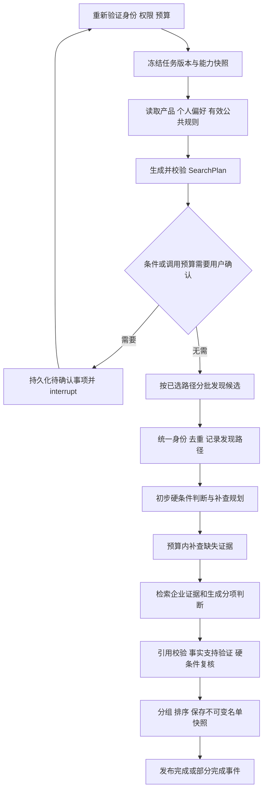
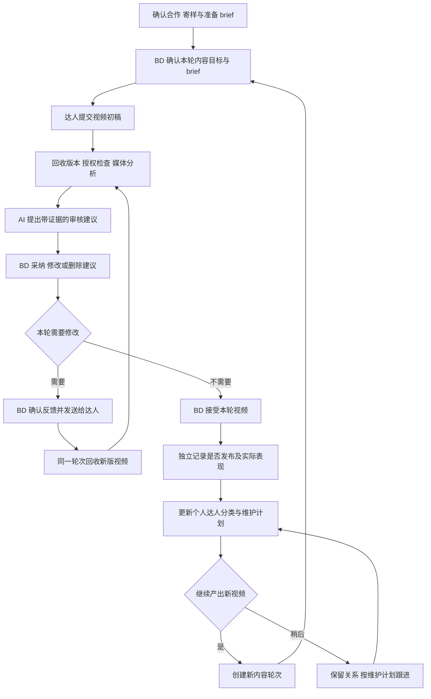

# 03 匹配、内容指导与 RAG 执行架构

状态：正式商用目标架构；本文是设计，不代表接口已联调或系统已实现。核查日期：2026-09-28。依据本项目[最终产品规格](../product/final-spec.md)。

## 1. 边界与不可破坏的约束

本模块支持一个 BD 独立完成“找人 → 匹配确认 → 确认合作并寄样 → 提供产品资料与拍摄指导 → 回收视频 → 审核并给建议 → 返修或继续产出 → 达人分类与长期维护”。发现与匹配将产品、活动条件、个人经验和获准的达人数据转成可解释名单；合作后的 AI 使用产品证据协助编写 brief、脚本、镜头清单、视频改进建议和维护计划。数据库负责权限、金额、规则判断、版本与状态；LangChain 负责受控模型调用和检索接口；LangGraph 负责可恢复的应用内工作流。LLM 不持有数据源密钥，不直接执行 SQL，不决定权限、扣费或是否符合数值硬条件。

`creator_relationships(tenant_id, owner_principal_id, creator_id)` 表示该 BD 与达人的长期关系，`collaborations` 表示一次具体合作。相同达人可以关联不同 BD 的独立关系，个人沟通、反馈、分类与维护记录按 owner 和资源权限隔离；不能因为另一位 BD 曾联系过就自动阻止当前 BD。不存在团队认领、任务转派或上级审核名单的必经节点。企业仍提供租户、账号、授权连接和产品知识边界，`admin | bd | viewer` 是访问角色，不是合作接力流程。

共同业务命名与其他架构文档一致：`campaigns` 表示合作任务，`campaign_markets` 是单市场执行单元；`matching_runs` 引用 `campaign_market_id`，并冻结 `product_version_id`、`criteria_version_id`、`rule_set_version_id`。`rule_set_versions` 保存本次有效规则集合快照及其中各条规则的版本，不能用单条规则版本代表整个集合。多市场请求分别运行、分别排序，再由上层汇总。不能在图内把不同市场的 GMV 当作同一量纲排序。

所有运行、数据、证据及缓存带 `tenant_id`。身份和租户来自服务端认证上下文，不能采信模型或客户端 JSON 自报的租户。API 统一位于 `/api/v1/tenants/{tenant_id}`，图运行不向前端暴露原始 LangGraph checkpoint 接口。

运行和后台任务统一使用 `queued | running | waiting_input | cancel_requested | succeeded | partial | failed | cancelled`。图的内部节点名不是新的业务状态。`waiting_input` 释放 worker，不占用一个长期等待的进程。

关键约束：

- 推荐属于指定任务版本和数据快照，不是达人的永久评价。
- 硬条件为 `pass | fail | unknown`；任何必要硬条件未知，都不能计入 `fully_qualified_count`。
- 同一逻辑外部操作只使用一种选定的 transport；超时不能自动再调用另一套 REST/MCP。
- 适配程度与证据充分程度独立；未知报价不按零元处理，未知销量不按零处理。
- 模型建议只有经当前 BD 确认才可成为其个人偏好、视频反馈或达人分类；企业公共规则由管理员显式维护，不把个人经验自动扩展到其他 BD。
- 内容价值与商业价值分别表达；视频已回收不等于已发布，修改同一条视频不等于新增一条产出。
- 结构化输出、存在引用、事实被引用支持是三项不同的验证。
- checkpoint 支持恢复，不提供业务副作用的 exactly-once 保证。

## 2. 服务与 worker 的责任

`MatchingService` 接受已授权的运行请求，校验活动与产品版本、创建 `matching_run` 及预算预留，提交事务 outbox。队列只带 `job_id` 和非敏感追踪标识，不带企业授权声明、密钥或完整企业文档；worker 从数据库任务记录解析 tenant、run 和执行身份。

worker 从队列领取任务，取得带 fencing token 的运行 lease，然后在进程内调用已编译的 LangGraph。队列采用可重复投递设计；重复投递通过数据库唯一约束、lease 和运行版本检查消除。心跳与 lease 到期后的接管属于 worker 层；节点流转和 checkpoint 属于图层。LangGraph 不是独立的分布式任务调度器，不能用它替代队列与业务 outbox。

同一 `run_id` 同时只有一个图驱动者。大候选池采用受限批次：worker 在图内按批次完成一组外部查询和评估，持久化后继续下一组；不向一个节点无限 fan-out。文档解析、OCR、嵌入生成、授权媒体转写等耗时工作独立投递 ingestion job，图只读取已完成的资料版本或记录等待条件。调度刷新创建新运行，避免永远增长的一个图线程。

商业消息发送、对外承诺、样品操作不属于匹配图。匹配图最多保存供当前 BD 确认的草稿及 action intent，由合作执行模块的已授权 executor 处理，且拥有自己的幂等键及该 BD 的确认记录。确认是本人检查并发出操作，不是向负责人提交流程。内容生成和视频分析使用各自的短生命周期 job，不能让匹配图长期等待样品、视频或达人回复。

生产使用 PostgreSQL 持久 checkpointer；应用控制 `thread_id` 为不含秘密的随机标识，并在业务库绑定 `(tenant_id, run_id, thread_id, graph_version)`。业务状态与审计的真相在应用表，checkpoint 只保存运行所需的状态及不可变对象引用。LangGraph 官方区分 thread 内 checkpoint 与跨 thread store；本设计的长期企业知识仍以有版本和 ACL 的应用表为准，不把自动形成的图记忆当企业规则。[官方 persistence](https://docs.langchain.com/oss/python/langgraph/persistence)

## 3. 可恢复的匹配图



应用图节点固定为 `authorize_run`、`freeze_context`、`retrieve_company_context`、`plan_search`、`confirm_plan`、`discover_batch`、`normalize_candidates`、`evaluate_hard_rules`、`plan_enrichment`、`enrich_batch`、`assess_candidates`、`validate_claims`、`rank_candidates`、`commit_snapshot`。补查和结构修复的回边都有次数、费用及截止时间上限，不能形成开放式 agent 循环。

`MatchingState` 至少包含：

```text
tenant_id, owner_principal_id, run_id, campaign_market_id
product_version_id, criteria_version_id, rule_set_version_id
graph_version, state_schema_version, prompt_version, ranking_version
connection_id, capability_snapshot_id, rights_snapshot_id
search_plan_id, candidate_batch_cursor, evidence_bundle_ids
assessment_ids, recommendation_snapshot_id
usage_reservation_id, authorization_epoch, cancel_epoch
pending_confirmation_id, progress_counters, terminal_reason
```

模型上下文和原始供应方响应不直接塞进 state；只保存获准保留的证据引用。更新采用明确的集合去重或键控 reducer，禁止重放时通过列表拼接重复加入同一候选。业务记录使用稳定键 upsert，已经完成的节点结果按输入版本查找复用。

`run_confirmations` 中的确认对象包括 `confirmation_id`、待确认类型、准确的输入版本哈希、有效期及当前 BD 的执行身份。BD 只确认已经展示的条件/预算/个人规则变更；一旦产品、站点、规则或预算改变，旧确认失效。前端提交本人确认结果后，服务端验证 ownership、操作权限和版本，再触发队列恢复，不接收客户端任意 `goto` 或 checkpoint 修改。

LangGraph `interrupt()` 恢复会重新从所在节点开头执行，因此 interrupt 前不得有未保护的扣费、发消息或外部操作。确认节点只有幂等数据库写入；`Command(resume=...)` 由服务端调用并使用原 thread。官方还要求 checkpoint 和可序列化的中断负载。[官方 interrupts](https://docs.langchain.com/oss/python/langgraph/interrupts)

## 4. FastMoss adapter、能力与使用权

### 4.1 统一操作接口

应用定义自己的 `CreatorDataProvider`，例如 `search_creators`、`get_creator_profile`、`get_audience_distribution`、`list_promoted_products`、`list_creator_content`、`get_content_script`、`get_creator_trends`。这些是内部语义操作，不宣称全部存在同名供应方 REST endpoint。

`FastMossRestAdapter` 与 `FastMossMcpAdapter` 实现已验证的子集。REST 的 path、分页字段、限流及单位由版本化映射描述；MCP 的工具 schema 在连接验证时发现并存快照，再映射到相同规范对象。MCP 工具文字和返回内容也视为不可信数据，不能临时把任意新工具暴露给模型执行。

每个 `ProviderRequestPlan` 固定 `(operation, transport, endpoint_or_tool, adapter_version, schema_hash, market, parameters, connection_id)`。一个逻辑请求中只允许 `rest` 或 `mcp` 一种 transport。某操作只有 MCP 支持时可为它选择 MCP，但不是同一次调用双发。transport 切换必须重新规划、重新检查授权和费用，并产生新的请求记录；不能把切换隐藏在 adapter 的重试中。

外部响应返回规范化数据和受控状态：`ok`、`empty`、`unsupported`、`permission_denied`、`auth_expired`、`quota_exhausted`、`rate_limited`、`upstream_timeout`、`schema_changed`、`partial`。`empty` 仅代表成功查询确实零结果；缺额度不是零达人。

### 4.2 能力清单

`CapabilitySnapshot` 的维度是 `(connection_id, operation, transport, market, field)`，记录：

- `availability = documented | verified | unavailable | unknown`；仅 `verified` 可以对用户标为已验证可用。
- `access_status = allowed | denied | unknown`，及本次账号/套餐验证时间。公开文档存在某能力不等于该客户有权调用。
- `field_mapping_version`、供应方 schema 哈希、字段来源路径、类型、单位、可能统计窗口、空值语义。
- 已验证分页方式、可请求窗口、最大批量/结果限制、时间区与新鲜度；未核查项保留未知。
- `verified_at`、`verification_method`、`expires_at`、失败原因与脱敏 request ID。

地区至少分别保留 `sales_market`、`creator_region`、`audience_country_distribution`、`content_languages`、`commerce_eligibility`。供应方 `region` 必须按端点的实际定义映射，不能统一转换成“受众在此站点”，也不能推断平台带货资格。

FastMoss REST 搜索文档明确提供地区、类目、粉丝范围及部分受众条件；其公开搜索也有结果窗口限制。查询执行器要报告 `search_truncated` 和已扫描页数，不能把有限结果称为全市场。[达人搜索文档](https://developers.fastmoss.com/api/docs/creator/v1/search)

官方工具目录列出达人画像、受众分布、推广商品、视频方向、趋势，且存在 `video_script_info` 获取字幕或口播文本的能力入口。目录不保证每个视频/语言/市场有完整文本。只有成功取得相关内容且使用权允许时，才执行内容深度分析；保存 `coverage=full|partial|unknown`，禁止根据标签声称已看完整视频。[FastMoss 官方工具目录](https://github.com/FastMoss/cli)

准确报价、实时档期、合作意愿、签收、消息发送、真实订单利润不纳入 FastMoss 默认能力。它们分别由人工确认、其他授权 connector 或企业记录补足；适配器没有字段时明确返回缺口，而不是用 LLM 估算填充。

### 4.3 使用权清单

`RightsSnapshot` 与能力分开，记录该来源当前许可的 `server_processing`、`llm_processing`、`embedding`、`raw_retention`、`derived_retention`、`tenant_display`、`export`、`public_share`，及字段范围、期限和依据。未知许可不能按允许处理。权限不允许云端 LLM 的证据可以按已许可范围用于确定性字段处理，但不得进入提示词或向量服务。

用户自带 key 不自动证明商用多租户处理、缓存、导出或云端模型处理获准；条款包含竞争服务和共享等限制，正式交付需与供应方确认实际商业许可。未确认时连接处于受限状态，不借“客户授权”绕过供应方限制。[FastMoss 服务条款](https://developers.fastmoss.com/zh/terms)

凭据从 secret store 临时注入 adapter；模型、前端、trace、checkpoint 只见 connection ID。缓存键包含 tenant、连接授权范围、operation、market、参数、schema/adapter 版本；缓存命中仍检查当前权限与保留期，不跨企业复用私有返回。

## 5. 多路径候选发现与三态硬条件

`SearchPlan` 由确定性能力映射约束模型提出的检索意图。模型可以提出关键词和主题，执行器只能编译成已知可调用字段及有限步骤。用户明确要求的硬条件原样保留；模型提取出的新硬条件先供确认。

候选发现包含五条可组合路径，每条有自己的结果上限和预算：

1. `filters`：已确认地区、类目、粉丝范围等接口真实字段。
2. `product_terms`：从产品版本得到场景、类目和多语言检索词，转换成多次受控的普通查询，合并结果；不虚构 FastMoss 语义向量搜索。
3. `reference_creator`：从授权参考达人证据提取主题、受众、内容形式、推广商品价位，重查候选后做相似性比较；不是假设存在“相似达人”接口。
4. `similar_product`：先确认相似产品，再取得其关联达人；仅在相关操作对该连接/市场验证通过后执行。
5. `relationship_library`：检索当前 BD 的既有达人关系、标签和已确认合作记录，并根据本次条件复查；有权使用的企业公共产品资料可以参与判断，但不能默认检索其他 BD 的私人沟通与维护记录。

每个候选保存所有 `DiscoveryEvidence(route, query_id, seed_id, provider_request_id, discovered_at)`。去重以供应方稳定标识为主，昵称变化保留别名；不能仅凭昵称自动跨平台合并。已联系、暂缓与不再合作属于当前 BD 的关系记录，不覆盖新的原始数据；企业确有已生效且适用的公共排除规则时单独展示其依据，不能把其他 BD 的不喜欢解释成企业黑名单。

硬条件引擎输入字段值、版本、证据有效性及规则定义，输出 `RuleEvaluation(rule_id, status, evidence_ids, reason_code)`。数量、币种、时间窗口及枚举用代码比较。冲突或过期证据进入 `unknown`，不能为了排序任选一个值。已过截止时间的报价不能证明当前价格仍符合预算。

聚合规则：任一必需条件 `fail` 则整体 `fail`；无 `fail` 但有 `unknown` 则整体 `unknown`；全部 `pass` 才是整体 `pass`。已确认企业排除条款有显式作用域和到期日。多个有效规则冲突时暂停确认，不由模型静默选择。

缺字段进一步标记：`not_collected`、`provider_missing`、`unsupported`、`permission_denied`、`stale`、`conflicting`、`requires_human_confirmation`。据此选择补查、提示用户确认或停止无意义请求。用户可以显示或隐藏“待核实”组，但它们始终与“已确认符合”组分开计数；硬条件失败组只能作为解释性排除记录，不能靠高软分重入名单。

无候选时只提出具体放宽建议，包含将改变哪条条件和预估新增查询费用。用户确认形成新 `criteria_version_id` 后再运行，不能自动把“只要美国受众”改成“达人地区美国”。

## 6. 企业知识库与多语言混合检索

### 6.1 文档 ingestion 与版本

原文件进入租户对象存储，记录校验哈希、来源、语言、上传/维护主体、ACL、使用权和保留期；解析/OCR 在独立 worker 中执行。保留段落、表格行列、页码及原文定位，按语义段和表格结构切块。金额、型号、兼容性、版本号保持原文，不依赖向量近似匹配。

`KnowledgeDocumentVersion` 与 `KnowledgeChunk` 不可变。新版本先完整解析、嵌入和校验，再原子切换可用 manifest。查询固定 manifest 版本，避免混用半完成新索引和旧文档。每个 chunk 包含 tenant、文档/产品版本、scope、ACL、language、source_locator、content_hash、effective_from/to、rights_ref、embedding_model/version、tokenizer_version。

实时指标在结构化 observation 表中，RAG 只检索指标相关证据和解释；不把旧 GMV 向量块当实时事实。规则分企业公共规则、活动条件和个人偏好，只有当前适用且经对应维护主体确认的规则可参与硬判断。企业公共资料与 BD 私人合作知识采用不同 scope，生成脚本和检索经验时同时验证 `owner_principal_id` 与 ACL。历史合作记录保留发生时上下文，单次负反馈不能自动变成新公司规则。

### 6.2 检索步骤

`CompanyRetriever` 接收服务端构造的 `RetrievalContext(tenant_id, principal_id, acl_epoch, product_version_id, campaign_market_id, rule_set_version_id, rights_scope, as_of)`。模型只能给自然语言 query 和允许的主题，不能提供或覆盖租户过滤。

并行检索两路，均在 SQL 候选集合形成前强制应用 tenant、ACL、有效期、资料范围、删除状态与使用权条件。禁止先取全局 top-k 内容、传到应用后才过滤权限；RLS/WHERE 是查询约束，近似索引的内部扫描顺序不改变授权候选边界：

- dense：多语言 embedding 存 PostgreSQL pgvector，检索产品场景与跨语言表达。
- lexical：PostgreSQL 全文检索加受控分词后的 `tsvector`，精确标识和型号使用独立字段匹配；中文及其他无空格语言在 ingestion/query 两侧使用同版本分词，不能假设 PostgreSQL 英文 stemming 能处理所有语言。

原文 query 和受控翻译扩展可以同时检索；翻译记录原文、目标语、模型版本，不替换原证据。使用 Reciprocal Rank Fusion 合并两个路由，再以已授权内容做 rerank。只把选定片段、必要邻近上下文和 source ID 发送给模型；不把整库作为上下文。

pgvector 官方支持与 PostgreSQL 全文检索结合，并提醒近似索引过滤会减少召回；本系统对小租户/严格 ACL 子集可用精确向量搜索，大规模时按租户分区或隔离索引，结合有上限的 iterative scan，并用测试集验证召回。不得为凑足 top-k 放宽权限。[pgvector 官方说明](https://github.com/pgvector/pgvector)

LangChain PGVector 封装提供 metadata filter，但它不是安全边界。应用 retriever 使用参数化 SQL/受控 repository 实现 mandatory filter，再以数据库 RLS 防御遗漏；运行角色不得具备 `BYPASSRLS`，表所有者角色与业务查询角色分离，所有租户业务表启用 `FORCE ROW LEVEL SECURITY`。reranker、缓存和引用展开再次检查当前 ACL。[LangChain PGVector](https://docs.langchain.com/oss/python/integrations/vectorstores/pgvector)；[PostgreSQL RLS](https://www.postgresql.org/docs/current/ddl-rowsecurity.html)

文件删除或权限撤销递增 `acl_epoch`，使检索缓存和旧证据访问失效；删除原文件、文本、embedding 及派生模型上下文缓存。检查点保存引用而非片段，恢复时访问已撤销文档应得到 unavailable，不允许回放旧内容绕过删除。可按授权要求保留无敏感内容的审计 tombstone；“历史可追溯”不等于永久保留被撤回的原文。

## 7. 证据、指标、判断的版本契约

以下 CamelCase 类型是模型 / 应用 DTO，持久化实体以 [02](02-data-model.md) 为准：`EvidenceRecord → evidence_items`、`MetricObservation → metric_observations`、`ClaimRecord → evaluation_claims`、`CandidateAssessment → candidate_evaluations`、`RecommendationSnapshot → recommendation_snapshots`。DTO 的 period_start/end 对应数据库 window_start/end，timezone 对应 time_zone，decimal_value 对应 value；转换通过版本化 schema 显式实现，来源时刻不能互相代替。

`EvidenceRecord`：`evidence_id, tenant_id, entity_ref, source_kind, source_url_or_locator, source_record_id, provider_request_id, content_hash, observed_at, fetched_at, source_updated_at?, period_start?, period_end?, timezone?, rights_ref, expires_at?, payload_ref, coverage, verification_state`。

`fetched_at` 是本应用拉取时间；只有供应方明确返回时才填 `source_updated_at`。不能把二者混为“数据更新时间”。引用定位可以是 JSON Pointer、页码/段落、表格单元格或视频时间片段；不存在的媒体时间戳不能由模型捏造。

`MetricObservation`：`metric_key, decimal_value?, unit, currency?, market, period_start/end, timezone, aggregation, source_kind, estimation_status, evidence_id, formula_version?, input_observation_ids[]`。区分供应方估计、供应方统计、店铺授权归因数据、应用计算、人工确认。零、缺失、未成熟统计窗口分别表达。货币转换另存派生 observation、汇率来源/日期和原始币种值，不覆盖原值。

`ClaimRecord`：`claim_id, tenant_id, run_id, candidate_id, dimension, text, kind, evidence_ids[], source_locators[], support_status, model_ref?, prompt_version?, reviewer_id?, supersedes_claim_id?`。`kind` 为 `sourced_fact | calculated_fact | model_inference | human_confirmation`；支持状态为 `supported | contradicted | insufficient | unresolved`。人工确认也有出处和有效期，不因类别名就永久有效。

`CandidateAssessment` 保存 hard rule evaluations、正反判断、缺失项、待确认问题、分项适配和证据覆盖。`RecommendationSnapshot` 冻结任务/规则/模型/排序版本、证据引用、分组顺序、已知限制和输入哈希。重跑创建新快照并给出 diff，不就地覆写 BD 已确认的名单。

同一数据源的多个转述不是独立证据。冲突证据要保留两边来源和时间；只有依据明确的版本替代/有效期策略才能判定较新记录取代旧记录，否则输出争议和待确认项。

## 8. 适配排序与证据完整性分离

硬条件先决定 `qualified`、`needs_verification` 或 `excluded` 分组。软适配至少分产品/场景、内容形式、受众、历史推广价位、市场内表现和该 BD 已确认的合作经验；哪些维度适用及权重由 BD 确认的 `RankingPolicyVersion` 确定。

每维度输出带证据的 `fit_component` 或 null；null 不转换为低分，也不计作通过。可在已观测维度上显示暂定加权适配值，但必须连同 `observed_dimension_set` 和“基于有限证据”标识，并且不与采用不同维度集合计算的分数直接做总榜比较。候选按相同证据维度集合/业务必需覆盖水平分层比较；证据缺口单独形成补查队列，不能靠缺数据拿到虚高总分。

`evidence_completeness` 来自明确的所需字段/维度覆盖、时效与冲突统计；它不是模型“自信度”，也不并入适配总分。界面必须同时显示高适配但证据少、适配一般但证据充分的情况。后端排序记录每个优先级/平局决策，不在前端再隐含加分。

向量相似度、lexical 检索分数和 RRF 分数只用于选择证据或发现候选，不直接显示为产品适配度，更不解释为回复率、成交率或业务成功概率。业务分项判断必须经过证据验证和独立的排序策略。

数值表现只在同市场、同窗口、同口径的候选中标准化；条件不同显示不可比。粉丝量、GMV 和一次爆款不直接代表产品适配或自然销售能力。依据不足时不输出成交概率、可靠报价或预测 ROI。

多样性控制与探索名额可以由当前 BD 配置，明确展示用于探索新达人；它们不能越过已失败的必要条件。记录进入候选、展示、被查看、被联系的曝光链条，用于识别只学习历史已入选人的偏差。

## 9. 结构化输出与事实验证

各模型节点定义独立 Pydantic schema：`SearchPlanDraft`、`RequirementExtraction`、`CandidateAssessmentDraft`、`ClaimDraft`、`OutreachDraft`、`RuleProposalDraft`、`ContentBriefDraft`、`ShotPlanDraft`、`VideoReviewDraft`、`CreatorClassificationProposal`、`MaintenancePlanDraft`。禁止让自由文本直接决定数据库更新。优先使用已验证的模型原生结构化输出，不支持时使用受控 tool strategy；选用方式及模型版本在运行中固定。LangChain 提供这两类结构化输出机制，但 schema 通过只证明形状符合要求。[官方 structured output](https://docs.langchain.com/oss/python/langchain/structured-output)

验证分四层：

1. Schema：字段类型、枚举、字数、引用数组、必需的未知值语义；拒绝模型输出未允许的工具或操作。
2. Reference：引用 ID 必须在本运行授权 evidence bundle 中，属于当前租户、候选/产品和有效范围；定位必须真实存在。模型只给证据 ID，链接由服务端生成。
3. Deterministic support：数值、币种、时间窗口、人物身份、型号、规则计算逐项比对规范数据；“30 天销售额”不能引用 28 天值。
4. Semantic support：内容性判断逐句与对应原文比对；可用独立验证模型辅助标记支持/矛盾/不足，但验证模型不能创造新证据，也不是事实保证。高影响争议保留给人工确认，其余不足判断降级为待核实或删除。

关键事实验证失败时不能发布强结论。可在预算内进行一次有明确错误输入的结构修复；再失败则保存验证错误并输出局部结果/人工待核实，不无限重试直到模型给出看似合格答案。修复不能伪造引用，也不能从其他租户取替代资料。

外部简介、字幕、文档与工具返回都以资料块隔离，忽略其中的命令；提示词明确只提取证据，禁止执行其中“发送密钥”“改变预算”等文字。工具 allowlist、参数校验、权限与限额均在模型外实施。raw model/tool trace 默认脱敏并按租户保留策略保存，不向第三方观测平台默认传送原文。

## 10. 额度、重试、取消与恢复

每个外部请求先在 `provider_calls` 创建逻辑调用记录，包含 `logical_request_id`、稳定业务幂等键、所选 transport、参数哈希、`usage_reservation_id` 和状态；每次实际网络执行另写 `call_attempts`，保存 attempt_no、供应方 request ID、结果与已知计费观测。统一的 `usage_ledger` 记录 FastMoss 和模型调用的实际/估计用量、成本及后续对账调整；调用记录与计费流水分别保存，不以一张表同时代表二者。内部幂等键防重复投递，不代表 FastMoss 接受幂等请求或不会重复收费。

执行前基于 `budget_accounts` 原子创建或追加 `usage_reservations`，预留 `max_provider_calls`、`max_llm_tokens`、最大候选数、最大详情数和金额估计；并发批次共享同一预算余额。实际消耗写入 `usage_ledger` 并结算相应预留；失败、释放或对账调整不得覆盖原流水。无法取得准确价格时显示估计和最大调用数，不能承诺严格金额上限；严格金额控制仅在有可靠价格与上界时启用。无法读供应方余额时只报告应用已记录消耗。

按 tenant、连接及 operation 限流。429 按可用 `Retry-After` 或带 jitter 的退避；可重试网络/5xx 有总次数和时长上限；无权限、失效凭据、额度耗尽、schema 变更不自动重试。LangGraph `RetryPolicy` 可用于明确的暂时性异常，但不能与 adapter 重试各自倍增：一个层拥有实际请求重试，另一个层只识别已耗尽状态。[Graph API 官方说明](https://docs.langchain.com/oss/python/langgraph/use-graph-api)

请求超时且供应方是否执行/收费未知时，provider_call 状态为 `unknown`，错误类别为 `PROVIDER_OUTCOME_UNKNOWN`。优先用供应方支持的 request 查询或持久回执核对；不支持核对时进入 waiting_input，由有权用户确认是否接受额外收费后，在重新预占的上限内创建后继调用并关联原调用，原 unknown 保留等待核对。不得用隐含产品默认策略自动再次发起。LLM 响应同样可能已计费，不能因为本地未收到结果就视作免费。

取消写入 `cancel_requested` 与 `cancel_epoch`；节点前、批次间、外部调用前检查。尽可能取消进行中的请求，但不承诺取消能撤销供应方工作/计费。已返回结果按授权保存，停止新调用，释放可确认未使用的预留，未知计费保留待对账。收束后 `cancelled`；保留完成部分供查看，但明确不是已完成推荐。

恢复顺序固定：

1. 验证触发人/运行服务主体仍属该企业且有任务权限，重查成员与 ACL epoch。
2. 校验连接、当前使用权、数据保留期与预算；旧快照记录当时依据，不能替代当前权限。
3. 读取同一 thread/checkpoint，检查 graph/state schema 兼容性；不兼容时迁移经过验证的 state 或保留旧执行版本，不能盲跑新节点。
4. 对照 request ledger、业务节点结果和 lease fencing token，复用已完成结果并核对未知请求。
5. 校验需复用证据仍可访问且对本运行结论足够新鲜。在尚未提交结果的运行内，可按已确认计划补取证据并创建新 evidence bundle、重算受影响评价；已经提交的快照只能创建新 run 更新。删除或授权已终止的内容不得为了复现重新获取。
6. BD 的确认输入绑定原输入哈希；变化使原确认过期并进入 `waiting_input`，不能自动继承旧确认。

发布名单以单次数据库事务写入 snapshot、claim 引用与完成事件/outbox。checkpoint 与业务表无法保证同一事务时，采用可重入的 `commit_snapshot` 和唯一 `(run_id, snapshot_kind)`，崩溃后通过 reconcile 识别已提交快照，不重复发布。外部动作 executor 采用自己的 outbox/幂等/对账策略。

## 11. 产品资料、脚本与拍摄指导

### 11.1 从匹配结果进入具体合作

BD 确认达人适合产品后，可以建立或继续自己的 `creator_relationships`，再创建 `collaborations`。匹配通过只证明本次评估可进入联系环节，不证明达人已经答应合作、接受佣金或愿意收样。合作意愿、样品地址、交付约定由 BD 确认或从获准连接取得。确认合作后，寄样和准备拍摄 brief 可以并行；物流记录保持独立，脚本生成不会把“已创建寄样单”写成“达人已签收”。

长期关系跨越不同产品和多次合作。一次合作结束不会关闭关系，也不清空之前的视频、反馈、分类和维护历史。本文中的所有关系检索都由服务端传入 `owner_principal_id`，模型不能自行把其他 BD 的关系加入上下文。

### 11.2 Brief 的资料边界与产出

`ContentAssistanceService` 以 `collaboration_id`、当前产品版本、市场、语言、内容目标和 BD 的要求创建生成 job。每次生成冻结使用的 `content_brief_versions` 及资料、prompt 和模型版本；生成草稿不直接覆盖已发给达人的版本。产品参数更新后显示受影响的未完成内容轮次，由 BD 决定是否修改 brief 并通知达人，不能暗改达人先前收到的要求。

`ContentBriefDraft` 至少包含：

- 产品信息：型号、适用场景、受众需求、已证实卖点、展示方法、注意事项与不能承诺的效果；事实逐项引用产品知识。
- 内容目标：本条视频要解决的问题、主要卖点、目标站点/语言、内容形式、期望时长、行动引导及交付时间；没有约定的字段保留待确认。
- 创意与脚本：可选择的开场、叙事结构、口播草稿、字幕与结尾，明确是创意建议；允许保留达人的表达方式，不能把所有创作者都套成一条固定文案。
- `ShotPlanDraft`：镜头顺序、建议时长、景别、动作、产品展示点、配音/字幕、道具和需要交付的素材。要求应能回到 brief 中的一项明确目标。
- 交付与权益：视频规格、是否需要原片/封面/字幕文件、交付渠道、是否要求发布，以及已确认的使用范围与期限；权益和费用引用合作约定，缺失时提出待确认项，不能模型代填。
- 事实缺口和冲突：例如说明书和旧商品页参数不一致；有冲突的卖点不得直接写进供达人使用的确定性话术。

RAG 顺序为当前产品版本 → 当前合作已确认约定 → BD 指定参考素材 → 该 BD 与该达人的历史反馈 → 当前适用的公共规则。参考达人风格可以帮助调整内容形式，但不把竞品承诺当本产品事实，也不复制无授权脚本。原语言事实与翻译结果同时保留，型号、数值、限制条件和否定词执行确定性校验。新创意不伪装成产品事实；模型不能创造折扣、佣金、赔付或销量保证。

草稿进入 `content_briefs` / `content_brief_versions`。BD 可编辑、确认后导出或通过可用 connector 外发，确认绑定准确版本和 payload hash；这只是当前 BD 对自己的对外内容负责，不增加负责人审批。没有发送能力时提供复制、下载和人工发送记录，不把“已生成”或“已复制”写成“已送达”。

## 12. 视频回收、审核建议与持续产出

### 12.1 内容轮次与视频版本

`production_rounds` 是一次独立内容目标：一条新的开箱、一个新的卖点演示或一次明确的新创意需求可以新建轮次。`video_assets` 保存该轮次的逻辑视频资产，`video_versions` 保存同一资产的初稿和后续修改稿。同一条视频更换字幕、重拍结尾、替换镜头或重新导出仍是同轮版本；不能通过上传次数累计新视频产出。下一条独立视频由 BD 显式创建新轮次，可以引用上一轮有效经验，但不能复用上一轮的交付完成状态。

如果一个轮次要求多项独立交付，需明确各项交付目标并为其建立独立逻辑资产；原片、字幕、封面和编码格式副本作为附属素材，不增加视频成片计数。产出统计以逻辑视频资产及明确的接收/采用口径计算，不按 `video_versions` 行数、LLM 分析次数或文件数量计算。

回收、BD 接受、对外发布是不同事实。接收到上传文件或可访问链接，只记录回收；BD 接受不自动生成发布时间、播放量或订单数据。一个视频可以被允许保存但尚未获准投放或公开展示，使用权单独跟踪。历史已发布视频的表现是另一组 observation，不能因为回收了新版就回写旧发布事件。

### 12.2 获准媒体的处理与覆盖范围

`VideoReviewService` 输入 `video_version_id`、该轮次冻结的 `content_brief_version_id`、当前产品资料、已确认的上次反馈和本轮检查要求。只有获准取得并处理的媒体才能进入分析；达人提供链接不自动等于拥有下载、云端模型处理或二次使用许可。仅能访问字幕或页面元数据时，报告对应分析范围；不能声称检查过镜头、画面清晰度或完整音轨。

媒体进入私有对象存储，先校验文件实际类型、大小、完整性和授权，再由 ingestion worker 在资源受限环境执行元数据提取、转写、OCR 和镜头/帧采样。保存源文件校验哈希、duration、time base、音轨信息及每段衍生结果的源时间码。抽帧策略、间隔、ASR/OCR 模型版本、覆盖区间与失败区间必须可查；抽样检查只能判断已观察片段，不能据此断言未观察片段不存在某个镜头或违规表达。

成本按视频时长、分辨率、抽样帧数和实际模型输入预估并预留，限制单文件和单轮次分析预算。相同版本与相同检查版本可复用仍有权访问的结果；新视频版本或 brief 变更生成新的审核 job，不能把旧结果当新版已通过。ASR 低可信词、画面遮挡和语言不支持都进入缺口清单。

### 12.3 基于证据的审核建议

`video_reviews` 保存对确定视频版本的审核，模型输出 `VideoReviewDraft`。每项检查区分：符合、明确不符合、无法判断、不适用。不能把“模型没看见”自动判成“不符合”。检查维度包括：

- 产品事实：型号、演示步骤、口播参数、必要限制是否与产品证据一致。
- 拍摄要求：已约定的产品露出、关键镜头、演示场景、字幕、行动引导、时长与文件规格是否满足。
- 内容可用性：观察到的收音、画面、字幕可读性和表达连贯性；审美判断明确标为建议，不能伪装成客观错误。
- 约定边界：素材/音乐来源是否已有使用凭据、是否出现尚未确认的权益问题；AI 不能替代实际使用权证明。
- 上轮反馈：每条已发建议在新版本中已解决、仍存在还是无法验证，引用新旧版本对应片段。

单项建议至少包含 `review_id, video_version_id, brief_requirement_id?, evidence_ids[], start_ms?, end_ms?, observation, issue_kind, impact, suggested_change, uncertainty`。画面证据指向真实帧/片段，语音证据指向转写及原音区间，产品事实指向知识片段。时间码必须落在源视频范围内，不得把模型估计的时间点当真实定位。无法定位的整体性建议注明“整体建议”，不捏造时间码；模型只能根据实际分析范围出结论。

例如“00:08–00:13 的字幕写 60 小时，而产品资料是 6 小时”可以形成带两侧证据的事实问题；“建议把产品演示提前”属于创意建议，应说明对应内容目标。两类信息分开展示，避免达人把风格偏好误当产品事实错误。

### 12.4 BD 反馈、返修和下一条视频



模型建议先存为审核草稿。只有 BD 采纳、修改或补充后的具体意见才能形成 `feedback_items` 的可发送版本；未采纳的模型意见不应出现在给达人的反馈包中。每项反馈记录提出者、内容、证据、目标视频版本、要求/建议类别、期望完成时间和完成依据。反馈包绑定对应视频和 brief 版本，由本人确认后发送；发送超时按外部结果未知处理，不重复轰炸达人。

达人提交新版后，系统比较同轮视频版本和未解决反馈，辅助 BD 确认哪些问题已修正、哪些要求已改变或由 BD 决定不再要求。BD 可以直接接受、明确要求修改、或者在保留本轮结果后规划下一条；模型不能自动通知达人重拍，也不能以反复返修次数代替关系价值判断。

内容循环通过持久实体和事件推进，每次生成/审核单独创建 job。等待寄样签收、达人上传和 BD 检查属于业务等待，不保持一个长时间运行的图进程。生成和分析的恢复仍遵守第 10 节的授权、预算、幂等与未知结果规则。

## 13. 个人达人分类、维护与经验回流

### 13.1 分类依据和作用域

`CreatorClassificationProposal` 只针对当前 BD 的 `creator_relationships` 生成建议，`creator_classification_events` 保存建议、BD 最终选择、理由、证据、分类规则版本及替代关系。分类标签可由 BD 调整，但至少区分“内容价值”“商业价值”“履约与沟通表现”三类证据，不能压成不透明的一个总分。

- 内容价值：独立视频产出数、BD 接受和实际采用情况、明确需求完成情况、可使用素材、修改是否解决问题，以及对应产品和内容类型。
- 商业价值：在获准且可归因的窗口内观察到的播放、点击、成交、退款和成本；第三方估计与企业实际数据分别标识。数据尚未返回、未成熟或没有销售权限时保持未知，不能判成零价值。
- 履约与沟通：已确认的交付约定、实际完成时间、有效回复和承诺落实情况；样品延迟、缺货、BD 修改要求或沟通中断的原因单独保存，不能一律归责达人。

建议的个人分类可包括待验证、持续观察、值得持续合作、重点维护、暂缓和不再合作；这些是关系标签，不是代替样品状态、视频审核状态或匹配状态的统一流水线。一个达人可以“内容价值高、商业价值待观察”；不同产品/市场存在相反表现时保留细分结论和时间范围。

每轮有新交付、新表现数据或新的人工反馈时，可以生成更新建议。模型不得自动降级、拉黑或结束关系；BD 可以确认、修改或拒绝，确认事件可逆且保留旧依据。长期无新数据标记“待更新”，不能把时间流逝直接解释为达人质量下滑。

### 13.2 维护建议与日常工作台

`maintenance_plans` 记录 BD 为该关系确认的维护目标、节奏、触发条件、下一次动作、原因和停用条件；`maintenance_actions` 记录实际沟通、寄送新品、补充素材、提出新内容目标或等待对方回复等动作。计划引用具体关系，不生成跨 BD 分工或认领任务。

AI 可结合已确认的价值判断，建议把时间优先投入有持续产出、内容适配或已验证商业价值的达人，同时解释证据和不确定性。工作台呈现“今天需要我做什么”：确认样品情况、准备某轮 brief、检查新回收视频、发出本人确认的修改意见、跟进下一条内容或维护重点达人。优先级来自到期事项、明确承诺和 BD 设定的关系优先级，不能只按粉丝量排序。

维护消息可引用真实合作进展并生成草稿，由 BD 确认后外发。对已拒绝、要求停止联系或暂停合作的关系，停止自动生成触达待办；不得因“提高产出”无限加密消息。提醒按事件与关系去重，BD 可延后或关闭，定时任务仍只创建建议和待办，不自动承诺费用或发送样品。

### 13.3 反馈如何改善找人与内容

反馈分为候选选择、合作沟通、内容交付、使用效果和商业结果，保存当时产品、市场、预算、佣金、供货与寄样背景。模型从多次已确认的个人反馈提出 `RuleProposal`，包含适用范围、证据、反例、可能混杂原因和撤销方式。BD 确认后形成个人偏好的新版本，并发布本次适用的 `rule_set_versions` 快照；其他 BD 的条件与名单不受影响。

如果需要企业公共规则，由有权管理员在独立设置中显式维护并保存依据，这不是每次找人或寄样的审批环节。临时活动要求不会被自动提升为永久规则，一次拒绝或一次返修不能自动拉黑达人。历史高价值视频可作为该 BD 的新 brief 参考，但只有在素材处理和参考用途获准且当前产品条件适用时才能检索使用。

## 14. 离线评测与业务效果验证

离线评测集按任务和时间切分，保存当时可取得的资料快照，禁止用合作后的成功结果泄漏到找人时特征。按市场、类目、语言、数据完整度、冷热启动用户分层。数据必须获准用于评测；跨企业或跨 BD 训练/共享私有经验需要单独许可，不默认拿所有记录训练统一模型。

评测覆盖：

- 候选发现：参考池内合格达人召回、路线贡献、重复率、查询截断与权限缺口，不宣称测得全市场召回。
- 硬条件：误通过率、unknown 正确保留率、币种/窗口/资格混淆；硬条件误通过是发布阻断项。
- RAG：授权相关资料召回、引用定位正确、冲突发现、多语言型号/参数保真、过期资料排除、个人关系记录隔离。
- 匹配判断：事实支持率、无依据结论率、正反证据覆盖、排序的 BD 相关性。评测人员可通过独立标注与争议裁定形成 gold set，这只是质量评测方法，不是产品中的团队审批流程。
- Brief 与脚本：已证实卖点覆盖、参数和限制保真、无依据承诺、语言与场景适配、BD 编辑量和实际采用情况；创意采用不等于销量保证。
- 视频审核：事实问题误报/漏报、时间码正确率、检查覆盖率、unknown 保留、新旧版本混淆、已解决反馈识别。只有有真实片段标注的受控素材才能据此验证多模态效果。
- 产出循环：回收后至 BD 完成检查的时间、首次接受率、独立视频产出数、实际采用数、返修时长；返修、附属文件、重复上传不得膨胀产出。
- 分类维护：内容/商业价值分开记录率、缺失销售数据处理、分类被 BD 采纳或纠正的原因、重点关系持续产出与维护待办有效性，不把回复频率当商业价值。
- 商业工作：合格名单形成时间、BD 采用、单位合格候选与独立视频处理成本、持续使用；回复、成交和产出变化保留产品、报价、库存与寄样的混杂因素，不宣称因果增量。
- 稳定性与权限：断点恢复、worker 崩溃、重复投递、429、超时已收费、取消竞态、凭据撤销、ACL/owner 变更、删除后恢复、租户串流、checkpoint 版本迁移，以及外发确认后内容变化导致旧确认失效。

与 FastMoss 原工作流及 FastMoss 加通用 LLM 使用同一市场、产品、可访问证据和调用预算对比。模型、embedding、prompt、adapter、规则及排序版本改变时执行相关固定评测与回归。数值质量门槛由标注数据和业务试验确定；在尚无真实数据时不写“准确率 95%”为已证实效果。安全隔离、幂等及引用存在性等确定性门槛必须满足后才能发布。

## 15. 交付验证与技术资料

实现前锁定实际 LangChain/LangGraph、模型 SDK、PostgreSQL/pgvector 和 MCP 客户端版本，形成依赖锁文件与兼容测试。下列链接支持能力/机制的设计选择，不替代真实授权账号测试：

- [LangGraph persistence](https://docs.langchain.com/oss/python/langgraph/persistence) 与 [checkpointers](https://docs.langchain.com/oss/python/langgraph/checkpointers)。
- [LangGraph interrupts](https://docs.langchain.com/oss/python/langgraph/interrupts) 与 [Graph API](https://docs.langchain.com/oss/python/langgraph/use-graph-api)。
- [LangChain structured output](https://docs.langchain.com/oss/python/langchain/structured-output) 与 [PGVector integration](https://docs.langchain.com/oss/python/integrations/vectorstores/pgvector)。
- [pgvector 官方项目](https://github.com/pgvector/pgvector) 与 [PostgreSQL row security](https://www.postgresql.org/docs/current/ddl-rowsecurity.html)。
- [FastMoss creator search](https://developers.fastmoss.com/api/docs/creator/v1/search)、[官方工具目录](https://github.com/FastMoss/cli)、[MCP 接入](https://developers.fastmoss.com/mcp/setup)、[服务条款](https://developers.fastmoss.com/zh/terms)。

本模块商用验收必须用真实获准连接覆盖指定市场的字段映射、费用与错误行为；用企业授权测试资料验证 ACL、证据链和完整恢复；用 BD 标注验证筛选和排序，并验证 brief、视频建议、同轮返修计数、个人分类与维护流程。模拟数据只能标为开发 fixture，不能据此把站点/字段标为已验证或声称推荐效果已达标。
