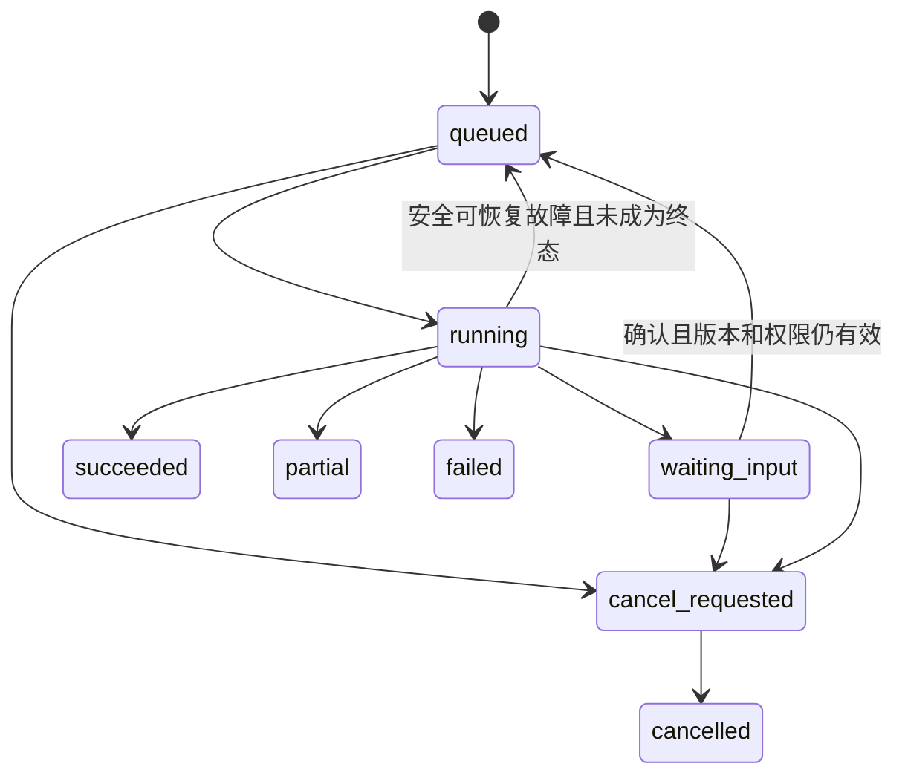

# 04 · API 契约与前端交互架构

本章是拟实现接口与界面设计，按单个 BD 独立完成达人发现、合作、持续视频产出和关系维护组织。端点名称是本应用的 API，不代表 FastMoss 或 TikTok 存在同名接口。数据库实体以 [02](02-data-model.md) 为准，安全边界以 [05](05-security-operations.md) 为准。

## 1. API 通用规则

企业资源前缀为 `/api/v1/tenants/{tenant_id}`，以下接口清单用 `T` 表示此前缀。账号会话使用 `/api/v1/auth`，当前用户使用 `/api/v1/me`。浏览器同源访问，使用 HttpOnly 会话 Cookie；状态变更携带同步 CSRF token。供应方回调使用独立验签入口，不能共用浏览器权限逻辑。

服务端依次执行认证、当前企业 membership、动作权限、资源 ACL、字段权限、业务校验。其他企业或不可知资源默认返回 404，避免泄露存在性；已知资源的明确动作无权限可返回 403。账号失效返回 401，前端清理企业敏感缓存，不无限刷新请求。

GET 只读。创建同步资源返回 201 与 Location；长任务返回 202，表示接受执行，不代表供应方成功。PATCH 修改可变实体需要 `If-Match`；API `revision` 对应数据库 `lock_version`，响应 ETag 如 `"7"`。版本不匹配返回 412；业务冲突返回 409。不能通过整表 PUT 覆盖别人已完成的操作。

创建付费运行、导出、外部动作与付款等命令需要 `Idempotency-Key`。唯一作用域为企业＋执行主体＋逻辑操作；存请求摘要及结果引用。同 key 同请求返回原结果，同 key 不同请求返回 409。幂等记录期限至少覆盖请求可重试窗口，外部动作另有持久业务唯一键，不能因 API 缓存过期再次发送。

列表采用不透明 cursor + 固定排序 tie-breaker，默认 limit=30、最大100；返回 `next_cursor`。排序字段和过滤操作符为白名单，拒绝任意 SQL/DSL 表达式。结果列表固定 recommendation snapshot；页面翻页不能混入另一轮刚刷新数据。

金额 JSON 使用字符串，时间为 RFC3339 UTC，日期和 IANA time_zone 单独表达。`null` 必须配合 availability 或 missing_reason，不用空字符串、零和未知混用。供应方 ID 原样保留为字符串。

错误采用统一 Problem JSON，至少包括 `type`、`title`、`status`、`code`、`detail`、`request_id`、`retryable` 和安全的字段错误；不得包含 Key、SQL、完整供应方响应或跨企业身份。HTTP 429 表示本应用限流；已接受作业中的供应方限流写入 job 的 provider error，不把成功的 GET job 返回成 HTTP 429。

错误类别包括：`VALIDATION_FAILED`、`RESOURCE_CONFLICT`、`STALE_REVISION`、`CONNECTION_AUTH_EXPIRED`、`CAPABILITY_UNAVAILABLE`、`PROVIDER_QUOTA_EXHAUSTED`、`PROVIDER_RATE_LIMITED`、`PROVIDER_SCHEMA_CHANGED`、`PROVIDER_OUTCOME_UNKNOWN`、`BUDGET_EXCEEDED`、`RIGHTS_RESTRICTED`、`EVIDENCE_UNAVAILABLE`。前端按类别展示下一步，不能统一显示“查不到达人”。

## 2. 权限模型在交互中的落点

采用 permission + 所有者 / ACL，默认角色只有 `admin`、`bd`、`viewer`。前端通过 `/me` 和资源响应中的 `allowed_actions` 展示控件；每次执行仍由服务端重新检查。企业是账号、连接、费用和许可边界；业务操作主体是独立 BD。

- `admin`：管理成员、连接、应用账单、保留政策和支持授权；管理 Key 只可替换 / 撤销，不能读取原文。此角色不默认取得 BD 私有客户关系、通信、报价或视频的读取权限；admin 角色同时包含处理本人业务的 BD 动作权限，不扩大跨 owner 可见性。
- `bd`：独立管理自己拥有的找人任务、个人名单、达人关系、合作、寄样、拍摄任务、视频反馈、分类及维护计划；在已授权连接与额度范围内查询和外发，由本人确认。
- `viewer`：只能读取明确获授的资源，不能修改、导出、发起付费查询、管理凭据或执行对外动作。

私有业务资源包含 `owner_principal_id`，创建时由服务端从当前主体确定，客户端不能代填另一个 BD。`creator_relationships` 的唯一范围是 `(tenant_id, owner_principal_id, creator_id)`；同一达人可以出现在不同 BD 的个人关系库中，彼此不泄露存在性、联系记录和分类。导出、费用与对象访问同时检查所有者和各自独立权限。基础公共产品资料可经明确 ACL 授权读取，派生内容不能扩大其可见范围。

权限名按业务动作组织：`products.write/confirm`、`campaigns.manage/run`、`shortlists.write`、`creator_relationships.write`、`collaborations.write`、`content_briefs.write/confirm`、`production_rounds.write`、`videos.review`、`creator_classifications.write`、`maintenance.write`、`outbound.confirm/send`、`rules.confirm`、`exports.create`、`connections.manage`、`billing.manage`、`members.manage`。确认外发是执行者核对具体内容和成本，不建立上级审核关卡。本人确认不能绕过实际连接许可、额度或被删除数据的访问限制。

## 3. 完整接口目录

此目录覆盖业务命令及查询。具体字段由实施时的 Pydantic schema 生成 OpenAPI 并同步客户端；分页 / audit / tenant 约束适用于每个列表和变更端点。

### 3.1 账户、企业与成员

- `POST /api/v1/auth/register`、`/verify-email`、`/login`、`/logout`、`/recovery/start`、`/recovery/complete`：注册、验证和恢复；回复不泄露邮箱是否注册。
- `GET /api/v1/auth/csrf`、`GET /api/v1/me`、`GET /api/v1/me/sessions`、`DELETE /api/v1/me/sessions/{id}`：会话、CSRF 与设备撤销。
- `POST /api/v1/auth/mfa/enroll`、`/mfa/confirm`、`/mfa/challenge`；MFA 撤销 / 恢复必须二次验证并审计。
- `GET/POST /api/v1/tenants`：列出所属企业 / 创建企业；创建同步建立管理主体与初始权益。
- `GET/PATCH T/settings`、`GET T/members`、`POST T/invitations`、`DELETE T/invitations/{id}`、`POST /api/v1/invitations/accept`。
- `PATCH T/members/{id}`、`POST T/members/{id}/revoke`、`POST T/membership/leave`：改角色、撤权和退出。最后一名管理员必须先转交管理权。
- `GET/PUT T/resources/{resource_type}/{id}/grants`：仅注册资源类型，禁止通用任意表名访问；授权修改需资源管理权；管理员不能给自己增加 BD 私有业务 ACL。

### 3.2 产品、文件与知识

- `GET/POST T/brands`、`GET/POST T/products`、`GET/PATCH T/products/{id}`、`POST T/products/{id}/archive`。
- `GET/POST T/products/{id}/versions`、`PATCH T/product-versions/{id}`：只能编辑 draft；`POST .../confirm` 发布确认版本，`GET .../diff?against=...` 对比版本。
- `POST T/uploads`、`POST T/uploads/{id}/complete`、`DELETE T/uploads/{id}`：取得限定大小、类型、对象键和有效期的上传许可；完成后服务端检查对象实际属性。
- `POST T/documents`、`GET T/documents/{id}`、`GET/POST T/documents/{id}/versions`、`GET T/document-versions/{id}/extraction`、`POST .../review`：文档归档、解析及审核。
- `GET T/knowledge-conflicts`、`POST T/knowledge-conflicts/{id}/resolve`：展示相互矛盾的值、版本与证据，记录明确决议。
- `POST T/knowledge/search`：仅检索允许的资料，返回来源和版本；`POST T/documents/{id}/deletion-requests` 阻断访问并异步清除。
- `GET T/objects/{id}/download`：按当前权限和生命周期下载；敏感对象经认证网关。普通已许可对象可使用极短期签名 URL，但其有效期内不能保证即时撤回，不能用于要求即时撤权的资料。

### 3.3 连接、能力和费用

- `GET/POST T/connections`、`GET T/connections/{id}`：创建受支持供应方类型连接，密钥只在 HTTPS 提交时接受，响应仅返回掩码。不能接收任意外部 MCP URL。
- `POST T/connections/{id}/validate`：返回202验证作业；展示拟调用操作和可能费用，不把验证当作必然免费。
- `POST T/connections/{id}/credentials/rotate`、`POST .../revoke`：新密钥验证后切换；撤销立即停止新调用。
- `GET T/connections/{id}/capabilities`、`GET .../usage`、`GET .../calls`：按市场、操作、字段查看能力与错误；调用详情脱敏。
- `GET/POST T/budgets`、`PATCH T/budgets/{id}`、`GET T/usage-ledger`、`GET T/usage-reservations`、`POST T/provider-calls/{id}/reconcile`：调用上限、费用与未知结果核对。人工核对需证据，不能将 unknown 直接改零。

### 3.4 多站点任务与运行

- `GET/POST T/campaigns`、`GET/PATCH T/campaigns/{id}`、`POST .../archive`、`POST .../copy`：复制配置不复制执行确认、外发许可或已失效证据。
- `GET/POST T/campaigns/{id}/markets`、`GET/PATCH T/campaign-markets/{id}`：创建单站点执行单元。
- `GET/POST T/campaign-markets/{id}/criteria-versions`、`PATCH T/criteria-versions/{id}`、`POST .../confirm`：保存并确认条件。
- `POST T/campaign-markets/{id}/search-plan-drafts`：LLM 生成待确认检索意图；`POST T/search-plans/{id}/confirm` 固定版本。计划只含已映射到真实能力的操作。
- `POST T/campaign-markets/{id}/estimates`：按输入版本、连接能力和价格版本估算；返回缺失、限制、费用上界是否可靠、过期时间及 estimate_id。
- `POST T/campaign-markets/{id}/matching-runs`：提交确定版本、有效 estimate_id、明确额度与幂等键；返回202。多站点通过应用用例批量创建独立运行，响应逐项报告，不暗示跨供应方原子成功。
- `GET T/matching-runs/{id}`、`GET .../candidates`、`GET .../snapshot`、`GET .../diff?against_run_id=...`：进度、固定候选集及变化原因。
- `POST T/matching-runs/{id}/cancel`、`POST .../confirmations/{confirmation_id}/decision`：请求取消与本人待输入确认；只允许确认展示过的输入哈希。
- `POST T/matching-runs/{id}/reruns`：终态重跑产生 parent_run_id 新运行。条件变更先创建新条件版本；故障内部恢复同一非终态 run，前端不直接操纵 checkpoint。

### 3.5 我的达人、证据、对比与名单

- `GET/POST T/creators`、`GET .../{id}/accounts`：建立或解析授权范围内的达人身份；返回基础身份不附带其他 BD 的私有关系。搜索响应也不得透出别人是否已保存该达人。
- `GET/POST T/creator-relationships`、`GET/PATCH T/creator-relationships/{id}`、`GET .../history`：默认只查询当前 BD 的个人关系库；包含联系信息、本人接触历史、当前分类和下一步动作。
- `POST T/imports`、`GET T/imports/{id}`、`POST .../confirm`、`POST .../retry-invalid-rows`：预览字段映射、错误和重复后提交到本人的关系库；外部数据许可同样检查。
- `POST T/creator-identity-links`、`POST .../{id}/confirm`、`POST .../{id}/reject`：基于证据修正身份，不能合并或曝光不同 BD 的关系记录；底层身份修正与个人备注、视频、维护数据分别保留。
- `GET T/candidates/{id}`、`GET .../evidence`、`POST T/candidate-comparisons`：指定同站点、口径和候选；建议最多4人并排，比较不限于总分。
- `GET T/evidence/{id}`：按当前权限展开来源；来源删除返回 unavailable 占位，不能从旧 claim 复制原文绕开权限。
- `POST T/campaign-markets/{id}/creator-decisions`：本人标记适合、待核实或不适合；适合仅表示 BD 匹配判断通过，不伪造双方已同意合作。
- `POST T/creator-relationships/{id}/exclusions`、`POST T/exclusions/{id}/revoke`：个人排除范围、原因与到期；不得静默变成全企业排除。
- `GET/POST T/shortlists`、`POST T/shortlists/{id}/versions`、`GET T/shortlist-versions/{id}`、`POST .../confirm`：个人候选名单和固定快照，状态 draft / confirmed / superseded，修改另存版本；可直接创建合作联系记录，无提交他人审阅步骤。
- `GET/POST T/notes`、`PATCH/DELETE T/notes/{id}`：私人备注绑定允许的业务资源，继承所有者 / ACL，编辑保留历史。

### 3.6 合作、寄样、视频产出与关系维护

- `GET/POST T/collaborations`、`GET/PATCH T/collaborations/{id}`、`POST .../transitions`：属于本人 `creator_relationship_id` 的合作与状态推进。匹配通过可创建联系准备记录；`POST .../confirm-agreement` 在本人记录双方达成的方式、时间与条款后确认合作，不能由匹配得分代填。
- `GET/POST T/collaborations/{id}/terms-versions`、`POST T/terms-versions/{id}/confirm`、`GET/POST T/collaborations/{id}/cost-items`、`POST .../budget-scenarios`：确认报价 / 佣金 / 寄样约定，实际费用与假设试算分开。
- `GET/POST T/creator-relationships/{id}/contacts`、`GET/POST T/collaborations/{id}/communications`：本人的联系人及沟通事实；人工录入保留来源、确认人和时间。
- `GET/POST T/collaborations/{id}/shipments`、`PATCH T/shipments/{id}`、`POST .../confirm-dispatch`、`GET/POST .../tracking-events`：样品规格、收件信息、寄出 / 签收 / 异常。创建物流订单是真实外部动作时复用本人确认及防重路径；手工登记已寄件只记录事实，不再次下单。
- `GET/POST T/collaborations/{id}/content-briefs`、`GET T/content-briefs/{id}`、`GET/POST .../versions`、`PATCH T/content-brief-versions/{id}`、`POST .../confirm`：产品资料、卖点、脚本、镜头清单、示范动作、禁用表达、成片要求、语言和参考素材。只编辑草稿，发布确认后不可原地改写；LLM 生成通过 `POST .../draft-jobs` 返回作业。
- `GET/POST T/collaborations/{id}/production-rounds`、`GET/PATCH T/production-rounds/{id}`、`POST .../transitions`：一轮对应一条预期新视频，绑定确定 brief 版本、约定日期、交付要求与创作目标。下一条通过 `POST T/production-rounds/{id}/next-rounds` 创建新轮，保留来源轮与复用 / 修改说明，不能覆盖上一条。
- `POST T/production-rounds/{id}/submission-links`、`DELETE T/submission-links/{id}`：签发 / 撤销仅用于该轮提交的限时链接。公开入口 `POST /api/v1/creator-submissions/exchange` 用高熵凭据换取短时受限会话，`GET .../context` 只读明确发布给达人的资料包，`POST .../uploads`、`POST .../complete` 提交受限文件 / 链接。该会话没有企业 API 权限，不可浏览企业资料和他人视频。
- `GET/POST T/production-rounds/{id}/video-assets`、`GET T/video-assets/{id}`、`GET/POST .../versions`：回收文件 / 内容链接及其版本。新一条视频建新轮和新 asset；同条返修添加 version，不算新的产出条数。提供链接不代表已取得可下载 / 分析权限，也不代表视频已发布。
- `GET T/video-versions/{id}/playback`、`POST .../analysis-jobs`：按当前权限取得受控播放入口或请求 AI 分析；响应明确实际取得的画面、音频、字幕、采样范围及分析能力，无媒体内容时只提供人工审片流程。
- `GET/POST T/video-versions/{id}/reviews`、`GET/PATCH T/video-reviews/{id}`、`GET/POST .../feedback-items`、`POST .../confirm`：本人审核；逐条意见关联版本、时间码、问题、建议拍法与优先级。AI 草稿须由本人确认，反馈外发走独立动作。
- `POST T/production-rounds/{id}/request-revision`：指向已确认 review 和当前 video version，请求修改同条视频；`POST .../accept-delivery`：记录本轮交付验收，不能据此将视频标记为已发布。两个接口均带 If-Match 与幂等键。
- `GET/POST T/video-assets/{id}/publications`、`GET/POST .../content-rights`：独立登记发布 URL / 时间 / 实际统计及广告、二次编辑等使用权范围；按平台内容 ID 去重，统计周期和估值来源单列。
- `POST T/collaborations/{id}/draft-jobs`、`GET/PATCH T/message-drafts/{id}`：邀约、寄样说明、拍摄指导、反馈、后续约拍与维护消息草稿；来源变化标记需复核；message_drafts 状态为 draft / confirmed / discarded / superseded。
- `POST T/external-actions`、`POST .../{id}/confirmation-preview`、`POST .../confirm`、`POST .../dispatch`、`POST .../cancel`、`POST .../reconcile`：本人核对内容哈希后确认，dispatch 返回202；不能让大模型或运营人员代为确认，unknown 不提供直接重发按钮。状态统一为 draft / awaiting_confirmation / confirmed / dispatching / succeeded / failed / unknown / needs_manual_review / cancelled，confirm 同时生成 action_confirmations。
- `GET/POST T/collaborations/{id}/commitments`、`POST .../outcomes`、`POST T/outcomes/{id}/corrections`：交付约定、结果与更正追加记录，平台截止、双方承诺和个人计划分开。
- `GET/POST T/creator-relationships/{id}/classification-events`：追加阶段 / 价值 / 维护优先级判断，绑定产出、视频质量、配合度、可用商业结果与人工理由。建议与本人确认区分，无销售数据也可认定内容价值。
- `GET/POST T/creator-relationships/{id}/maintenance-plans`、`GET/PATCH T/maintenance-plans/{id}`、`GET/POST .../actions`、`POST T/maintenance-actions/{id}/complete`：维护目标、节奏、最近联系、下次联系或约拍、执行记录与暂停。维护计划可指向下一轮拍摄，但不自动发送或寄样。
- `GET T/rule-proposals`、`POST .../{id}/confirm`、`POST .../{id}/reject`、`GET/POST T/rules`、`POST T/rules/{id}/revoke`、`GET T/rule-sets/{id}`：本人确认个人经验建议，默认只影响本人的后续筛选与维护；公共产品事实与个人偏好分离。

### 3.7 持续任务、报告、商业运营与支持

- `GET/POST T/saved-searches`、`PATCH T/saved-searches/{id}`、`GET/POST T/refresh-schedules`、`POST .../{id}/pause`、`POST .../{id}/resume`：时区、预算、执行主体、静默时段和频率。更改条件版本策略需确认。
- `GET T/notifications`、`POST .../{id}/read`、`GET/PATCH T/notification-preferences`：消息去重、已读和摘要设置；SSE 只是更新提示，数据库保留实际待办。
- `GET T/metric-definitions`、`POST T/report-runs`、`GET T/report-runs/{id}`：指标定义版本、计算任务及结果。
- `POST T/exports`、`GET T/exports/{id}`、`GET .../download`：字段白名单、固定源快照、用途、许可、当前权限及 CSV 公式转义。
- `POST T/share-links`、`DELETE T/share-links/{id}`：资料分享默认要求身份验证且限定资源；达人提交使用独立受限 submission-link，不复用企业读取会话。
- `GET T/subscription`、`GET T/entitlements`、`GET T/invoices`、`POST T/subscription/change`、`POST .../cancel-renewal`、`POST .../resume-renewal`：版本化套餐及明确生效时间。
- `POST T/payment-sessions`：只在选定支付模式启用；`POST /api/v1/webhooks/{provider}/{endpoint_id}` 验签处理付款或供应方事件，tenant 从服务端 endpoint_id 映射，不能信任回调正文的企业 ID。
- `GET T/jobs/{id}`、`GET .../events`、`POST .../cancel`：统一后台进度；`POST T/support-requests`、`GET T/audit-events`、`POST T/support-grants`：用户支持、审计和可撤销支持授权。
- `GET/PATCH T/retention-policy`、`POST T/data-export-requests`、`POST T/deletion-requests`、`GET T/deletion-requests/{id}`、`POST T/closure-requests`：导出、清除与企业关闭。关键变更要求二次验证与具体范围确认。

## 4. 核心请求与响应示例

以下为虚构 ID 和测试数值，仅说明应用契约；不是真实客户数据、FastMoss 定价或支持市场承诺。

### 4.1 启动单市场匹配

`POST T/campaign-markets/{id}/matching-runs`，带 CSRF 和 `Idempotency-Key`。任务条件已经确认，本请求不能偷偷添加新的硬条件。

```json
{
  "product_version_id": "00000000-0000-4000-8000-000000000011",
  "criteria_version_id": "00000000-0000-4000-8000-000000000012",
  "rule_set_version_id": "00000000-0000-4000-8000-000000000013",
  "search_plan_id": "00000000-0000-4000-8000-000000000014",
  "estimate_id": "00000000-0000-4000-8000-000000000015",
  "connection_id": "00000000-0000-4000-8000-000000000016",
  "limits": {
    "max_provider_calls": 40,
    "max_candidates": 200,
    "max_details": 50,
    "max_llm_tokens": 60000
  },
  "include_needs_verification": true
}
```

服务端从所有 ID 解析企业、单站点关系、版本哈希与价格；请求中即使填合法 UUID 也必须检查归属。limits 不得高于确认 estimate 与企业上限。更换输入或报价过期返回冲突，重新估算确认。

```json
{
  "run_id": "00000000-0000-4000-8000-000000000021",
  "job_id": "00000000-0000-4000-8000-000000000022",
  "status": "queued",
  "revision": 1,
  "progress": {"stage": "queued", "completed_units": 0, "total_units": null},
  "budget": {"reservation_state": "held", "amount_guarantee": "call_limit_only"},
  "events_path": "/api/v1/tenants/00000000-0000-4000-8000-000000000001/jobs/00000000-0000-4000-8000-000000000022/events"
}
```

总工作量未确定时不展示虚构的 80% 进度；展示已查询页数、候选数量、详情完成数、等待原因和已知费用。供应方存在截断时返回 scanned / truncated / cap_reason。

### 4.2 一张有未知信息的推荐卡

```json
{
  "candidate_id": "00000000-0000-4000-8000-000000000031",
  "snapshot_id": "00000000-0000-4000-8000-000000000032",
  "group": "needs_verification",
  "hard_result": "unknown",
  "hard_checks": [
    {"criterion_id": "target_language", "result": "pass", "evidence_ids": ["00000000-0000-4000-8000-000000000033"]},
    {"criterion_id": "commerce_eligibility", "result": "unknown", "reason": "requires_human_confirmation", "evidence_ids": []}
  ],
  "fit": {"overall": null, "comparison_policy": "same_observed_dimensions", "components": [{"dimension": "product_scenario", "label": "相关", "evidence_ids": ["00000000-0000-4000-8000-000000000033"]}]},
  "evidence_completeness": {"present_required_dimensions": 3, "required_dimensions": 5},
  "confirmed_quote": {"amount": null, "currency": null, "availability": "unknown"},
  "missing_information": ["当前带货资格", "确认报价"],
  "suggested_questions": ["是否可以在目标站点参与本次产品合作？"],
  "allowed_actions": ["creator_decision.create", "comment.create"]
}
```

卡片不能因为语言或场景合适就标为“已合格”。推荐依据由后端结构化 claims 返回；本例省略详细 claim 文本，正式响应须含匹配点、不匹配点及其引用、统计窗口和数据时效。

### 4.3 针对某一版视频的具体反馈

`POST T/video-versions/{id}/reviews` 保存本人审片记录或待确认 AI 建议；时间码基于这一版实际媒体时长，不能直接套用到下一版。以下数值为接口示例。

```json
{
  "decision": "request_revision",
  "content_brief_version_id": "00000000-0000-4000-8000-000000000041",
  "feedback_items": [
    {
      "start_ms": 8000,
      "end_ms": 13000,
      "category": "product_demonstration",
      "issue": "演示被手遮挡，观众无法看到关键操作",
      "suggestion": "固定侧前方机位，完整拍一次操作，再补结果特写",
      "priority": "required",
      "origin": "human_review"
    }
  ]
}
```

确认此反馈后，`request-revision` 引用该 review 与原 video version，新文件写入同一 asset 的下一版本；“继续拍下一条”使用 `next-rounds` 新建 production round，两种行为不得混用。并发修改同一反馈或拍摄轮返回412，展示当前 revision 并让本人核对，不覆盖已确认意见。

### 4.4 本人确认外发或寄样

创建动作只存草稿和执行意图。`confirmation-preview` 冻结当前执行内容并转为 awaiting_confirmation，返回用于本人核对的摘要与哈希；它本身不执行外发。`confirm` 请求提交展示过的 `payload_hash` 与版本，由该业务的 BD 本人确认；不向负责人发起审批。`dispatch` 重新验证所有者、当前权限、连接、recipient、内容、附件、金额、有效期及单次执行权。修改反馈、资料包版本、收件地址或寄样数量将原确认失效。未知结果只开放核查和人工处置，不能让普通 retry 按钮触发第二次发送或物流下单。

### 4.5 达人分类与维护契约

分类事件必须记录证据截至时间、产出统计口径、内容判断、业务结果可用性和本人结论。至少区分“尚未产出 / 已有产出”“内容可用 / 待改进 / 不可用 / 尚未评价”“商业结果已知 / 未知”与“重点维护 / 常规跟进 / 观察 / 暂停”，避免一个总分吞掉差异。分类用于个人筛选及待办，不自动拉黑或发送消息。

API 返回 `submitted_video_count`（不同 asset）、`accepted_video_count`、`revision_count`、`published_video_count` 及各自截至时间；不能把同条视频的三次返修计为三条产出。销售缺失返回 availability=unknown，不能当作0。维护动作完成只更新最近执行时间与下一次计划，真正新约拍必须明确创建下一轮。

## 5. 任务状态、事件与恢复体验



取消和完成同时发生时采用数据库 CAS：若已经提交终态，取消返回当前终态；若取消先成功，不再创建新调用，已在途结果单独落账。终态不原地回到 running。业务重新运行创建新 run，系统故障恢复同一非终态 job 的新 attempt。

进度使用服务端事件流 `GET T/jobs/{id}/events`，采用 SSE；每条含 event id、job revision、stage、counts、safe_message。支持 Last-Event-ID 在保留窗口内补读，事件窗口过期返回 resync 提示，前端重取 GET job。SSE 断线只代表连接断开，不能把运行改成 failed。

每次建立 / 续接流以及发出涉及业务内容的事件时复查当前权限；撤权关闭流。事件是状态通知，不发送完整 Prompt、原始工具返回或模型思维过程。浏览器回退到带退避的轮询仍可工作。多标签页使用同一服务端状态，不各自启动新任务。

## 6. 前端模块和路由

企业内路由前缀 `/w/:tenantId`；深链接必须经过会话与资源授权加载，旧书签不绕过权限。页面默认是“我的业务”，企业切换不改变同企业内的个人数据边界。

- `/home`：**我的达人工作台**；按今天该做什么组织：联系候选、确认寄样、待发拍摄包、催收视频、待审视频、待发反馈、待返修、下一条约拍、重点达人维护。没有待分配 / 待上级审批入口。
- `/products`、`/products/:id`：产品、市场条款、资料来源、版本、冲突和知识索引状态。
- `/campaigns`、`/campaigns/:id`、`/campaigns/:id/markets/:marketId/setup`：本人找人任务与各站点独立条件、预算及进度。
- `/campaigns/:id/markets/:marketId/discovery`、`/runs/:runId/candidates/:candidateId`、`/compare`：发现、证据、同口径对比与个人决定；“适合，准备合作”进入邀约及合作记录。
- `/shortlists/:id`：个人名单、快照、理由和预算未知项，直接发起联系，不出现送审和分配。
- `/creators`、`/creator-relationships/:id`：我的达人库、个人接触历史、合作列表、累计产出、分类卡、下次动作；默认不公开给其他 BD。
- `/collaborations`、`/collaborations/:id`：本人合作总览，双方约定、寄样、资料脚本、拍摄轮、回收与后续安排。
- `/shipments`、`/shipments/:id`：寄样确认、物流、签收、异常和签收后下一步。
- `/content-briefs/:id`：产品资料包、脚本、分镜和拍摄指导；显示已发版本、草稿差异与适用轮次。
- `/production-rounds`、`/production-rounds/:id`：拍摄任务、明确一条新视频的目标、截止、提交链接及当前交付状态。
- `/videos`、`/video-assets/:id/review`：我的回收箱、版本选择、受控播放器、时间码反馈、返修与下一条入口；发布登记独立。
- `/maintenance`、`/creator-relationships/:id/maintenance`：按维护优先级、最近联系、下一次联系、下次约拍组织，显示支持此分类的实际产出和判断理由。
- `/rules`、`/reports`：本人偏好、确认后的经验；漏斗、视频产出、返修、内容价值、维护进度、费用及可取得的商业结果。
- `/connections`、`/usage`、`/settings/members`、`/settings/billing`、`/settings/data`、`/settings/security`：获授连接、用量和应用管理，管理员不能通过设置页进入其他 BD 私有业务。

达人提交页为独立 `/submit` 受限入口。链接凭据换取短会话后从浏览器地址移除，不加载企业导航、广告埋点或第三方脚本；仅显示 BD 主动提供的拍摄要求、可提交格式、当前提交回执与联系说明，不提供企业资源搜索。

全局提供企业切换、本人任务搜索、通知中心、帮助与服务状态。AI 助手在当前达人、拍摄轮或产品上下文中工作；回答中的“修改脚本”“发出反馈”“再约一条”只生成可确认建议，真正动作经过正式 API。

## 7. 核心页面的信息设计

### 7.1 找人任务与匹配判断

配置顺序：选择产品确认版本 → 选择站点并显示实际能力 → 设置目标与条件 → 解决缺项 / 冲突 → 查看费用与覆盖 → 确认运行。条件标识来自本人、产品事实或 AI 建议；新增 AI 硬条件默认待确认。运行中编辑保存新版本，旧运行不被静默改写。

发现页将候选分“已确认符合”“待核实”“已排除”，显示适配维度、证据完整性、本人接触状态和缺口。首屏回答适合什么、不适合什么、缺什么、需问什么；事实、模型推断、报价假设分开。未知数值不能画成0，统计窗口不可比时直接提示。本人选中合适达人后可记录联系与合作意向，双方确认后进入寄样安排。

### 7.2 寄样与产品 / 脚本交付

寄样卡包含产品 SKU / 数量、收件资料、物流状态、双方寄样约定和下一步。记录“已寄出”与向物流服务创建订单分开；重复点击不能产生二次寄样。无物流连接可人工维护节点。

拍摄指导按达人语言与实际内容风格生成草稿：要说的产品事实、目标人群与使用场景、开头表达、镜头和演示步骤、关键卖点、禁用表述、成片时长 / 画幅、参考素材和交付日期。脚本是可调整的创作建议，产品事实与不可承诺内容单独标识。已发资料固定到版本，修改后明确提示“此轮原要求”和“新建议”的差异，由 BD 决定是否补发。

### 7.3 回收视频、给建议、继续产出

回收箱区分“待回收”“已提交待审”“需返修”“交付已验收”“待下一条”，以及文件失效、只有链接不可播放等异常。平台发布单独显示状态，不由回收或验收自动推断。

审片页将视频、对应 brief 和反馈并排：时间码点击定位，记录具体问题和如何改拍；每条意见标识人工或 AI 来源。AI 分析必须显示实际使用了全片、采样画面、音频还是仅字幕；未取得媒体时不能展示“已观看”。本人确认后可发反馈。返修保留同条视频版本链；已经达到要求或决定换角度拍摄时创建下一轮，新 brief 可以引用上一轮有效做法和已解决问题。

### 7.4 达人分类与长期维护

达人卡同时显示产出数量、及时性、沟通配合、内容可用性、与产品的持续适配及可用商业结果。用户可按事实将达人设为重点维护、常规跟进、观察或暂停；AI 建议提供理由和缺失数据，由本人最终确定。没有成交数据的优秀内容达人仍可以进入重点维护。

维护页面突出“为什么值得花时间”“最近合作发生了什么”“下一步做什么”：可计划产品更新、新脚本沟通、节日联系、复合作邀约和下一条视频，使用本人选择的节奏提醒，不能为了提高活跃率生成无意义催促。每次产出或新结果可提示重看分类，不能偷偷改分类或发消息。

## 8. 前端状态、错误和可用性

服务端状态存 TanStack Query，query key 必须包含 tenant、当前 principal、资源、版本及相关过滤；切换企业、退出或权限版本变化时移除相关缓存。服务端仍必须鉴权。会话密钥不存 localStorage，持久化仅允许非敏感显示偏好。

表单状态局部保存；默认不在浏览器持久缓存完整产品资料、联系人或导出。预算、合作确认、寄样、视频验收、反馈发送、分类确认、删除不使用乐观成功；普通标签/备注可乐观更新，但必须处理 revision 冲突和失败回滚。

页面统一支持 loading、empty、partial、stale、permission_denied、failed、waiting_input；不能把所有状态变成空白表格。长列表虚拟滚动，固定排序和选择状态绑定快照，切换运行要求重新核对批量选择。

国际化先支持中文操作界面与多语言内容；币种显示不依赖语言猜测，日期提供站点时区与用户时区切换。键盘可操作、表单有标签、错误可定位、颜色不作为唯一状态提示。桌面 BD 工作台优先，小屏支持查看和待办处理。

AI 解释采用受控 Markdown 子集，过滤 HTML 和不安全 URL；外链显示域名并安全打开。CSV 导出防公式注入，附件下载使用安全文件名和 Content-Disposition。

## 9. 对外契约维护

Pydantic schema → OpenAPI → 生成前端客户端 → 契约检查。API v1 中新增可选字段允许兼容演进，删除或重定义字段需要版本迁移；任务和导出记录所用 schema_version 不能省略。

前端端到端测试基于模拟连接器覆盖状态行为，真实联调单独验证供应方契约。模拟成功不能让连接中心显示 verified。功能开关分 deployment capability、企业 entitlement、resource permission、connection capability 四层，任何一层未通过都返回明确原因，不能仅隐藏按钮。
