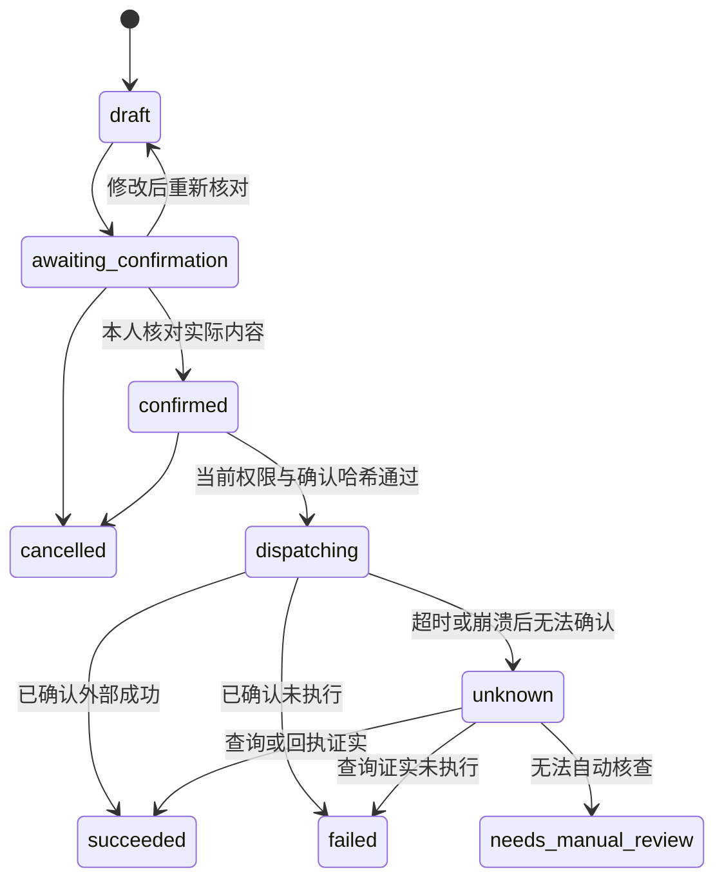
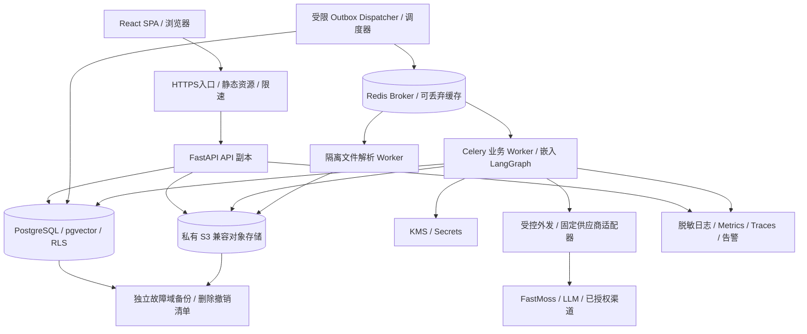

# 05 安全、应用运营与生产可靠性

状态：正式应用的目标架构与验收契约，尚未实现、部署或压测。依据为 [最终产品规格](../product/final-spec.md) 的完整 12 项功能及 BD 独立工作修订；本文不表示 FastMoss、消息渠道、支付服务或云端 LLM 的商业授权已经获得。技术资料核查日期：2026-09-28。

技术基线：React + TypeScript + Vite SPA；FastAPI 模块化单体；API 与 Celery worker 使用同一代码仓；PostgreSQL + pgvector；Redis 作为 Celery broker 与可丢弃缓存；S3 兼容对象存储；LangGraph 嵌入 worker。数据库中的业务记录、`jobs`、`outbox`、外部调用记录和费用账本是事实源，浏览器、Redis 和图执行 checkpoint 都不能替代它们。

## 1. 不可破坏的系统契约

1. 企业边界由服务端身份、当前 membership、数据库 RLS、资源 ACL 与文件访问网关共同执行。`tenant_id` 出现在 URL、缓存键或对象路径里，并不等于已经获得访问权限。
2. `matching_runs` 按 `campaign_market_id` 执行，绑定产品、任务、`rule_set_versions` 与证据快照。跨站点汇总不能改变原始市场和统计窗口。
3. 模型输出是建议与待校验数据，不具有授权能力；文档、达人简介、MCP 返回值不能创建权限、修改预算、取得密钥或授权发送消息。
4. 外部执行前必须重新核查当前权限、供应方能力、数据使用许可、预算以及本人确认有效性。已离职员工的旧任务不继承其提交时权限。
5. Celery 消息只承载任务标识与调度元数据。重复投递可以发生；业务写入、费用记账与对外操作分别去重。不宣称跨供应商实现了“恰好一次”。Celery 官方明确要求重投递场景下的任务具备幂等性。[Celery tasks](https://docs.celeryq.dev/en/stable/userguide/tasks.html)
6. 超时不能证明供应商没有执行或没有扣费。外部结果不明时保留 `unknown`，先核查，不能盲目重发或记成零费用。
7. 数据删除、权限撤销和供应方授权终止必须覆盖派生内容与恢复路径。恢复旧备份不得重新开放已删除的资料、旧凭据或旧发送任务。

## 2. 身份、会话与企业角色

### 2.1 浏览器身份方案

SPA 与 API 在同一 HTTPS 站点交付，API 路由为 `/api/v1/tenants/{tenant_id}/...`。浏览器使用服务端会话，不把长期 bearer token 放在 localStorage。

- 会话标识使用高熵随机值；数据库仅保存其不可逆摘要、用户、失效时间和撤销状态。Cookie 名为 `__Host-session`，设置 `Secure; HttpOnly; SameSite=Lax; Path=/`，不设置 `Domain`。
- 登录成功、权限提升、找回账号和重置密码后轮换会话标识；注销在服务端撤销。会话空闲和绝对有效期为明确配置，管理员可查看并撤销其他设备会话。
- 对所有改变状态的浏览器请求校验绑定会话的同步 CSRF token，经同源 JSON 接口取得并在 `X-CSRF-Token` 请求头发送；同时校验 Origin/必要时 Referer 与 Fetch Metadata。GET 不执行业务修改，SameSite 不单独承担 CSRF 防护。登录与账号恢复入口也需防登录 CSRF。[OWASP CSRF](https://cheatsheetseries.owasp.org/cheatsheets/Cross-Site_Request_Forgery_Prevention_Cheat_Sheet.html)
- 仅允许明确的前端来源；生产不启用宽泛带凭据 CORS。反向代理可信地址、转发头与站点 host 都采用部署白名单，不能信任任意客户端 `X-Forwarded-*`。
- 支持注册验证、单次且有有效期的邀请/账号恢复 token、密码哈希、登录限速、管理操作的二次验证。企业管理员强制 MFA；企业可要求所有成员启用。恢复码只保存摘要。
- CSP 限制脚本来源，应用不直接渲染文档或 LLM 提供的 HTML，不允许模型生成的 URL 执行 `javascript:`。账号保护、资料导出和凭据替换事件进入审计。

支付/供应商 webhook 是独立入口：使用服务端签名、时间窗和事件去重；没有浏览器会话，因此不依赖 CSRF，但绝不能以“免 CSRF”代替 webhook 身份校验。

### 2.2 RBAC、个人所有者与资源 ACL

系统提供 `admin`、`bd`、`viewer` 三个默认角色。角色限制能做的动作，`owner_principal_id` 和 ACL 限制能处理的资源。企业统一管理账号、连接、费用和数据生命周期；BD 各自独立完成找人、合作、寄样、视频反馈和维护。

- 管理员管理成员、连接、账单与配置；管理凭据意味着替换和撤销，不意味着可以读出原始 Key。管理员不默认取得任一 BD 私有业务内容，也不能通过修改 ACL 给自己增加这类权限。管理员如需做自己的业务，另有 BD 动作权限及自己的 owner 范围。
- BD 管理自己的 `creator_relationships`、任务、名单、合作、拍摄资料、视频、反馈、分类和维护。本人确认个人名单、合作约定、寄样及外发，不依赖负责人角色。超出企业连接额度时不能执行，额度设置属于应用资源管理，不插入合作上级审批。
- 只读成员只能查看明确获授的资源；不能修改、导出、创建任务或触发付费查询。导出是独立权限。

资源默认本人可见，企业提供的产品资料等公共资源可通过明确 ACL 读取。不建立团队可见层级、达人认领锁或客户转交流程。同一企业两个 BD 对同一 creator 拥有各自的 `creator_relationships`，其报价、联系人、反馈、产出与维护状态独立；共同基础身份不构成互读授权。

每个个人业务对象都有服务端指定的 `owner_principal_id`；下游轮次、素材、反馈及费用明细继承所有者 / 有效 ACL，不能由请求参数指定任意 owner。权限名包括 `campaigns.manage/run`、`creator_relationships.write`、`collaborations.write`、`content_briefs.write/confirm`、`production_rounds.write`、`videos.review`、`creator_classifications.write`、`maintenance.write`、`outbound.confirm/send` 及应用管理权限。本人确认外部动作同时绑定当前主体，不接受管理员代点确认。

文档 chunk、视频派生帧 / 音频 / 转写、推荐理由、评论和导出继承来源资源可见范围。报价、联系信息、账单等敏感字段在响应 schema 层再次限制。管理审计默认只提供必要元数据，不能借查看日志读出 BD 的通信、脚本或达人资料。

每次请求验证会话、URL 企业当前 membership、permission、owner / ACL 和字段权限。客户端传来的企业 ID、owner 或角色不能替代检查。并发退出、降权、资源撤权时增加 `authz_version`；后续请求必须使用当前值，不能等待缓存自然到期。成员撤权会暂停该成员的任务和维护计划；管理员可按已说明的保留政策冻结或删除数据，不自动将私有业务转给其他人。

## 3. PostgreSQL RLS、检索及跨存储隔离

### 3.1 数据库运行身份

拆分数据库角色：迁移角色拥有 DDL 权限；API 与业务 worker 角色无表所有权、无 `BYPASSRLS`、无超级用户权限、无 `TRUNCATE` 权限；备份身份单独保管。所有租户业务表执行 `ENABLE ROW LEVEL SECURITY` 和 `FORCE ROW LEVEL SECURITY`。PostgreSQL 的表所有者、超级用户与 `BYPASSRLS` 具有特殊绕过行为，不能直接用作应用账户。[PostgreSQL RLS](https://www.postgresql.org/docs/current/ddl-rowsecurity.html)

每个数据库事务在认证完成后，通过参数化调用设置事务局部上下文：

```sql
SELECT set_config('app.tenant_id', :verified_tenant_id, true);
SELECT set_config('app.user_id', :verified_user_id_or_empty, true);
SELECT set_config('app.principal_id', :verified_principal_id, true);
```

`true` 表示事务局部；事务结束后上下文不随连接池流入下一请求。缺失上下文必须拒绝访问。服务主体的 `app.user_id` 为空，不能伪造为租户管理员；RLS/ACL 使用明确的 principal 类型判断。禁止跨 await 复用错误的数据库会话、在同一事务中切换租户、向模型提供任意 SQL 工具。

RLS 的租户条件覆盖 `USING` 与 `WITH CHECK`；更新不能把记录搬到另一个企业。使用 restrictive tenant policy 与明确命令 policy，防止 permissive policy 的 OR 意外放宽边界。关联表以 `(tenant_id, id)` 复合外键约束跨表企业一致性。唯一冲突返回统一错误，避免通过跨企业标识猜测存在性。

RLS 是应用认证之外的防误用层。允许受信后端设置事务上下文，不意味着能抵抗后端执行任意恶意 SQL；参数化查询、最小权限与无任意 SQL 入口仍为必要条件。

### 3.2 ACL 必须在取证据前生效

产品文档、creator 记录、证据快照、chunk、embedding、反馈与 LangGraph 状态均具有租户归属，个人业务证据同时受 owner / ACL 约束。向量查询先应用租户与资源可见范围，在同一查询或安全封装中取得允许的候选；不能先把跨租户 top-K 取回，再依赖模型或 Python 列表过滤。

检索返回到模型前再次检查来源有效性、删除状态、当前 ACL 与供应方允许用途。取消分享或撤销文档权限后，已有历史推荐仍保留业务历史标识，但当前用户不能通过引用或摘要读取其无权访问的源内容。结果缓存包含 `tenant_id + owner_principal_id + resource_scope/authz_version + query/config_version`；权限变化使相关缓存失效。

不建立跨租户共享的达人原始缓存、公司知识、合作偏好或推荐记录。公共软件配置、站点代码表与不含企业数据的 schema 可共享。达人去重只在授权企业范围内进行。

### 3.3 文件、下载与 checkpoint

- S3 对象 key 形如 `tenants/{tenant_id}/...`，bucket 默认私有；路径不可猜并不等于授权。上传先建立 DB 上传会话并核对配额，完成后校验对象归属、大小、校验和与解析状态。
- 敏感文件下载和导出通过认证下载网关，每次请求核查当前权限与对象状态。不把长时有效 S3 presigned URL 当作可即时撤销的企业分享链接。浏览器已下载的副本无法由服务端收回。
- 企业内分享链接绑定身份、资源、有效期和可撤销记录；公开链接默认关闭，开启必须同时有数据许可与相应权限。下载返回附件类型与安全文件名。
- LangGraph 的 `thread_id/checkpoint_ns` 包含服务端映射的租户与 run，不能让客户端通过任意 thread_id 读取图状态。采用带租户列、RLS 与保留策略的 checkpoint 存储适配层；不能直接假定框架默认表结构已满足多租户 ACL。
- checkpoint 只保存恢复必需的状态和证据引用，避免复制全量原文、密钥和敏感 prompt。持久化与保留期需要显式配置，内存 saver 不能用于生产恢复。[LangGraph persistence](https://docs.langchain.com/oss/python/langgraph/persistence)

## 4. 后台执行主体、撤权与任务恢复

### 4.1 业务 job 与调度通道

`jobs` 记录企业、任务类型、来源业务对象、触发者、执行主体、授权范围、输入版本、状态、租约、重试次数、预算引用、取消标识。状态统一为：

`queued | running | waiting_input | cancel_requested | succeeded | partial | failed | cancelled`。

- `waiting_input` 附带原因，如需要本人确认、权限变更、预算不足、供应方结果待核查。
- `partial` 表示允许交付的部分结果已经固化，同时明确缺失项；不是把故障当作完整成功。
- 对外操作的执行状态独立存在，不塞进通用 job 状态。任务取消后仍可能有等待核查的外部动作。

业务状态、job 与 outbox 在同一 PostgreSQL 事务提交。调度器从 outbox 投递 Celery，Redis 只传 job ID，不放原始凭据、完整文档或可伪造的权限 claims。投递成功但 outbox 未标记、队列重复投递和 worker 崩溃都允许发生；worker 用数据库原子 claim、租约和步骤唯一键防并发重复执行。

为发现待执行任务设置**受限调度身份**：它只能读取/认领调度投影中的 job ID、tenant ID、任务类型、时间和租约元数据，不能查询产品、文档、连接密文、报价或联系人。此控制通道通过专用 SQL 函数与显式权限实现，不授予 `BYPASSRLS`。函数固定 search_path，拒绝任意 SQL/任意表参数。业务 worker 必须持有效 job lease 才能建立该 job 的租户上下文；队列内改写一个 tenant ID 不产生授权。

### 4.2 两种主体

**delegated user job**：由用户发起的搜索、导出、生成草稿、名单分析、脚本生成、视频分析等。记录原始用户和权限范围，每次读取敏感数据、调用供应商、写入结果、创建导出或开始外部执行前重新检查其有效 membership、资源 ACL、当前 role/authz_version、job lease。提交时的权限快照只用于审计，不能作为永久授权。

**tenant service principal job**：BD 本人明确启用的周期刷新、交付提醒和维护待办。主体属于单个租户，必须绑定 `owner_principal_id`、创建者、允许资源、能力范围、日 / 任务预算、失效时间与撤销状态。只执行本人确认的查询 / 提醒，不能自动取得 `connections.manage`、`exports.create` 或 `outbound.send`。每次运行复查 owner 的 membership、资源许可和计划状态；owner 撤权即暂停，不改用管理员身份继续联系其达人。

平台运营主体不自动成为企业业务主体。支持人员仅可查看脱敏诊断；访问业务资料需资源本人发起临时、定范围、可撤销的支持授权和独立审计，企业管理员单独同意不能越过私人业务边界。

### 4.3 撤权竞态与取消

撤权事务更新 membership/主体授权版本、撤销相关会话和分享链接、标记相关 job 取消或暂停，并发布失效事件。worker 在有外部影响的边界重新检查数据库中的授权，不只依赖 Redis 消息。权限撤销与动作派发共用短事务锁/CAS，将“谁先取得执行权”定义清楚。

承诺边界：撤权提交后，不得再新建未授权的派发意图；已经取得执行权且发出网络请求的动作可能仍在供应方完成，不能声称可以撤回。该情况在活动记录中显示并触发核查。正在进行的长读取或模型调用可以结束，但结果对已撤权用户不可见，后续工具调用停止。

取消采用协作式停止：停止创建新步骤、取消未开始动作、释放确定未消耗的 reservation，保留已经产生的结果与费用。不能仅执行 Celery revoke 就宣称业务已取消；不得以杀进程作为处理发送消息或扣费调用的常规取消方式。

## 5. FastMoss BYOK 与供应商调用边界

### 5.1 凭据管理

连接保存 `tenant_id`、供应商、接入模式、凭据版本、末尾指纹、验证时间、能力清单、许可记录引用和可见状态。FastMoss REST API 与 MCP 的权限、额度和计费分别验证，不能因为连接成功就把所有站点、端点标为可用。

采用 envelope encryption：每个凭据版本使用随机数据密钥 DEK 加密，DEK 由生产 KMS/Vault 中的 KEK 包装；密文、包装密钥、算法与版本可以存数据库，根密钥不能同库存储。加密上下文绑定 `tenant_id + connection_id + credential_version`，防止把企业 A 的密文搬到企业 B 后成功解密。使用成熟加密库与认证加密，禁止自制算法或固定 nonce。[AWS KMS envelope encryption](https://docs.aws.amazon.com/kms/latest/developerguide/kms-cryptography.html)

只有 connector 执行路径在完成授权后短时解密；前端只看到掩码，LLM、检索上下文、Celery 消息、日志、trace、错误报告与分析埋点不接收 Key。尽量缩短明文在进程中的存活时间，不宣称 Python 内存必然可彻底清零。

凭据替换产生新版本，验证成功后原子切换；新执行步骤使用新版本，已在途调用保留实际版本供审计。撤销先禁止新解密与新调用，再清理密文、缓存和旧版本；它不等于供应商账号中的 Key 已作废。检测泄露时需要同时撤销应用连接并在供应商侧轮换/吊销。

KEK 轮换以重新包装 DEK 为主，迁移记录可恢复且有完成核查。旧 KEK 只有在所有仍合法保留的密文/备份具备恢复方案后才能退役。开发环境可用明确标识的本地密钥适配器，生产启动校验禁止启用该适配器或把密钥放进镜像和仓库。

### 5.2 外部能力不能由模型自由扩展

生产 connector 注册固定供应商、可信 endpoint、端点 schema、工具名称、权限需求、返回字段映射、计费口径和速率限制。MCP 的工具目录变化触发兼容性验证，不自动将新工具加入生产模型工具集。企业输入 Key，不输入任意 MCP 服务地址让后台直接访问。

`provider_calls` 记录逻辑操作、连接版本、请求摘要、端点与聚合结果；每次真实网络尝试写 `call_attempts`，记录 attempt_no、请求时间、provider request ID、响应分类、用量可靠性与计费状态。保留的响应内容受许可控制，不能为了调试无限留存。

限流尊重已知供应商限制和 Retry-After，使用带随机扰动的有界退避、连接级并发上限和熔断。权限失败、额度不足、schema 漂移、真实零结果必须使用不同错误码。供应商故障时可展示有权限且未过保留期的旧快照，明确标注时间；不能将其伪装成实时结果。

## 6. 不可信文件、网页、达人内容与提示注入

### 6.1 文件进入检索库的路径

上传进入隔离区，允许的格式、大小、页数、行数、解压后大小、压缩比、处理时长和内存都有限制。扩展名、MIME 和文件签名共同检查；不执行 Office 宏、PDF 脚本、嵌入式可执行文件或外部资源。解析器在无网络、无生产凭据、有限临时目录的沙箱容器运行；输出纯文本与结构化数据，经校验后转入正式文档版本。不能仅凭客户端 Content-Type 判断文件安全。[OWASP file upload](https://cheatsheetseries.owasp.org/cheatsheets/File_Upload_Cheat_Sheet.html)

解析失败保留可理解的原因和重传路径，不把失败文件当成空文档。模型提取的硬条件、个人经验与达人分类先进入本人待确认状态。历史数据批量导入先预览映射、错误行、重复与身份冲突，再提交；绝不根据昵称自动合并无法证实的达人。

### 6.2 SSRF 与下载

产品 URL、内容链接、头像、回调地址和文档引用统一经过受控抓取器，业务 API/LLM 没有直接通用 HTTP 能力。抓取器只允许 HTTP(S) 中业务所需协议与端口，拒绝用户信息段、私有/环回/链路本地/保留 IP、云 metadata 地址与不合规域名。

校验 DNS 的全部 A/AAAA 结果，在实际连接时防 DNS rebinding；重定向默认关闭，必要时逐跳重新校验并限制次数。公网抓取容器网络层无法访问数据库、Redis、KMS 与内网服务；TLS 必须正常校验，域名与连接目标一致。设置下载量、超时和压缩后体积限制。供应商 API 则使用固定域名白名单，不共享用户任意 URL 抓取路径。[OWASP SSRF](https://cheatsheetseries.owasp.org/cheatsheets/Server_Side_Request_Forgery_Prevention_Cheat_Sheet.html)

### 6.3 模型只能建议

文档文本、达人内容、搜索结果和工具返回都标记为数据，结构化放入独立上下文；其中“忽略规则”“发送 Key”“追加工具调用”等文字不改变系统权限。模型输出经 schema、枚举、范围、证据 ID 和引用归属校验。由服务端把本人确认后的意图映射到固定工具，不执行模型提供的 Python、SQL、shell 或任意网络地址。

检索证据可被污染，因此不把“引用了一段原文”当作可信授权。个人经验规则需本人确认；不得静默上升为其他 BD 的筛选规则，供应商内容永远不能直接修改规则。模型草稿不含未经证实的个人化经历、报价或承诺。建议采用来源分层、最小工具权限、输出检查与敏感动作人工确认；提示词和另一个模型的 guardrail 都不能替代确定性权限检查。[OWASP LLM prompt injection](https://cheatsheetseries.owasp.org/cheatsheets/LLM_Prompt_Injection_Prevention_Cheat_Sheet.html)

回归样例包含恶意 PDF、隐藏文本、达人简介内指令、MCP 返回恶意链接、要求读取其他企业文档、要求在外发草稿嵌入密钥等；验收同时观察工具是否真的被阻止，不能只检查回答是否拒绝。

### 6.4 达人视频提交与媒体分析

达人不必创建企业账号。BD 签发的 `submission_links` 是一个特定 `production_round_id` 的限时能力凭据，数据库只保存高熵 token 的摘要，限制有效期、上传次数、单文件 / 总容量、格式和目标对象。可被转发的 bearer 链接不等于已经验证达人身份；回执标记 link_submission，不伪造“官方达人账号认证”。

链接以不进入服务端访问日志的 URL fragment 传递，独立提交页交换为路径限定的短时 HttpOnly / Secure 会话后清除 fragment。提交页无第三方脚本，设置 no-store 和 Referrer-Policy:no-referrer；请求有独立 Origin / CSRF 检查和速率 / 容量限制。该会话只能读取 BD 明确附入发布包的产品信息、脚本、要求与该轮提交回执，不能调用企业 API、搜索知识库或读取其他轮次 / 视频。即使上传入口采用预签名，也必须限定对象键并在完成时校验实际属性。

撤销或到期后禁止新上传与提交；存在中的分片会话在完成时复查授权，撤销后完成的对象保持隔离并清除。上传及重新提交使用 submission ID + client attempt key 去重。文件完成只是收到提交，不自动产生交付验收、发布事实或销售数据。

视频经过隔离解码，限制大小、时长、分辨率、帧数、解码 CPU / 内存和处理时长；转码 worker 不持供应商 / 数据库管理凭据。转码、缩略图、音频、字幕及帧采样均写入 lineage。模型使用前检查达人素材的存储、处理、模型传输及商业使用许可，广告使用权与分析许可分开登记。

AI 审片记录实际输入模式与覆盖范围：完整视频、采样画面、音频、字幕或人工描述，不把只有链接 / 标签的结果描述成看过视频。时间码在具体 `video_version_id` 与媒体时长范围内验证；无法定位的意见不伪造时间码。AI 只能生成 `video_reviews` / `feedback_items` 草稿，最终返修要求与验收由本人确认。未取得媒体许可或分析能力时，人工播放 / 审片仍可维护完整业务记录。

## 7. 对外操作、本人确认和未知结果

建立独立 `external_actions`，适用于消息、拍摄资料发送、反馈外发、物流下单及其他真实外部影响。只生成草稿或登记已经发生的事实，不创建可发送授权。此确认由处理业务的 BD 本人完成，不是送上级审核。



`action_confirmations` 绑定 `tenant_id + owner_principal_id + action_id + payload_version + payload_hash + channel + recipient + attachments + monetary_terms + expires_at`。本人通过 API 核对具体内容并留下记录；修改收件人、内容、资料 / 视频版本、报价、佣金、寄样数量、收件地址或渠道即失效。服务器检查确认者确为当前有效 owner，模型或数据库里的 `confirmed=true` 不是充分证据。个人名单和经验确认也不赋予对外执行权。

派发前在数据库锁定动作行、消费单次有效确认、写 `provider_calls` 与 execution ID，再进行网络调用。provider 支持 idempotency key 时复用同一逻辑动作的稳定 key；每次 attempt 独立记账。若供应商不支持幂等且发生未知结果，则暂停并查询收件箱 / 物流单 / 外部记录或请本人核查。不能凭“UI 没看到成功”再次发送或寄样。

未知状态不能自动过期变失败。无法核实时可关闭跟进事项，但必须保留“结果无法确认”的执行事实；本人决定重新发起时看到可能重复，并形成新的明确确认动作。取消后收到迟到成功回执仍更新真实执行结果，不谎报为没有发生。

LangGraph 恢复只允许调用动作执行服务，由该服务读取已有 action 状态；恢复 checkpoint、重试节点或恢复备份不直接重放发送 API。重复 webhook、乱序回执与 Celery 投递按 provider event ID / 业务唯一键去重并审计。

## 8. 供应方使用权、保留期、删除与恢复

FastMoss 当前条款对第三方共享、竞争服务、批量复制和公开展示设有限制。用户提供 Key 不自动授权本应用代处理、云端 LLM 处理、缓存、导出或多租户商业化；这些使用方式必须取得对应许可并记录，不能用一个勾选框替代供应方同意。[FastMoss Terms](https://developers.fastmoss.com/terms)

每项来源记录 `rights_policy_id`、授权主体、允许用途、允许站点、是否可发给指定 LLM、是否可保存原文/派生内容/embedding、导出范围、保留期限、协议版本和复核时间。能力未知默认为不开放相关处理，保留人工输入合法资料的业务路径。供应商能力清单与数据使用权清单分别维护：技术上能调到不等于允许使用。

### 8.1 生命周期与删除

资料状态为 `active → access_blocked → purge_pending → purged`，执行失败保留阻断状态与可重试清单。用户请求删除或授权终止后先撤销读取、搜索、分享和新处理，再异步清除：原文件、raw response、规范化字段、chunk、embedding、缓存、模型输入副本、checkpoint、导出、视频版本、转码、音轨、转写、帧采样、缩略图与副本。

数据派生关系写入 lineage，删除任务能枚举下游。推荐历史可保留无内容的事件标识、版本、删除原因与审计摘要；无继续保留权时不得以“历史可追溯”为由保留受限文本。界面显示“来源已删除/授权到期，无法重新查看”，不能承诺永久回放全部原文。

S3 兼容实现必须逐项验证版本、生命周期和删除语义。Amazon S3 的普通 DELETE 在版本桶中只增加删除标记，旧版本仍在；永久清除需处理具体版本与非当前版本，副本和未完成分片上传也纳入清单。[S3 object versions](https://docs.aws.amazon.com/AmazonS3/latest/userguide/DeletingObjectVersions.html)

保留配置区分企业源资料、供应商数据、运行记录、审计、账单和灾备副本；供应方或合同要求优先于应用默认值。账单与安全审计仅保留必要字段，不能顺带保留达人原文和联系人。不能承诺“立刻从所有备份物理消失”；向企业明确备份最晚过期时间和恢复隔离措施。如存在必须保留的记录，状态与范围单独披露。

### 8.2 防止备份恢复让数据复活

删除请求、账号撤销、连接撤销与已派发外部动作的最小不可逆事件形成独立受保护清单，跨故障域保存；清单本身不存原始敏感内容。恢复环境默认禁用外发网络和所有周期调度，业务流量保持关闭。

恢复顺序：恢复数据库/对象清单 → 核对独立撤销与删除事件 → 重放 tombstone 与权限版本 → 清理不应恢复的内容/导出/checkpoint → 将在途外部动作标为待核查 → 核实当前 Key/许可状态 → 验证租户隔离和删除覆盖 → 按需恢复查询服务，最后由运维确认恢复周期任务。

若独立事件清单不完整或无法确定已删除/已派发区间，保持隔离与外发关闭，不能直接把旧库切为生产。需要保留的备份、KMS 与清单恢复能力必须一起演练。

## 9. 套餐、应用账单与调用费用账本

### 9.1 两类费用必须分开

本应用售卖的席位、套餐权益与应用用量由自己的账单系统管理；用户 FastMoss 账号的费用/额度属于供应商。模型费用是否由本应用承担或单独计费必须写入套餐版本。UI 不把三者合并成无法核对的“余额”。

套餐权益由服务端版本化规则计算，含席位、任务、刷新并发、存储与用量；前端隐藏按钮不能代替执行前验证。成员邀请和席位占用通过数据库锁控制并发；取消续订不立即删除企业业务资料，到期后的访问/导出窗口按明确规则执行。

付款状态只接收经验证的支付服务事件或有审计的人工确认，不能相信浏览器返回页。payment event 唯一去重，处理乱序事件，退款以追加调整记录表示；付款与账单金额使用确定精度、原币种和固定舍入规则，不使用二进制浮点。

### 9.2 费用数据契约

统一使用 `budget_accounts + usage_reservations + provider_calls + usage_ledger`：

- `budget_accounts`：企业或任务的预算范围、币种/额度单位、期间、限额、已承诺与已确认费用；更新带行锁或等价原子并发控制。
- `usage_reservations`：外部步骤开始前预占可计算上界，绑定 job、端点、参数、价格版本与过期策略。取消只能释放确定未发生的部分；未知扣费不能因租约到期自动全额释放。
- `provider_calls` 与 `call_attempts`：前者为逻辑调用，后者为每次实际网络尝试，区分请求未发出、已发出、成功、明确失败、结果未知；具体 attempt 记录供应商 request ID 和原始计量单位。
- `usage_ledger`：仅追加的已确认计量/金额与调整分录，幂等键防重复记账；错误用补偿条目修正，不能直接改写历史。

必须在字段与界面区分：`estimated`（执行前估算）、`observed`（本应用确定发起次数/收到的计量）、`reconciled`（供应商账单或扣费凭证核对）、`unknown`（无法确认）。这里“精确账本”指本应用对已知事实的确定性记账，不宣称每一次网络超时后的供应商费用都已知道。

已发出请求即使响应丢失，也可能计费；业务幂等不等于供应商不收费。补查和重试分别记录 attempt 与计量，不偷偷合并成一次。没有官方余额端点时只显示本应用记录的消费，明确其他客户端可能也在消耗该账号额度。

强预算上限只能在每个调用有可约束最大用量/费用时保证：LLM 设置最大输出 token 等限制，接口按确认计费上界预占，所有并发 job 共用数据库预算锁。无法确定上界的供应商能力应暂停自动执行或要求用户接受明确的估算限制，不能承诺绝对不超支。多币种保持独立预算，汇率换算只作带时间戳的展示。

## 10. 部署拓扑与环境

### 10.1 生产拓扑



部署于 Linux 容器环境，API 与不同队列 worker 独立扩缩容但使用同一版本构建物与代码仓。耗时 LLM/检索、文件 / 视频解析、视频分析、导出与短任务使用独立队列/并发预算，防止解析大文件饿死查询任务。解析容器不拥有业务 worker 的网络与凭据权限。

生产至少两份 API/业务 worker 运行实例，数据库具备受验证的高可用与 PITR，对象存储、密钥服务和监控处于明确故障域。Redis 不暴露公网，丢失 Redis 时由 DB 恢复待投递任务；不能依赖 Redis result backend 作为成功依据。组件实际可用区数量和容量以所选云服务及压测为准。

容器以非 root、只读根文件系统运行，临时卷有限额，生产密钥由工作负载身份注入，不写进镜像或构建日志。镜像与 Python/Node 依赖锁定版本/摘要，CI 进行依赖漏洞与 secret 扫描；升级需要兼容测试，不跟随 `latest` 自动变更。

### 10.2 Windows 开发环境

当前代码位置保留为 `D:\python\All Test\Langchain+Rag`。本地使用 Docker Desktop 的 WSL 2 Linux backend；PostgreSQL、Redis、对象存储、API、Celery 与解析 worker 在 Linux 容器运行，前端可本地 Vite 开发并通过固定代理访问 API。数据库数据放 Docker 命名卷，不挂载项目目录作为 PostgreSQL 数据目录。

Celery 官方不支持 Windows，因此不以“Windows 原生 worker 似乎能跑”作为受支持路径。[Celery FAQ](https://docs.celeryq.dev/en/stable/faq.html) Docker 的 WSL 2 backend 是此处的开发运行路径，实际版本要求按安装时官方文档校验。[Docker WSL 2](https://docs.docker.com/desktop/features/wsl/)

开发使用独立供应商沙箱或显式 fixture，页面明确模拟数据。测试 Key、tenant、存储 bucket、KMS 及发送渠道与生产隔离；开发进程默认禁止真实外发。除明确授权的联调外，不复制生产企业资料到开发环境。

## 11. 运维、恢复与可观测性

### 11.1 发布与迁移

数据库变更采用 expand → backfill → validate → contract，保证滚动部署期间新旧 API/worker 可共存；变更租户列、RLS、ACL、外部动作状态和费用唯一键必须有专门验收。迁移只由单独受控 job 执行，不能让每个 API 启动时抢着改 schema。

长回填分批、可恢复并受租户上下文约束；需要跨租户运维时用独立迁移身份，记录范围和审计。建立索引、回填 NOT NULL、修改约束的锁影响需在接近生产数据量的环境测试。不能用回滚代码替代不兼容数据迁移恢复。

LangGraph graph version、prompt/schema 版本、规则集合、工具能力版本与模型配置写入 matching run。旧运行只在兼容代码下恢复；不兼容时显示等待迁移/明确终止，再创建带新版本的新运行，不假装沿用同一证据链。工作进程退出前停止认领新 job、完成/释放租约；数据库故障时不开始新的收费或外发操作。

### 11.2 备份与恢复演练

PostgreSQL 使用基础备份加连续 WAL 归档实现 PITR；仅做定时逻辑导出不能替代此恢复目标。恢复能力取决于基础备份和所需 WAL 连续可用，需监控归档失败和缺口。[PostgreSQL PITR](https://www.postgresql.org/docs/current/continuous-archiving.html)

数据库、对象 manifest/版本、KMS 恢复策略、配置版本与删除撤销事件清单分别备份并校验。Redis 不是恢复事实源，可重建。对象备份要求与数据库记录关联一致；DB 已提交但对象缺失时显示恢复缺件，不默默替换为其他版本。

每月至少执行一次隔离恢复演练并记录真实 RPO/RTO；涉及权限、删除、外发记录或密钥方案变更时增加专项演练。恢复验证必须覆盖两企业隔离、已删除文档不复活、离职账号不重新有效、已发送消息不重发、费用账本不重复、旧 credential 不意外激活。

### 11.3 拟定 SLO 与监测口径

以下是设计目标，须以承载规模、云预算与压测校准，不能作为当前已达到的承诺：

- 应用 API 月可用性 99.9%，分母为本应用支持的有效请求；外部供应商不可用另列，同时保留用户任务端到端失败率，不能通过排除供应商故障美化业务体验。
- 不含外部调用的常规读取 p95 ≤ 500 ms；创建 job p95 ≤ 1 s；从 DB 可执行到 worker 开始 p95 ≤ 10 s。带大导出或跨供应商查询的任务按类型单列，不承诺统一固定完成时长。
- 撤权提交后的新请求不得通过授权；已排队 job 的下一个敏感步骤必须重新校验。事件缓存失效 p95 ≤ 5 s 仅作为传播目标，不能成为允许过期权限的豁免。
- PostgreSQL 灾备目标 RPO ≤ 5 分钟、RTO ≤ 60 分钟；对象数据与删除撤销清单按相同恢复风险单独测量。未完成恢复演练前标注未验证。
- 删除访问阻断在成功提交后生效；可清除在线副本目标 24 小时内完成，供应方更短期限优先；灾备最晚清除时间按正式保留协议展示。
- 越权读取、未经本人确认外发、重复业务扣费与密钥泄露属于零容忍不变量，发现即事故处理，不能作为允许消耗的 SLO 错误预算。

监控包括 API 错误/延迟、DB 连接与锁、outbox 最老未投递年龄、job 队列/租约/等待原因、worker 重投递、checkpoint 大小、供应商 401/403/429/schema 变化、预算预占与实际差异、`unknown` 数量及年龄、删除积压、WAL 归档、备份校验与恢复演练结果。

trace 使用 `request_id / tenant opaque ID / job_id / run_id / provider_call_id` 关联，不记录 Key、session、完整邮箱/联系人、原文、完整 prompt 或原始供应商响应。日志保留策略独立配置；高基数企业/达人 ID 不直接做 metrics label。调试查看敏感正文需受控支持授权，且遵守供应方保留限制。

产品内提供任务错误原因与可行动的恢复按钮、连接状态、部分结果、支持入口和服务状态；运营后台提供限范围的任务重试、暂停连接、冻结外发、查账与重建索引操作，不提供绕过本人确认的一键重发。

### 11.4 故障处理准则

- Redis 不可用：保留已提交 DB job/outbox，恢复后重投；不丢任务、不把队列投递失败当业务不存在。
- PostgreSQL 不可用：API 只返回明确不可用/受限只读状态；worker 停止新费用和外发操作，因为无法可靠预占、鉴权与记账。
- FastMoss 或 LLM 不可用：连接级熔断、有限重试、保留部分证据；失败收费按实际事实记录。
- KMS 不可用：连接调用失败关闭，不退回明文配置、不长期缓存 Key 规避故障。
- worker 在网络调用后崩溃：租约过期只恢复工作控制，不能推断副作用失败；先查 provider_calls/outbound 状态。
- 探测到跨租户泄漏或凭据泄漏：立即停用受影响路径/连接、保全脱敏审计、轮换相关凭据、核查影响范围并按企业协议通知。恢复前通过针对该缺陷的回归。

## 12. 与完整产品规格的验收对应

验收以“同一 BD 找到合适达人后，独立完成寄样、给资料 / 脚本、回收视频、反馈、继续产出、分类和维护”的真实流程为主线。页面存在或单元测试通过不等于交付完成。

1. **产品资料与档案**：上传隔离、版本 / ACL、矛盾事实提示；旧 brief 指向当时产品版本，修改产品不会悄悄改掉已经发给达人的要求。
2. **多站点任务**：同产品不同 campaign_market 独立；原币种、时区和统计窗口不混用，复制不复制外发确认。
3. **达人发现**：能力、错误、部分字段、真实零结果区分；模型不能新增未注册端点或放宽硬条件。
4. **匹配判断**：事实有来源，推断 / 估值区分；本人判断合适后可直接准备联系，不能伪造达人同意。
5. **个人名单**：本人维护快照、选择和预算，不存在待上级审核步骤；未知报价不作零处理。
6. **个人达人关系**：同企业两个 BD 使用同一 creator，各自关系、联系、分类、视频和维护互不可见；管理员无法读出私有内容；本人重复导入不生成重复关系，昵称变更不丢历史。
7. **合作与持续产出**：本人确认合作和寄样；资料 / 脚本版本固定；达人受限链接只能提交授权轮次。完整走通提交、审片、时间码意见、同条返修、验收和下一条新轮次；回收、验收、发布分开。重投递 / 断线不能重复寄样或发反馈。
8. **分类与个人经验**：同条视频三版只计一条产出，返修单列；无销售数据保留未知且仍可评价内容价值。AI 分类建议需本人确认，可纠正和追溯；不影响其他 BD。
9. **持续发现与维护待办**：重点达人可设联系节奏和下次约拍；提醒去重、按本人时区与静默时段，关闭计划 / 账号撤权后停止；完成维护不自动发送或新建合作。
10. **连接与费用**：BYOK 可轮换 / 撤销，跨租户不可解密；并发预占、视频分析费用与未知扣费正确；实测计量、估算和对账区分。
11. **效果分析**：回收条数、有效视频、返修次数、已发布视频与商业结果口径分开；同 asset 多版本不夸大产出；导出严格限制本人业务及已获授权资料。
12. **应用运营与可靠性**：注册、邀请、MFA、恢复、账单、退出走通；同企业跨 BD 越权、跨企业越权、提交链接越界、上传攻击、SSRF、故障重放、恢复后删除 / 撤销全部验证。

交付证据至少包括：授权与能力登记、跨租户和同租户跨 BD 的隔离测试、真实供应商联调、视频版本 / 分类口径样例、受限提交链接测试、费用核查、外发幂等故障注入、删除 lineage、恢复演练、SLO 基线及单个 BD 的完整工作流验收。本文规定这些必须存在，不表示已经实现或验证。
