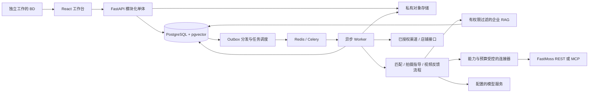
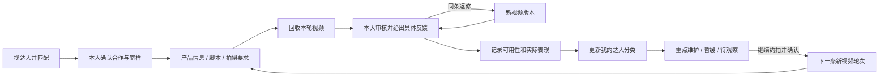

# 完整应用架构设计

版本：1.1 · 修订日期：2026-09-29 · 状态：待实现、待真实接口验证。

## 设计目标与边界

本设计落实[最终产品规格](../product/final-spec.md)的全部 12 个功能域。交付对象是企业级、多租户、支持多 TikTok Shop 站点的BD 个人达人开发与内容运营应用。核心闭环是：

**产品资料 → 找人及匹配 → 确认合作并寄样 → 产品信息、脚本与拍摄指导 → 回收视频 → 反馈修改 → 返修或继续产出新视频 → 达人分类 → 重点维护与再次约拍。**

同一名 BD 独立推进全过程。企业账号只承担资料边界、连接、费用与账户管理；个人候选名单无需上级审核，没有团队分工、认领或分配步骤。寄样与拍摄包准备可并行；视频回收、验收和发布分别记录；每轮完成后都可更新分类。

系统必须同时回答“为什么推荐”“哪些信息还不知道”“是否值得继续花钱查询”“谁可以查看和操作”。大模型负责理解与辅助判断；权限、硬条件、预算、任务状态和可计算指标由确定性的业务代码与数据库负责。

本次完成的是可指导研发的架构文档，不包含可运行应用、已验证的第三方授权、接口联调、商业上线或性能达标声明。原项目没有业务代码，因此目录结构是目标结构，不是对既有实现的描述。

## 文档导航

1. [00 · 架构决策与统一契约](00-decisions.md)：固定技术选择、关键约束、命名、状态、权威来源与待验证项。
2. [01 · 系统设计与工程组织](01-system-design.md)：系统图、独立 BD 工作流、视频返修与继续产出循环、模块责任、进程和工程目录。
3. [02 · 领域模型与数据设计](02-data-model.md)：表、关联、约束、索引、版本、费用账本、隔离与生命周期。
4. [03 · 匹配引擎、LangChain 与 RAG](03-matching-and-rag.md)：找人匹配、产品与脚本 RAG、视频反馈、分类维护、可恢复执行与评测。
5. [04 · API 与前端交互架构](04-api-and-frontend.md)：接口契约、权限、路由、状态、关键页面及示例。
6. [05 · 安全、运维与商业运营](05-security-operations.md)：身份、密钥、任务可靠性、部署、账单、监控与恢复。
7. [06 · 验收与需求追踪](06-verification-and-traceability.md)：12 域映射、端到端场景、测试、上线证据和完成定义。

建议先读 00 和 01；后端研发重点读 02、03、05，前端重点读 04，产品与验收重点读 06。跨文档发生冲突时，先按 00 的统一契约处理，并修正其他文档，不在代码中自行创造另一套约定。

## 一眼看懂系统

## BD 的视频产出与维护循环

## 不可破坏的设计原则

- 企业内各 BD 的关系、沟通、报价、视频反馈和分类默认私有；公共产品资料按明确 ACL 使用。不同企业的数据和凭据不混用。
- 一条新视频对应一个拍摄轮次，同轮返修保存为新版本；关系库跨合作持续存在，收到一条视频不等于关系结束。
- 任务按站点执行，推荐绑定产品、条件、规则与数据版本，旧名单不被新数据偷偷覆盖。
- 符合、不符合、未知是不同状态；适配程度与证据充分程度分开；未知费用不等于零。
- 同一逻辑外部调用只选择一个传输路径；超时后结果不明必须核对，不能靠重试假装“只执行一次”。
- 外部内容不能变成系统指令；模型不能直接获取密钥、修改预算或替人批准外发动作。
- 最终产品包含商业运营与故障恢复。功能开放以真实能力与验收证据为准，模拟数据仅用于明确标注的测试。

## 需要在研发中验证的外部依赖

实际 FastMoss 账号的站点、字段、收费、分页、限流、历史覆盖和数据使用权；TikTok / 邮件等渠道可获授权的动作；拟使用模型的数据处理范围；生产存储、通知、支付供应商；实际 BD 用户规模、视频量和媒体处理成本。它们不会改变闭环设计，但决定某个连接器或站点何时可以标为“已支持”。未验证时，系统提供人工记录或明确的不可用状态，不展示虚构的自动化。
